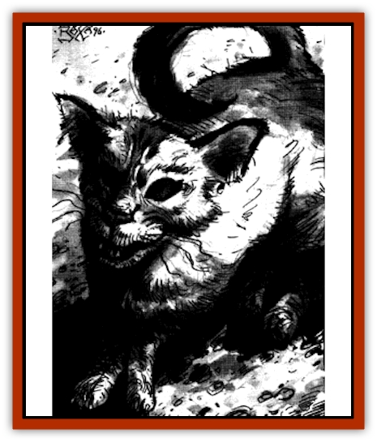
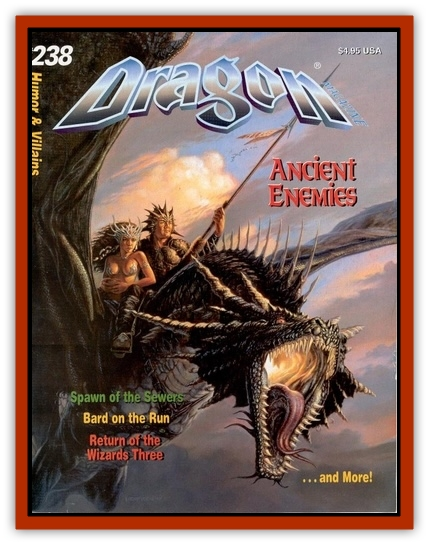

# Cat - Water

| Statistic | **Cat, Water** |
| --- | --- |
| **Activity Cycle:** | Any |
| **Alignment:** | Neutral (Good) |
| **Armor Class:** | 5 |
| **Climate/Terrain:** | Sewers |
| **Damage/Attack:** | 1d2/1/1/1/1 |
| **Diet:** | Carnivore |
| **Frequency:** | Rare |
| **Hit Dice:** | 2 |
| **Intelligence:** | Average (8-10) |
| **Magic Resistance:** | 50% |
| **Morale:** | Average (9) |
| **Movement:** | 12, Sw 5 |
| **No. Appearing:** | 1 |
| **No. of Attacks:** | 5 |
| **Organization:** | Solitary |
| **Size:** | T (1') |
| **Special Attacks:** | Poisonous bite |
| **Special Defenses:** | See below |
| **THAC0:** | 19 |
| **Treasure:** | Nil |
| **XP Value:** | 420 |

Water [[Cat_Small|cats]] are descended from the familiars of several of the wizards who died at the hands of the necromancer during his overthrow of the guild. Like many other creatures of the sewers, they have been warped by the magical pollution. Unlike most others, however, the cats are still benign and retain a strong affinity to man. Rumors speak of water cats guiding lost delvers back to the surface.

**Combat:** In many respects, water cats are unchanged from ordinary cats. They attack with their claws and bite, and these are not especially dangerous, except for their poison. Interestingly, water cats' fangs are hollow like a [[Snake|snake's]], and poison is injected with every bite. If a save vs. poison fails, the victim is affected as by the 2nd-level Wizard spell *ray of enfeeblement*. Furthermore, human, demi-human, or humanoid victims must make a second save or gradually transform into a [[Mongrelman|mongrelman]] over the period of a month. [[Rat|Rats]], [[Rat|giant rats]], [[Lycanthrope_Wererat|wererats]], and other rat creatures are slain instantly upon a failed saving throw. Water cats are the prominent cause of so many giant rats fleeing the sewers recently; normal rats are better at avoiding their predators, but many of them have also fled to the relative safety of the surface.

**Habitat/Society:** Water cats, true to their name, live in and around water. Unlike their normal cousins, they have no qualms about getting wet. They are secretive creatures who rarely allow themselves to be seen. Water cats rarely interact with others of their kind, except for mating. They communicate with each other in the manner of normal cats, but a select few actually understand common, a gift from their extraordinary forebears.

**Ecology:** Rats, mice, and other small mammals make up the majority of the water cat's food, but occasionally they will nibble on a fallen monster or other creature. Water cats serve admirably to limit the rat population, and should one ever be captured and taken to the surface, it would make an incomparable mouser

---
## Discovery & Documentation

**Source Publication:** Dragon238 (1997)
**Campaign Setting:** Dragon Magazine
**Author(s):** John Baichtal, Brian Walton, Tom Baxa

### Other Creatures Found in This Source Book
   * [[Crocodile_Albino|Crocodile, Albino]]
   * [[Lich's_Blood|Lich's Blood]]
   * [[Moth_Plague|Moth, Plague]]
   * [[Mummy_Ice|Mummy, Ice]]
