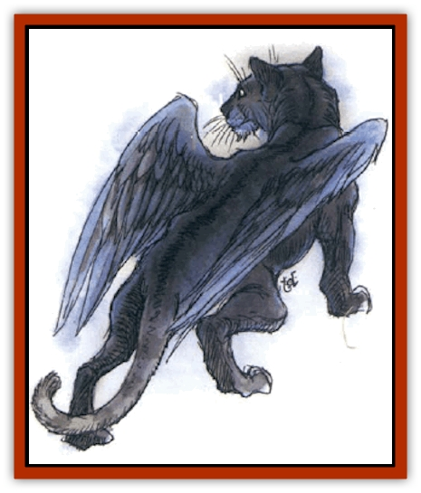

# Cat - Winged

| Statistic | **Greater** | **Lesser** |
| --- | --- | --- |
| **Activity Cycle:** | Night | Any |
| **Alignment:** | Chaotic neutral | Neutral |
| **Armor Class:** | 6 | 5 |
| **Climate/Terrain:** | Temperate hills and grasslands | Any |
| **Damage/Attack:** | 1-4/1-4/1-10 | 1/1/1-2 |
| **Diet:** | Carnivore | Carnivore |
| **Frequency:** | Very rare | Very rare |
| **Hit Dice:** | 5+5 | 1+1 |
| **Intelligence:** | Average (8-10) | Semi- (2-4) |
| **Magic Resistance:** | Nil | Nil |
| **Morale:** | Average (8-10) | Average (8-10) |
| **Movement:** | 12, Fl 30 (B, C if mounted) | 9, Fl 18 (A) |
| **No. Appearing:** | 1-4 | 1-4 |
| **No. of Attacks:** | 3 | 3 |
| **Organization:** | Family group | Solitary |
| **Size:** | L (6-7' long) | T (1-2' long) |
| **Special Attacks:** | Rear claws 1d6+1 each | Rear claws 1-2 each |
| **Special Defenses:** | -2 bonus on surprise rolls | -2 bonus on surprise rolls |
| **THAC0:** | 15 | 19 |
| **Treasure:** | Nil | Nil |
| **XP Value:** | 975 | 175 |

These beautiful, winged felines are coveted by collectors and zookeepers. Their origins are unknown.

## Greater Winged Cat

The greater winged cat, or jana-nimr, is a [[Cat_Great|large feline]] with wings covered in soft fur. Most have short sandy-colored, gray, or black fur. Yellow or gray individuals with black stripes have also been seen. Lighter colored individuals usually have white underbellies and wings, while the darker ones tend to have solid black fur on their wings. Like other cats, these usually have yellow or green eyes, with a few instances of blue. A greater winged cat has a wingspan of 15 feet or more.

These cats speak their own language, and a few (10%) speak the languages of [[Sphinx|sphinxes]] or other catlike species.

**Combat:** Jana-nimar are generally peaceful and relaxed, but they are very dangerous if hunting or if threatened. They attack from the air when possible, first using teeth and front claws while flying past an opponent. If prevented from flying away, or if they prefer to enter melee, they may rake with their rear claws, provided both front claws hit first.

These animals back down only if their lives are endangered. Even then, the cat remembers the incident, and may hunt its enemy for years to exact revenge.

**Habitat/Society:** These beasts inhabit grasslands and hills, usually making a nest by flattening a small grassy area.

Jana-nimar have a mating season once a year, during which the male brings gifts of food to his chosen partner. A litter of 1-3 cubs is raised by the mother, and they often stay with her for as long as two years. Jana-nimar live for up to 50 years.

**Ecology:** Greater winged cats prefer live prey, especially mammals or birds. They scavenge only in times of great need, and they almost never attack humans or other bipeds. They are intelligent enough to generally leave domestic animals alone. If captured young, a jana-nimr can be trained as a mount, though much patience is needed because of the cat's great independence. Once loyalty is obtained, it is never lost. A jana-nimr will accept only its trainer as a rider.

## Lesser Winged Cat

Also known as "fluttercats" and jana-qitat, lesser winged cats look much like common [[Cat_Small|domestic cats]], but they have wings covered in soft fur. Coloration varies widely, and almost any standard color or combination is possible. The rarest jana-qitat are medium brown, with dark brown faces, ears, paws, wings, and tails. Long and short hair are equally common. Fluttercats have wingspans of about four feet.

Jana-qitat are playful and curious, and can be quite beautiful. Those fluttercats that live in cities, however, may become as scruffy as any common alley cat.

**Combat:** Fluttercats fight if threatened, and a mother will ferociously protect her offspring. They fly at an opponent, attacking with claws and teeth. If both front paws hit, they rake with rear claws for 1-2 points of additional damage.

**Habitat/Society:** Jana-qitat make lairs in an enclosed space several feet above the ground. Flutterkittens are born in litters of 1-3 and cared for by the mother for about three months, as they learn to fly and hunt. A jana-qit has a life span of up to 20 years, but slows down as it gets older, spending more and more time in warm places.

**Ecology:** Fluttercats help control vermin populations, just as other cats. They are also great bird hunters, being able to follow them into the air. If captured as kittens, they make good pets, and a jana-qit will bring as much as 50 gp. They tend to be affectionate toward loving masters, though all have a strong sense of independence. They are prized as familiars, but a wizard must be very lucky to gain one in such a capacity.

See also: [[Tressym|Tressym]]

---
## Discovery & Documentation

**Source Publication:** City of Delights (1993)
**Campaign Setting:** Al-Qadim (Forgotten Realms)
**Author(s):** tom Prusa, Tim Beach, Steve Kurtz

### Other Creatures Found in This Source Book
   * [[Afanc|Afanc]]
   * [[Al-Jahar|Al-Jahar]]
   * [[Bird_Talking|Bird, Talking]]
   * [[Crypt_Servant|Crypt Servant]]
   * [[Elemental_Vermin|Elemental Vermin]]
   * [[Genie_Tasked_Harim_Servant|Genie, Tasked, Harim Servant]]
   * [[Ogre_Zakhara|Ogre (Zakhara)]]
   * [[Opinicus|Opinicus]]
   * [[Parasite|Parasite]]
   * [[Pasari-Niml|Pasari-Niml]]
   * [[Sirine|Sirine]]
   * [[Tatalla|Tatalla]]
   * [[Tree_Singing|Tree, Singing]]
