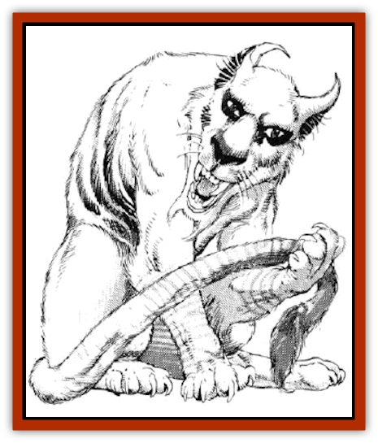

# Caterwaul

| Statistic | **Caterwaul** |
| --- | --- |
| **Activity Cycle:** | Generally night |
| **Alignment:** | Chaotic evil |
| **Armor Class:** | 6 or better (see below) |
| **Climate/Terrain:** | Temperate mountains |
| **Damage/Attack:** | 1-4/1-4/1-6 |
| **Diet:** | Carnivore |
| **Frequency:** | Rare |
| **Hit Dice:** | 4+2 |
| **Intelligence:** | Low (5-7) |
| **Magic Resistance:** | Nil |
| **Morale:** | Steady (12) |
| **Movement:** | 18 or 24 |
| **No. Appearing:** | 1 |
| **No. of Attacks:** | 3+ (see below) |
| **Organization:** | Solitary |
| **Size:** | M (5' long) |
| **Special Attacks:** | Screech, rake |
| **Special Defenses:** | Haste |
| **THAC0:** | 17 |
| **Treasure:** | Q (&times;4) |
| **XP Value:** | 270 |

Caterwauls are vicious [[Cat_Great|feline]] creatures with short, midnight-blue fur, yellow eyes and a long, prehensile tail. The face has an almost [[Elf|elven]] look, with its delicately pointed ears and almondshaped eyes.

**Combat:** The caterwaul's preferred method of attack is to hide in a tree or rock outcropping above a trail and leap onto its victim, chasing it only if necessary. Caterwauls are able to move on their hind legs at great speed (18), then drop to all fours to move even faster (24). The caterwaul attacks with two claws for 1-4 points of damage, plus a bite for 1-6 points. In addition, if a caterwaul strikes with unmodified "to hit" rolls of 18 or better with both claws, it may rake twice for a further 1-6 points of damage per rake.

Once per turn, the caterwaul can emit a high-pitched, keening sound in addition to its melee attacks. This keening inflicts 1-8 points of damage on all creatures within 60 feet unless they save against breath weapons. Caterwauls usually use this attack during their first round of melee. Also once per turn, a caterwaul can *haste* itself, gaining a +4 bonus to its Armor Class and gaining double normal attacks and movement. The caterwaul cannot keen or make melee attacks during the round in which it *hastes* itself. The *haste* lasts seven rounds.

**Habitat/Society:** The caterwaul is normally a militantly solitary creature, leaving its mother after only three months of life. The normal lifespan of a caterwaul is 5 years. During its life it will breed a maximum of three times. Caterwauls do not mate for life, as this would necessitate a permanent companion.

Caterwauls are generally found in low mountains, especially those with thick vegetation. Like most felines, the caterwaul hates water, but it can swim if necessary. Its diet is exclusively meat, generally large rodents, but larger prey is not uncommon, and it will occasionally supplement its hunting with a raid on domestic sheep or cattle. After killing something the size of a sheep or larger, the caterwaul will gorge itself, and then it may not hunt again for up to ten days. It will, however, defend its territory at any time from all intruders. The caterwaul is not a scavenger, and will not even finish off its own kills if they are more than a day old,

The caterwaul can climb virtually any surface (95% climb skill), move silently (85%), and hide in shadows (75%). During its life, a caterwaul will not roam more than about 8 miles from its lair, once it has established its territory. The lair of a caterwaul will be heavily marked with vertical grooves, where the creature has honed its claws. There will also be a pungent odor, as the entrance to the lair is heavily marked by the caterwaul's scent glands to warn off other creatures.

Caterwaul's treasure is not normally as valuable as it might seem at first. They collect shiny objects of all shapes and sizes, and any hoard will be mostly worthless bits of quartz and shiny stones.

The caterwaul's prehensile tail is of little use in combat, but the creature will often use its tail to secure its food for eating. It will also use it as a sort of "hand" to brush twigs or other obstructions out of its line of sight when it is waiting in ambush.

Like most cats, the caterwaul's tail is also an elegant indicator of the creature's emotions.

**Ecology:** Caterwauls have no natural enemy, including man. They hunt only for food, and fight to defend their territory. The claws of a caterwaul may be used in the creation of a *sword of sharpness*. Its fur is prized for its unusual color, but must be carefully treated to remove the caterwaul's scent.

---
## Discovery & Documentation

**Source Publication:** MC14 Fiend Folio Appendix (1992)
**Campaign Setting:** Fiends Folio
**Author(s):** Don Bingle, John Terra, Wes Nicholson, Tim Beach, Steve Hardinger, Kris Hardinger, Rob Nicholls, Greg Swedberg, Al Boyce, Vince Garcia, Norm Ritchie

### Other Creatures Found in This Source Book
   * [[Aballin|Aballin]]
   * [[Achaierai|Achaierai]]
   * [[Adherer|Adherer]]
   * [[Algoid|Algoid]]
   * [[Al-Mi'raj|Al-Mi'raj]]
   * [[Apparition|Apparition]]
   * [[Coffer_Corpse|Coffer Corpse]]
   * [[Crabman|Crabman]]
   * [[Dark_Creeper|Dark Creeper]]
   * [[Dark_Stalker|Dark Stalker]]
   * [[Darter|Darter]]
   * [[Denzelian|Denzelian]]
   * [[Dune_Stalker|Dune Stalker]]
   * [[Dwarf_Urdunnir|Dwarf, Urdunnir]]
   * [[Falcon_Fire|Falcon, Fire]]
   * [[Faux_Faerie|Faux Faerie]]
   * [[Flawder|Flawder]]
   * [[Fyrefly|Fyrefly]]
   * [[Gambado|Gambado]]
   * [[Garbug|Garbug]]
   * [[Giant_Fhoimorien|Giant, Fhoimorien]]
   * [[Gibberling|Gibberling]]
   * [[Gorbel|Gorbel]]
   * [[Grimlock|Grimlock]]
   * [[Hellcat|Hellcat]]
   * [[Ice_Lizard|Ice Lizard]]
   * [[Iron_Cobra|Iron Cobra]]
   * [[Khargra|Khargra]]
   * [[Mantari|Mantari]]
   * [[Penanggalan|Penanggalan]]
   * [[Pernicon|Pernicon]]
   * [[Phantom_Stalker|Phantom Stalker]]
   * [[Retriever|Retriever]]
   * [[Ruve|Ruve]]
   * [[Scathe|Scathe]]
   * [[Sheet_Ghoul_Sheet_Phantom|Sheet Ghoul/Sheet Phantom]]
   * [[Shocker|Shocker]]
   * [[Spanner|Spanner]]
   * [[Stwinger|Stwinger]]
   * [[Sussurus|Sussurus]]
   * [[Symbiotic_Jelly|Symbiotic Jelly]]
   * [[Terithran|Terithran]]
   * [[Thunder_Children|Thunder Children]]
   * [[Troll_Ice|Troll, Ice]]
   * [[Tween|Tween]]
   * [[Umpleby|Umpleby]]
   * [[Volt|Volt]]
   * [[Xill|Xill]]
   * [[Xvart|Xvart]]
   * [[Zygraat|Zygraat]]
