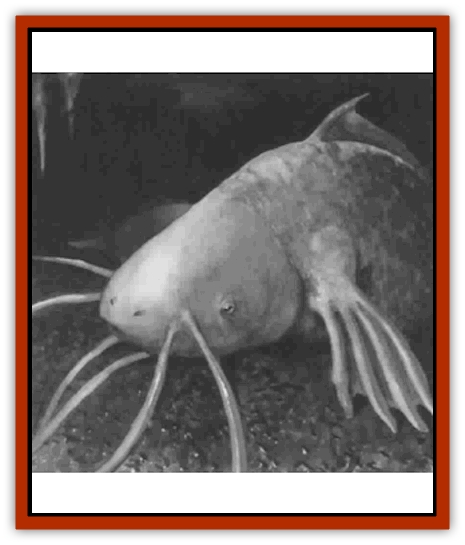

# Catfish - Stalking

| Statistic | **Catfish, Stalking** |
| --- | --- |
| **Activity Cycle:** | Any |
| **Alignment:** | Neutral |
| **Armor Class:** | 5 |
| **Climate/Terrain:** | Subterranean |
| **Damage/Attack:** | 1d8 |
| **Diet:** | Carnivore |
| **Frequency:** | Very rare |
| **Hit Dice:** | 12 |
| **Intelligence:** | Animal (1) |
| **Magic Resistance:** | Nil |
| **Morale:** | Fearless (19) |
| **Movement:** | 3, Swim 18 |
| **No. Appearing:** | 1 |
| **No. of Attacks:** | 1 |
| **Organization:** | Solitary |
| **Size:** | G (30' long) |
| **Special Attacks:** | Swallow whole |
| **Special Defenses:** | Nil |
| **THAC0:** | 6 |
| **Treasure:** | Incidental |
| **XP Value:** | 4,000 |

The stalking [[Fish_Giant|catfish]] is amazingly adaptable, being able to spend nearly all its time out of the water, walking about on its broad and muscular fins. This enables it to leave isolated cavern pools and lakes to find new prey after it has totally devoured all the goodies in its previous habitat. Although few can appreciate its appearance in the underground darkness, its scales are a gleaming metallic green.

**Combat:** This land-dwelling [[Fish|fish]] moves slowly and methodically through the caverns, its 12'-long barbels or whiskers probing everything within reach. Thus, concealing magic is no defense. Whenever even one barbel touches a living thing, an electric impulse shoots automatically to the small brain, and the great fish hinges forward to swallow the victim whole. (It can do this to Size M prey or smaller.) If the target fails to avoid this attack, the target suffers 1d8 points of damage from the creature's teeth and the same amount each subsequent round from its digestive juices. Swallowed prey can attack using short weapons such as daggers and short swords, but only if such weapons are in hand. If outside rescuers attempt to cut the victim free, there is a 50% chance per slice that the blow inflicts half damage - rounding down - to the one being rescued.

The catfish's ability to probe for prey depends entirely on its long barbels; if they are all cut, it is all but helpless in the dark, attacking at a -4 penalty. However, anyone who starts cutting them off at the base will be at most within only a few feel of the catfish's mouth, announcing his or her presence in the strongest possible terms. Severing a barbel requires a successful called shot with a slashing weapon.

**Habitat/Society:** These fish are solitary for much of the year, but they gather in large numbers in large bodies of water once a year, for a full week, during the breeding season. Depending im how many large bodies of water there are in the region, each pool or lake could contain up to a dozen stalking catfish during the week in question. Because of their voracious appetites, the other life forms in the pools and lakes tend to have greatly reduced populations. This is beneficial to the catfish because their eggs are helpless and vulnerable to any other predator. Each female lays up to a hundred eggs, but no more than four or five reach maturity.

**Ecology:** Stalking catfish that make their way to the outside world generally become the top predators in the areas they inhabit, unless some truly fearsome monster such as a [[Dragon_General_Information|dragon]] is already present. In their normal environment, however, they are just another giant predator. If a [[Tunnelmouth_Dweller|tunnelmouth dweller]] gets the drop on one, it works its jaws extensively until the catfish carcass is bitten in two, as the stalking catfish is one of the few rivals it cannot simply swallow whole.

Stalking catfish flesh is delicious, and the meat, whether fresh or smoked, fetches 10 gp a pound in almost any market. The smashed-up gelatinous eggs can also be used to make an "egg cake" of exquisite flavor that costs 20 gp. (The eggs themselves cost 6 gp per dozen but must be submerged in water until used.) The tough but beautiful hide is also prized by fashion-conscious fighters, who would pay heavily to have a wizard form this hide into a suit of scale mail +1. A foot-long length of barbel, encased in amber and suitably enchanted, can also be used to make a *wand of enemy detection*; no more than one barbel per catfish can be so enchanted.

---
## Discovery & Documentation

**Source Publication:** Dragon267 (2000)
**Campaign Setting:** Dragon Magazine
**Author(s):** 

### Other Creatures Found in This Source Book
   * [[Tunnelmouth_Dweller|Tunnelmouth Dweller]]
