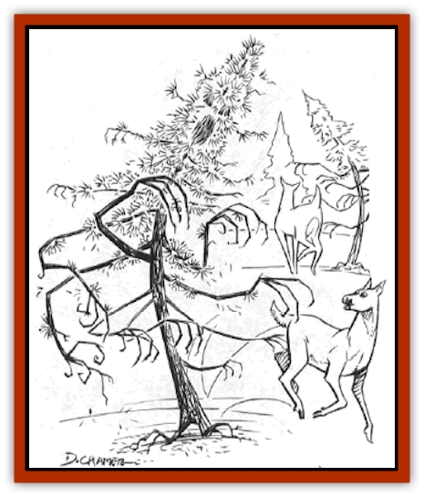

# Cedar Spawn

| Statistic | **Cedar Spawn** |
| --- | --- |
| **Activity Cycle:** | Any |
| **Alignment:** | Chaotic evil |
| **Armor Class:** | 2 (trunk), 4 (branches) |
| **Climate/Terrain:** | Special |
| **Damage/Attack:** | 1d8(&times;6) |
| **Diet:** | None |
| **Frequency:** | Rare |
| **Hit Dice:** | 6+6 |
| **Intelligence:** | Low (6) |
| **Magic Resistance:** | Nil |
| **Morale:** | Fanatic (17) |
| **Movement:** | 9 |
| **No. Appearing:** | 3d6 |
| **No. of Attacks:** | 6 |
| **Organization:** | Pack |
| **Size:** | L (12-20' tall) |
| **Special Attacks:** | Entangle, incinerate |
| **Special Defenses:** | +1 or better weapons needed to hit |
| **THAC0:** | 15 |
| **Treasure:** | Nil |
| **XP Value:** | 4,000 |

Cedar spawn are trees animated by the power of Chaos into dangerous creatures. Their favored form is that of a dried, brittle-looking evergreen, though they can be created from virtually any kind of tree that is of sufficient size.

**Combat:** Cedar spawn attack enemies in all directions. Each attack is the lash of a branch, which is a whiplike slash that can inflict deep and painful wounds. Though a cedar spawn can attack up to six times in a round, it can attack a single foe (or a group of enemies in a single direction) only three times. The other attacks must be directed at a different target or targets on the other side of the cedar spawn.

If a cedar spawn attacks with a roll of 16-20, that branch has a chance of wrapping around the victim, thus entangling him or her. The tree does not have to hit for this to take effect. The hero thus struck must make a saving throw vs. breath weapon to escape the entanglement, but failure means that the branch has firmly clasped a waist, torso, or leg.

Each of the spawn's attacking branches has 12 hit points. If the entangling branch is struck for 12 or more points of damage, it is severed. However, damage inflicted against individual branches does not count toward the overall hit points of the cedar spawn itself - the tree's "main" hit points are lost only by blows against the trunk itself.

**Habitat/Society:** Though cedar spawn have no way to see, hear, or smell, they can still pick out their foes quite easily. They consider anything living to be a foe, and they automatically attack living creatures once the creatures come within range of their branches. Unless set to a certain task, the cedar spawn can move to close with a foe. Additionally, though cedar spawn look like dead trees, they do not use the same resources as normal trees to provide themselves with sustenance.

**Ecology:** Because of the brittle and dried nature of these trees, they are tremendously susceptible to fire. Any flaming attack instantly incarcerates a cedar spawn. This fire is so hot that any creature within 20 feet of the tree suffers 4d6 points of fire damage; a successful saving throw vs. breath weapons can reduce this damage to half. Furthermore, any other cedar spawn within 20 feet of an incinerated tree also goes up in flames on the subsequent round. This secondary incineration inflicts damage just as the primary, and the ignition can continue through an unlimited chain reaction as long as more cedar spawn are in range.

---
## Discovery & Documentation

**Source Publication:** Chaos Spawn (1999)
**Campaign Setting:** Dragonlance
**Author(s):** Douglas Niles

### Other Creatures Found in This Source Book
   * [[Daemonlord|Daemonlord]]
   * [[Sand_Spawn|Sand Spawn]]
   * [[Scavenger_Spawn|Scavenger Spawn]]
