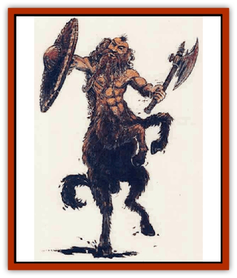

# Centaur-kin - Dorvesh

| Statistic | **Centaur-kin, Dorvesh** |
| --- | --- |
| **Activity Cycle:** | Day |
| **Alignment:** | Neutral |
| **Armor Class:** | 4 (7) |
| **Climate/Terrain:** | Temperate hill or mountain |
| **Damage/Attack:** | 1d6/1d6 or by weapon |
| **Diet:** | Omnivore |
| **Frequency:** | Very rare |
| **Hit Dice:** | 4 |
| **Intelligence:** | Average (8-10) |
| **Magic Resistance:** | Nil |
| **Morale:** | Elite (13-14) |
| **Movement:** | 12 |
| **No. Appearing:** | 2-12 (80-120) |
| **No. of Attacks:** | 2 hoof or 1 weapon |
| **Organization:** | Clan |
| **Size:** | L (5' and taller) |
| **Special Attacks:** | Nil |
| **Special Defenses:** | +4 save vs. spell and poison |
| **THAC0:** | 17 |
| **Treasure:** | M,Q (B) |
| **XP Value:** | 270 / Chief: 420 |

Dorvesh have the upper body of a [[Dwarf|dwarf]] and the lower body of a donkey. Their donkey hindquarters are covered with coarse hair which varies from light brown to black. The dwarven upper half is usually well-muscled and earthy brown. They retain the full beards of their dwarven cousins.

Dorvesh clans are distrustful of outsiders, but they are not overly aggressive. They will fight only to defend themselves or their homesteads. When not expecting combat, dorvesh wear simple tunics of rough leather or hide; otherwise, they wear chain mail vests and carry shields. They wear their hair long and braided to keep it out of the way when they work in the mines.

Since dorvesh avoid contact with other races as much as possible, they speak only their own dialect of dwarvish. Anyone who speaks dwarvish has a 75% chance to understand the dorvesh dialect.

**Combat:** Dorvesh do not use magic of any kind, and only rarely do they use magical items. Dorvesh have an inherited resistance to spells and poison, and they can detect the slope of a passageway (1-3 on 1d6) and new tunnel construction (1-4 on 1d6). They have 30-foot infravision.

Although not warlike, dorvesh are well organized and disciplined when forced to fight. They are intuitive strategists. They wear chain mail vests and tough leather barding, and they carry shields.

Dorvesh wield a variety of weapons: hammers (35%), swords (50%) and light crossbows (15%). If unarmed, dorvesh attack with their front hooves, inflicting 1d6 damage with each.

In a group of more than eight dorvesh, there is a 60% chance that the clan chief will ibe with the group. The chief has 5 HD and AC 4.

**Habitat/Society:** An average dorvesh clan numbers 80 to 120 members, 20% of them children and 20% females. Dorvesh females are skilled fighters who will fight beside the males if the homestead is attacked.

Dorvesh live in towns constructed around their mine entrances. Since dorvesh do not construct deep mines, they sometimes have to move to a new site. Though their settlements are well constructed, they are not permanent. Abandoned dorvesh settlements may occasionally be found in remote valleys, often inhabited by [[Goblin|goblins]] or [[Kobold|kobolds]].

Dorvesh produce all their own metalwork. These items are sturdy and reliable, but they are less likely to be engraved or decorated than similar dwarven items. Dorvesh prefer the classic lines of a plain hammer, chisel, or axe. They hoard precious metals and gems, gold being particularly prized.

Dorvesh are a stubborn and tenacious people, often considered deliberately obtuse by outsiders. Unlike their dwarf counterparts, the dorvesh do not wage war against [[Orc|orcs]], [[Goblin|goblins]], giants, or [[Elf_Drow|drow]], preferring to remain detached from the other races.

**Ecology:** Though dorvesh are skilled miners and metal-workers, they rarely sell the goods they produce. Thus limited in commerce, they hunt for their own food and cultivate mushrooms and tubers to supplement their diets.

Dorvesh usually live from 150 to 200 years.

---
## Discovery & Documentation

**Source Publication:** Monstrous Compendium, 1995 Annual, Volume 2 (1995)
**Campaign Setting:** Advanced Dungeons & Dragons 2nd Edition
**Author(s):** Jon Pickens

### Other Creatures Found in This Source Book
   * [[Aboleth_Savant|Aboleth, Savant]]
   * [[Addazahr|Addazahr]]
   * [[Amiq_Rasol|Amiq Rasol]]
   * [[Arch-Shadow|Arch-Shadow]]
   * [[Automaton_Scaladar|Automaton, Scaladar]]
   * [[Automaton_Trobriand's|Automaton, Trobriand's]]
   * [[Bat_Sporebat|Bat, Sporebat]]
   * [[Beetle_Dragon|Beetle, Dragon]]
   * [[Bi-nou|Bi-nou]]
   * [[Boggle|Boggle]]
   * [[Brownie_Dobie|Brownie, Dobie]]
   * [[Brownie_Quickling|Brownie, Quickling]]
   * [[Cat_Crypt|Cat, Crypt]]
   * [[Cat_Great_Cath_Shee|Cat, Great, Cath Shee]]
   * [[Centaur-kin_Gnoat|Centaur-kin, Gnoat]]
   * [[Centaur-kin_Ha'pony|Centaur-kin, Ha'pony]]
   * [[Centaur-kin_Zebranaur|Centaur-kin, Zebranaur]]
   * [[Chronolily|Chronolily]]
   * [[Curst|Curst]]
   * [[Darktentacles|Darktentacles]]
   * [[Dinosaur_Aquatic|Dinosaur, Aquatic]]
   * [[Dinosaur_II|Dinosaur II]]
   * [[Dinosaur_III|Dinosaur III]]
   * [[Doppelganger_Greater|Doppelganger, Greater]]
   * [[Dragon_Brine|Dragon, Brine]]
   * [[Dragon_Half-|Dragon, Half-]]
   * [[Dragon-kin_Sea_Wyrm|Dragon-kin, Sea Wyrm]]
   * [[Dwarf_Wild|Dwarf, Wild]]
   * [[Ekimmu|Ekimmu]]
   * [[Elemental_Nature|Elemental, Nature]]
   * [[Elf_Winged|Elf, Winged]]
   * [[Fish_Great_Glacier|Fish (Great Glacier)]]
   * [[Fish_Subterranean|Fish, Subterranean]]
   * [[Fish_Toril|Fish (Toril)]]
   * [[Flareater|Flareater]]
   * [[Flumph|Flumph]]
   * [[Froghemoth|Froghemoth]]
   * [[Ghost_Casurua|Ghost, Casurua]]
   * [[Ghost_Ker|Ghost, Ker]]
   * [[Ghul|Ghul]]
   * [[Ghul-Kin|Ghul-Kin]]
   * [[Giant_Half-giant|Giant, Half-giant]]
   * [[Golem_Burning_Man|Golem, Burning Man]]
   * [[Golem_Phantom_Flyer|Golem, Phantom Flyer]]
   * [[Gulguthhydra|Gulguthhydra]]
   * [[Hakeashar|Hakeashar]]
   * [[Horse_Moon-|Horse, Moon-]]
   * [[Human_Dragonslayer|Human, Dragonslayer]]
   * [[Human_Vistana|Human, Vistana]]
   * [[Jellyfish_Giant|Jellyfish, Giant]]
   * [[Kalin|Kalin]]
   * [[Kholiathra|Kholiathra]]
   * [[Laerti|Laerti]]
   * [[Leucrotta_Greater|Leucrotta, Greater]]
   * [[Lich_Suel|Lich, Suel]]
   * [[Lurker_Shadow|Lurker, Shadow]]
   * [[Lycanthrope_Werepanther|Lycanthrope, Werepanther]]
   * [[Lycanthrope_Wereshark|Lycanthrope, Wereshark]]
   * [[Mammal_Herd_II|Mammal, Herd II]]
   * [[Marl|Marl]]
   * [[Meenlock|Meenlock]]
   * [[Mimic_Greater|Mimic, Greater]]
   * [[Mold_II|Mold II]]
   * [[Mummy_Creature|Mummy, Creature]]
   * [[Nyth|Nyth]]
   * [[Ooze_Slime_Jelly_Ghaunadan|Ooze/Slime/Jelly, Ghaunadan]]
   * [[Palimpsest|Palimpsest]]
   * [[Peltast|Peltast]]
   * [[Plant_Dangerous_II|Plant, Dangerous II]]
   * [[Pleistocene_Animal|Pleistocene Animal]]
   * [[Pudding_Subterranean|Pudding, Subterranean]]
   * [[Raggamoffyn|Raggamoffyn]]
   * [[Snake_Serpent|Snake, Serpent]]
   * [[Snake_Serpent_Vine|Snake, Serpent Vine]]
   * [[Sphinx_Draco-|Sphinx, Draco-]]
   * [[Sprite_Seelie_Faerie|Sprite, Seelie Faerie]]
   * [[Sprite_Unseelie_Faerie|Sprite, Unseelie Faerie]]
   * [[Squealer|Squealer]]
   * [[Turtle_Giant|Turtle, Giant]]
   * [[Umpleby|Umpleby]]
   * [[Vizier's_Turban|Vizier's Turban]]
   * [[Wall_Walker|Wall Walker]]
   * [[Webbird|Webbird]]
   * [[Yak-Man|Yak-Man]]
   * [[Zorbo|Zorbo]]
