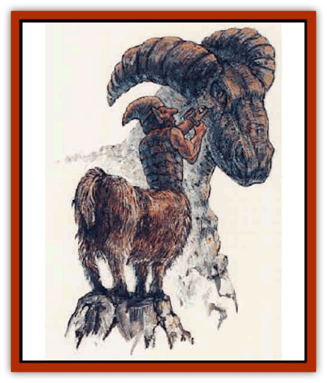

# Centaur-kin - Gnoat

| Statistic | **Centaur-kin, Gnoat** |
| --- | --- |
| **Activity Cycle:** | Day |
| **Alignment:** | Neutral |
| **Armor Class:** | 6 |
| **Climate/Terrain:** | Temperate or tropical hill or mountain |
| **Damage/Attack:** | 1d6 (by weapon) |
| **Diet:** | Omnivore |
| **Frequency:** | Very rare |
| **Hit Dice:** | 3+1 |
| **Intelligence:** | Average (8-10) |
| **Magic Resistance:** | Nil |
| **Morale:** | Steady (12) |
| **Movement:** | 15 |
| **No. Appearing:** | 3-12 (100-300) |
| **No. of Attacks:** | 1 |
| **Organization:** | Clan |
| **Size:** | M (5'+ tall) |
| **Special Attacks:** | Rear kick (1d6) |
| **Special Defenses:** | +4 save vs. spell and poison |
| **THAC0:** | 17 |
| **Treasure:** | M,Q (I) |
| **XP Value:** | 270 / Chief: 420 / Illusionist: 420 |

A gnoat has the upper body of a [[Gnome|gnome]] and the lower body of a large mountain goat. Gnoats usually have brown skin, varying in shade from tan to a deep chestnut. The shaggy coat on the goat hindquarters also varies in color, being brown, black, or gray with a white or cream underside. Hair is the same color as the coat and is usually worn short by both males and females. Hooves are usually black or very dark brown.

Male gnoats have beards which match the color of the goat hindquarters. Beards are kept fairly short and often are trimmed to form elaborate designs. Most gnoats have blue eyes, ranging from light, cool shades to deep cobalt blue, but a few individuals have brown or green eyes.

Clothing usually consists of shirts and jackets of cotton or leather, and hats of various design. Gnoats tend to avoid very bright colors, but they do wear clothes of many differing shades. A favorite garment among gnoats is a patchwork jacket, with swatches of many different colors and materials. These jackets are very strongly constructed and act as padded armor. Jewelry, when worn, consists of carved wooden pendants and bracelets.

Gnoats speak gnomish and common. Many gnoats can communicate with burrowing mammals, but a few clans have lost this ability.

**Combat:** On the whole, gnoats are peaceful, although they are wary of strangers until they prove themselves worthy. Gnoats will defend themselves if attacked, and the majority of males are proficient with weapons. Females rarely fight unless directly threatened.

Gnoats usually arm themselves with spears or clubs, and at least half of any group carries short bows. If unarmed, gnoats will kick with their rear hooves. This single attack causes 1d6 points of damage.

Like gnomes, gnoats are resistant to spells and poison, receiving a +4 bonus to their saving throws.

Any group encountered may be the entourage of the clan chief and a 3rd-level illusionist (15% chance). If so, 2-8 additional gnoats accompany the group. The chief wears an elaborately decorated matching jacket and hat, and he carries a shield bearing the clan emblem. Typical emblems are horns, mountains, trees, or tools. The clan illusionist normally wears a plain black tunic and black leather skull cap.

**Habitat/Society:** For most of the year, gnoat clans inhabit cave systems in the lower foothills of high mountain ranges. They spend their time hunting and farming in order to product enough food for the winter. During the winter months, gnoats usually keep to caverns deep within the mountains, where they have stockpiles of grain, cured meat, and honey. Gnoat clans have 100 to 300 members, of which 40% are females and 10% children. Each clan is led by a chief (5+1 HD, AC 5, THACO 15) and advised by 1 to 4 illusionists of levels 1-3.

**Ecology:** Gnoats are excellent wood-carvers and sculptors of stone. During the winter months, they develop their arts and produce many wonderful pieces ranging from delicately carved wooden animals and fruits small enough to fit in the palm of one's hand, to bold stone statues larger than a fullsized goat.

Gnoats leave their warm caverns in spring and attempt to trade some of their sculptures for pottery, metalwork, and fabrics. They do not stray far from their homesteads but wait for traveling merchants to cross the passes in their mountain homes. The gnoats approach merchants cautiously at first, but gradually build firm friendships. Some traders keep the gnoats' whereabouts secret in return for a ready supply of beautiful carvings each spring.

---
## Discovery & Documentation

**Source Publication:** Monstrous Compendium, 1995 Annual, Volume 2 (1995)
**Campaign Setting:** Advanced Dungeons & Dragons 2nd Edition
**Author(s):** Jon Pickens

### Other Creatures Found in This Source Book
   * [[Aboleth_Savant|Aboleth, Savant]]
   * [[Addazahr|Addazahr]]
   * [[Amiq_Rasol|Amiq Rasol]]
   * [[Arch-Shadow|Arch-Shadow]]
   * [[Automaton_Scaladar|Automaton, Scaladar]]
   * [[Automaton_Trobriand's|Automaton, Trobriand's]]
   * [[Bat_Sporebat|Bat, Sporebat]]
   * [[Beetle_Dragon|Beetle, Dragon]]
   * [[Bi-nou|Bi-nou]]
   * [[Boggle|Boggle]]
   * [[Brownie_Dobie|Brownie, Dobie]]
   * [[Brownie_Quickling|Brownie, Quickling]]
   * [[Cat_Crypt|Cat, Crypt]]
   * [[Cat_Great_Cath_Shee|Cat, Great, Cath Shee]]
   * [[Centaur-kin_Dorvesh|Centaur-kin, Dorvesh]]
   * [[Centaur-kin_Ha'pony|Centaur-kin, Ha'pony]]
   * [[Centaur-kin_Zebranaur|Centaur-kin, Zebranaur]]
   * [[Chronolily|Chronolily]]
   * [[Curst|Curst]]
   * [[Darktentacles|Darktentacles]]
   * [[Dinosaur_Aquatic|Dinosaur, Aquatic]]
   * [[Dinosaur_II|Dinosaur II]]
   * [[Dinosaur_III|Dinosaur III]]
   * [[Doppelganger_Greater|Doppelganger, Greater]]
   * [[Dragon_Brine|Dragon, Brine]]
   * [[Dragon_Half-|Dragon, Half-]]
   * [[Dragon-kin_Sea_Wyrm|Dragon-kin, Sea Wyrm]]
   * [[Dwarf_Wild|Dwarf, Wild]]
   * [[Ekimmu|Ekimmu]]
   * [[Elemental_Nature|Elemental, Nature]]
   * [[Elf_Winged|Elf, Winged]]
   * [[Fish_Great_Glacier|Fish (Great Glacier)]]
   * [[Fish_Subterranean|Fish, Subterranean]]
   * [[Fish_Toril|Fish (Toril)]]
   * [[Flareater|Flareater]]
   * [[Flumph|Flumph]]
   * [[Froghemoth|Froghemoth]]
   * [[Ghost_Casurua|Ghost, Casurua]]
   * [[Ghost_Ker|Ghost, Ker]]
   * [[Ghul|Ghul]]
   * [[Ghul-Kin|Ghul-Kin]]
   * [[Giant_Half-giant|Giant, Half-giant]]
   * [[Golem_Burning_Man|Golem, Burning Man]]
   * [[Golem_Phantom_Flyer|Golem, Phantom Flyer]]
   * [[Gulguthhydra|Gulguthhydra]]
   * [[Hakeashar|Hakeashar]]
   * [[Horse_Moon-|Horse, Moon-]]
   * [[Human_Dragonslayer|Human, Dragonslayer]]
   * [[Human_Vistana|Human, Vistana]]
   * [[Jellyfish_Giant|Jellyfish, Giant]]
   * [[Kalin|Kalin]]
   * [[Kholiathra|Kholiathra]]
   * [[Laerti|Laerti]]
   * [[Leucrotta_Greater|Leucrotta, Greater]]
   * [[Lich_Suel|Lich, Suel]]
   * [[Lurker_Shadow|Lurker, Shadow]]
   * [[Lycanthrope_Werepanther|Lycanthrope, Werepanther]]
   * [[Lycanthrope_Wereshark|Lycanthrope, Wereshark]]
   * [[Mammal_Herd_II|Mammal, Herd II]]
   * [[Marl|Marl]]
   * [[Meenlock|Meenlock]]
   * [[Mimic_Greater|Mimic, Greater]]
   * [[Mold_II|Mold II]]
   * [[Mummy_Creature|Mummy, Creature]]
   * [[Nyth|Nyth]]
   * [[Ooze_Slime_Jelly_Ghaunadan|Ooze/Slime/Jelly, Ghaunadan]]
   * [[Palimpsest|Palimpsest]]
   * [[Peltast|Peltast]]
   * [[Plant_Dangerous_II|Plant, Dangerous II]]
   * [[Pleistocene_Animal|Pleistocene Animal]]
   * [[Pudding_Subterranean|Pudding, Subterranean]]
   * [[Raggamoffyn|Raggamoffyn]]
   * [[Snake_Serpent|Snake, Serpent]]
   * [[Snake_Serpent_Vine|Snake, Serpent Vine]]
   * [[Sphinx_Draco-|Sphinx, Draco-]]
   * [[Sprite_Seelie_Faerie|Sprite, Seelie Faerie]]
   * [[Sprite_Unseelie_Faerie|Sprite, Unseelie Faerie]]
   * [[Squealer|Squealer]]
   * [[Turtle_Giant|Turtle, Giant]]
   * [[Umpleby|Umpleby]]
   * [[Vizier's_Turban|Vizier's Turban]]
   * [[Wall_Walker|Wall Walker]]
   * [[Webbird|Webbird]]
   * [[Yak-Man|Yak-Man]]
   * [[Zorbo|Zorbo]]
