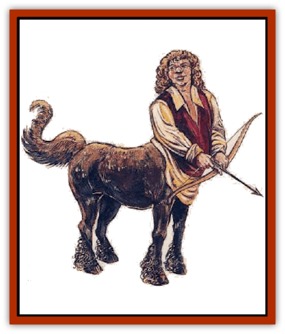

# Centaur-kin - Ha'pony

| Statistic | **Centaur-kin, Ha'pony** |
| --- | --- |
| **Activity Cycle:** | Day |
| **Alignment:** | Neutral good |
| **Armor Class:** | 7 or 6 |
| **Climate/Terrain:** | Any temperate |
| **Damage/Attack:** | 1d3 |
| **Diet:** | Omnivore |
| **Frequency:** | Very rare |
| **Hit Dice:** | 2+2 |
| **Intelligence:** | Average (8-10) |
| **Magic Resistance:** | Nil |
| **Morale:** | Steady (11-12) |
| **Movement:** | 12 |
| **No. Appearing:** | 2-8 (80-150) |
| **No. of Attacks:** | 1 |
| **Organization:** | Community |
| **Size:** | M (4½-5' tall) |
| **Special Attacks:** | +3 with bows and slings |
| **Special Defenses:** | +2 save vs. spell and poison |
| **THAC0:** | 19 |
| **Treasure:** | M (I) |
| **XP Value:** | 175 / Mayor: 270 |

Ha'ponies have the upper body of a [[Halfling|halfling]] combined with the lower body of a [[Horse|pony]]. Their pony hindquarters are varying shades of brown and chestnut, with some grays. In most tribes, the mayor has a piebald coat. Ha'ponies wear brightly colored shirts and tunics, and the majority braid their hair and tails with many-colored ribbons. Their complexions are weather-beaten, with hair varying from sandy to dark brown.

Ha'ponies speak halfling and common.

**Combat:** Ha'ponies are peace-loving creatures but will fight ferociously in defense of their homes and families. Like halflings, they are skilled with the sling and short bow, receiving a +3 bonus to attack rolls with these weapons. Ha'ponies gain a +2 bonus to their saving throws vs. spell and poison due to the natural resistance shared with their halfling cousins.

Ha'ponies do not normally wear armor, but each village has a militia with 20 to 30 members who wear studded leather armor (jerkins and barding: Armor Class 6). In their villages, ha'ponies do not normally carry weapons, except for the militia. These stalwarts are usually armed with short swords and slings, or short swords and short bows.

When outside the village, ha'ponies are usually armed with short swords or spears. In addition, 50% of the group is armed with slings or short bows. There is a 30% chance that a group encountered outside a village will be militia on patrol.

The mayor very rarely (5%) leaves the village, but if so he or she will wear a chain mail vest and carry a short sword and short bow. The mayor has 4+2 HD, AC 5, and THAC0 17.

**Habitat/Society:** Ha'pony villages usually number between 80 and 150 individuals. Of this number, 15% are young and 30% are females. Ha'pony females do not normally fight, but if the village is threatened they will defend their homes and children with slings and daggers.

The village has a mayor, but most important decisions are made by a council of elders known as "The Circle of Oak". In extreme cases, the Circle can remove a mayor from office and exile the unfortunate ha'pony.

Ha'ponies are a cheerful people who are briefly wary of outsiders. They take pleasure in simple crafts and in nature, but they do not have the great love of food which characterizes their halfling cousins.

**Ecology:** The main fare of a ha'pony is fruit, supplemented by cereals. They make up to 20 different varieties of bread, each community having its own speciality. Ha'ponies occasionally hunt game birds such as pheasants and partridges.

Ha'ponies have a life span of approximately 120 years. They live in small family clusters within the village community. They don't breed often, but once a child is born it is lovingly cared for and spoiled by all its relatives.

---
## Discovery & Documentation

**Source Publication:** Monstrous Compendium, 1995 Annual, Volume 2 (1995)
**Campaign Setting:** Advanced Dungeons & Dragons 2nd Edition
**Author(s):** Jon Pickens

### Other Creatures Found in This Source Book
   * [[Aboleth_Savant|Aboleth, Savant]]
   * [[Addazahr|Addazahr]]
   * [[Amiq_Rasol|Amiq Rasol]]
   * [[Arch-Shadow|Arch-Shadow]]
   * [[Automaton_Scaladar|Automaton, Scaladar]]
   * [[Automaton_Trobriand's|Automaton, Trobriand's]]
   * [[Bat_Sporebat|Bat, Sporebat]]
   * [[Beetle_Dragon|Beetle, Dragon]]
   * [[Bi-nou|Bi-nou]]
   * [[Boggle|Boggle]]
   * [[Brownie_Dobie|Brownie, Dobie]]
   * [[Brownie_Quickling|Brownie, Quickling]]
   * [[Cat_Crypt|Cat, Crypt]]
   * [[Cat_Great_Cath_Shee|Cat, Great, Cath Shee]]
   * [[Centaur-kin_Dorvesh|Centaur-kin, Dorvesh]]
   * [[Centaur-kin_Gnoat|Centaur-kin, Gnoat]]
   * [[Centaur-kin_Zebranaur|Centaur-kin, Zebranaur]]
   * [[Chronolily|Chronolily]]
   * [[Curst|Curst]]
   * [[Darktentacles|Darktentacles]]
   * [[Dinosaur_Aquatic|Dinosaur, Aquatic]]
   * [[Dinosaur_II|Dinosaur II]]
   * [[Dinosaur_III|Dinosaur III]]
   * [[Doppelganger_Greater|Doppelganger, Greater]]
   * [[Dragon_Brine|Dragon, Brine]]
   * [[Dragon_Half-|Dragon, Half-]]
   * [[Dragon-kin_Sea_Wyrm|Dragon-kin, Sea Wyrm]]
   * [[Dwarf_Wild|Dwarf, Wild]]
   * [[Ekimmu|Ekimmu]]
   * [[Elemental_Nature|Elemental, Nature]]
   * [[Elf_Winged|Elf, Winged]]
   * [[Fish_Great_Glacier|Fish (Great Glacier)]]
   * [[Fish_Subterranean|Fish, Subterranean]]
   * [[Fish_Toril|Fish (Toril)]]
   * [[Flareater|Flareater]]
   * [[Flumph|Flumph]]
   * [[Froghemoth|Froghemoth]]
   * [[Ghost_Casurua|Ghost, Casurua]]
   * [[Ghost_Ker|Ghost, Ker]]
   * [[Ghul|Ghul]]
   * [[Ghul-Kin|Ghul-Kin]]
   * [[Giant_Half-giant|Giant, Half-giant]]
   * [[Golem_Burning_Man|Golem, Burning Man]]
   * [[Golem_Phantom_Flyer|Golem, Phantom Flyer]]
   * [[Gulguthhydra|Gulguthhydra]]
   * [[Hakeashar|Hakeashar]]
   * [[Horse_Moon-|Horse, Moon-]]
   * [[Human_Dragonslayer|Human, Dragonslayer]]
   * [[Human_Vistana|Human, Vistana]]
   * [[Jellyfish_Giant|Jellyfish, Giant]]
   * [[Kalin|Kalin]]
   * [[Kholiathra|Kholiathra]]
   * [[Laerti|Laerti]]
   * [[Leucrotta_Greater|Leucrotta, Greater]]
   * [[Lich_Suel|Lich, Suel]]
   * [[Lurker_Shadow|Lurker, Shadow]]
   * [[Lycanthrope_Werepanther|Lycanthrope, Werepanther]]
   * [[Lycanthrope_Wereshark|Lycanthrope, Wereshark]]
   * [[Mammal_Herd_II|Mammal, Herd II]]
   * [[Marl|Marl]]
   * [[Meenlock|Meenlock]]
   * [[Mimic_Greater|Mimic, Greater]]
   * [[Mold_II|Mold II]]
   * [[Mummy_Creature|Mummy, Creature]]
   * [[Nyth|Nyth]]
   * [[Ooze_Slime_Jelly_Ghaunadan|Ooze/Slime/Jelly, Ghaunadan]]
   * [[Palimpsest|Palimpsest]]
   * [[Peltast|Peltast]]
   * [[Plant_Dangerous_II|Plant, Dangerous II]]
   * [[Pleistocene_Animal|Pleistocene Animal]]
   * [[Pudding_Subterranean|Pudding, Subterranean]]
   * [[Raggamoffyn|Raggamoffyn]]
   * [[Snake_Serpent|Snake, Serpent]]
   * [[Snake_Serpent_Vine|Snake, Serpent Vine]]
   * [[Sphinx_Draco-|Sphinx, Draco-]]
   * [[Sprite_Seelie_Faerie|Sprite, Seelie Faerie]]
   * [[Sprite_Unseelie_Faerie|Sprite, Unseelie Faerie]]
   * [[Squealer|Squealer]]
   * [[Turtle_Giant|Turtle, Giant]]
   * [[Umpleby|Umpleby]]
   * [[Vizier's_Turban|Vizier's Turban]]
   * [[Wall_Walker|Wall Walker]]
   * [[Webbird|Webbird]]
   * [[Yak-Man|Yak-Man]]
   * [[Zorbo|Zorbo]]
