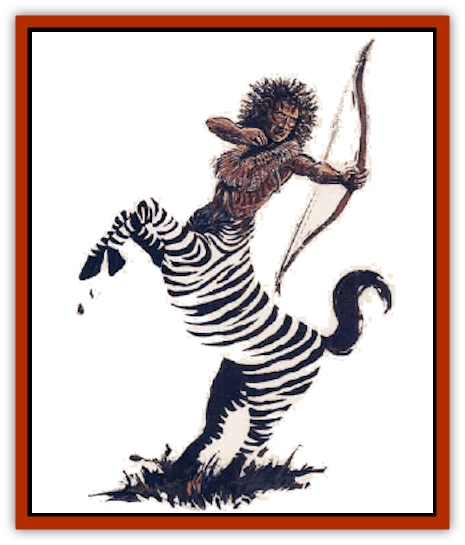

# Centaur-kin - Zebranaur

| Statistic | **Centaur-kin, Zebranaur** |
| --- | --- |
| **Activity Cycle:** | Day |
| **Alignment:** | Neutral |
| **Armor Class:** | 7 |
| **Climate/Terrain:** | Temperate plains |
| **Damage/Attack:** | 1d4/1d4 and weapon |
| **Diet:** | Omnivore |
| **Frequency:** | Very rare |
| **Hit Dice:** | 3+4 |
| **Intelligence:** | Average (8-10) |
| **Magic Resistance:** | Nil |
| **Morale:** | Steady (11-12) |
| **Movement:** | 18 |
| **No. Appearing:** | 2-16 (50-80) |
| **No. of Attacks:** | 1 to 3 |
| **Organization:** | Tribe |
| **Size:** | L (6' and taller) |
| **Special Attacks:** | +1 with bow |
| **Special Defenses:** | Nil |
| **THAC0:** | 17 |
| **Treasure:** | M,Q (I, M&times;10) |
| **XP Value:** | 175 / Chief: 270 / Shaman: 420 |

Zebranaurs have the upper body of a human and the lower body of a zebra. A zebranaur's upper body is normally brown, without the characteristic black-on-white stripes that cover its lower body. Many have a short mane of coarse black bristles running from the middle of the lower back up to the nape of the neck. Most favor a spiky hairstyle, but others prefer the traditional styles of the local humans.

Zebranaurs usually wear an individually embroidered square of supple leather that covers the chest and is tied around the waist and neck with leather thongs. They adorn themselves with jewelry made of wood and bone, using feathers and bright seeds to color their designs. Zebranaurs prize brass and copper jewelry and will trade well-made fringed garments or feathered spears for these items.

Zebranaurs speak the common tongue and may know one or more other spoken languages, but few learn to read or write.

**Combat:** Because of rneir long-standing tradition of bow hunting, all zebranaurs gain a +1 bonus to attack rolls with all bows except crossbows. Not all zebranaurs use bows, however. When a band is encountered, 30% use spears, 20% scimitar and spear, and 30% scimitar and bow. Even if unarmed, zebranaurs can attack with their front hooves for 1d4 points of damage each. Zebranaurs never wear armor.

Zebranaur society does not discriminate against its female members, and females will make up 30% of any encountered band. In a group of more than 10 zebranaurs, there is a 50% chance that the group includes a chief and a shaman.

**Habitat/Society:** Zebranaurs are nomadic by nature, and their temporary camps are well guarded by 8 to 12 zebranaurs armed with scimitars and bows. They are tribal creatures who remain close to nature and are most at home in the wild, much like the humans who live nearest them. Zebranaurs tribes are led by a chief of 4+4 HD and AC 6.

An average tribe numbers 50 to 80 members, including 20% children and 30% females. Males are equally responsible for raising the young, preparing meals, teaching, and performing other traditionally domestic duties.

A tribe usually has one shaman of 4th or 5th level and three or four shamans of 1st to 3rd level. These are most often armed with quarterstaves.

Zebranaurs have an almost photographic memory for abstract designs and shapes. They cannot normally read or write common, but they paint intricately whorled patterns on tanned leather to record their history. The oldest shaman keeps these records safe and passes on the knowledge to the next generation.

Most Zebranaurs paint their upper bodies with dark stripes or patterns, using vegetable dyes to enhance the effect of their camouflaged lower bodies. New markings are added yearly to commemorate achievements, battles, or loves. Some tribes engage in ritual tattooing when foals come of age. One southern tribe has developed this tattooing to a fine art.

**Ecology:** Zebranaurs hunt most types of small game, supplementing this diet win roots and berries. They are more pacifistic than [[Wemic|wemics]], with whom they do not get along very well. If a tribe of wemics moves into their territory, zebranaurs will often move out.

The typical zebranaur life span is 50-60 years.

---
## Discovery & Documentation

**Source Publication:** Monstrous Compendium, 1995 Annual, Volume 2 (1995)
**Campaign Setting:** Advanced Dungeons & Dragons 2nd Edition
**Author(s):** Jon Pickens

### Other Creatures Found in This Source Book
   * [[Aboleth_Savant|Aboleth, Savant]]
   * [[Addazahr|Addazahr]]
   * [[Amiq_Rasol|Amiq Rasol]]
   * [[Arch-Shadow|Arch-Shadow]]
   * [[Automaton_Scaladar|Automaton, Scaladar]]
   * [[Automaton_Trobriand's|Automaton, Trobriand's]]
   * [[Bat_Sporebat|Bat, Sporebat]]
   * [[Beetle_Dragon|Beetle, Dragon]]
   * [[Bi-nou|Bi-nou]]
   * [[Boggle|Boggle]]
   * [[Brownie_Dobie|Brownie, Dobie]]
   * [[Brownie_Quickling|Brownie, Quickling]]
   * [[Cat_Crypt|Cat, Crypt]]
   * [[Cat_Great_Cath_Shee|Cat, Great, Cath Shee]]
   * [[Centaur-kin_Dorvesh|Centaur-kin, Dorvesh]]
   * [[Centaur-kin_Gnoat|Centaur-kin, Gnoat]]
   * [[Centaur-kin_Ha'pony|Centaur-kin, Ha'pony]]
   * [[Chronolily|Chronolily]]
   * [[Curst|Curst]]
   * [[Darktentacles|Darktentacles]]
   * [[Dinosaur_Aquatic|Dinosaur, Aquatic]]
   * [[Dinosaur_II|Dinosaur II]]
   * [[Dinosaur_III|Dinosaur III]]
   * [[Doppelganger_Greater|Doppelganger, Greater]]
   * [[Dragon_Brine|Dragon, Brine]]
   * [[Dragon_Half-|Dragon, Half-]]
   * [[Dragon-kin_Sea_Wyrm|Dragon-kin, Sea Wyrm]]
   * [[Dwarf_Wild|Dwarf, Wild]]
   * [[Ekimmu|Ekimmu]]
   * [[Elemental_Nature|Elemental, Nature]]
   * [[Elf_Winged|Elf, Winged]]
   * [[Fish_Great_Glacier|Fish (Great Glacier)]]
   * [[Fish_Subterranean|Fish, Subterranean]]
   * [[Fish_Toril|Fish (Toril)]]
   * [[Flareater|Flareater]]
   * [[Flumph|Flumph]]
   * [[Froghemoth|Froghemoth]]
   * [[Ghost_Casurua|Ghost, Casurua]]
   * [[Ghost_Ker|Ghost, Ker]]
   * [[Ghul|Ghul]]
   * [[Ghul-Kin|Ghul-Kin]]
   * [[Giant_Half-giant|Giant, Half-giant]]
   * [[Golem_Burning_Man|Golem, Burning Man]]
   * [[Golem_Phantom_Flyer|Golem, Phantom Flyer]]
   * [[Gulguthhydra|Gulguthhydra]]
   * [[Hakeashar|Hakeashar]]
   * [[Horse_Moon-|Horse, Moon-]]
   * [[Human_Dragonslayer|Human, Dragonslayer]]
   * [[Human_Vistana|Human, Vistana]]
   * [[Jellyfish_Giant|Jellyfish, Giant]]
   * [[Kalin|Kalin]]
   * [[Kholiathra|Kholiathra]]
   * [[Laerti|Laerti]]
   * [[Leucrotta_Greater|Leucrotta, Greater]]
   * [[Lich_Suel|Lich, Suel]]
   * [[Lurker_Shadow|Lurker, Shadow]]
   * [[Lycanthrope_Werepanther|Lycanthrope, Werepanther]]
   * [[Lycanthrope_Wereshark|Lycanthrope, Wereshark]]
   * [[Mammal_Herd_II|Mammal, Herd II]]
   * [[Marl|Marl]]
   * [[Meenlock|Meenlock]]
   * [[Mimic_Greater|Mimic, Greater]]
   * [[Mold_II|Mold II]]
   * [[Mummy_Creature|Mummy, Creature]]
   * [[Nyth|Nyth]]
   * [[Ooze_Slime_Jelly_Ghaunadan|Ooze/Slime/Jelly, Ghaunadan]]
   * [[Palimpsest|Palimpsest]]
   * [[Peltast|Peltast]]
   * [[Plant_Dangerous_II|Plant, Dangerous II]]
   * [[Pleistocene_Animal|Pleistocene Animal]]
   * [[Pudding_Subterranean|Pudding, Subterranean]]
   * [[Raggamoffyn|Raggamoffyn]]
   * [[Snake_Serpent|Snake, Serpent]]
   * [[Snake_Serpent_Vine|Snake, Serpent Vine]]
   * [[Sphinx_Draco-|Sphinx, Draco-]]
   * [[Sprite_Seelie_Faerie|Sprite, Seelie Faerie]]
   * [[Sprite_Unseelie_Faerie|Sprite, Unseelie Faerie]]
   * [[Squealer|Squealer]]
   * [[Turtle_Giant|Turtle, Giant]]
   * [[Umpleby|Umpleby]]
   * [[Vizier's_Turban|Vizier's Turban]]
   * [[Wall_Walker|Wall Walker]]
   * [[Webbird|Webbird]]
   * [[Yak-Man|Yak-Man]]
   * [[Zorbo|Zorbo]]
