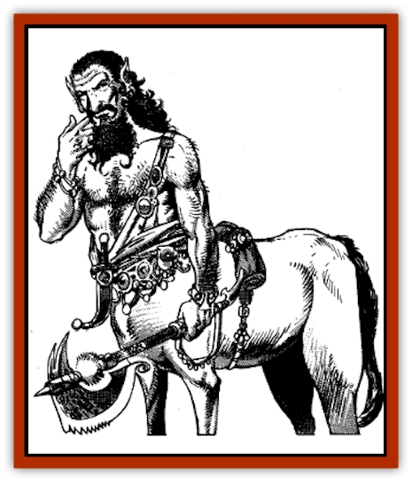

# Centaur - Desert

| Statistic | **Centaur, Desert** |
| --- | --- |
| **Activity Cycle:** | Night |
| **Alignment:** | Neutral or chaotic good |
| **Armor Class:** | 6 |
| **Climate/Terrain:** | Subtropical/desert, grasslands |
| **Damage/Attack:** | 1-4/1-4 and weapon |
| **Diet:** | Omnivore |
| **Frequency:** | Rare |
| **Hit Dice:** | 3 |
| **Intelligence:** | Low to Average (5-10) |
| **Magic Resistance:** | Nil |
| **Morale:** | Elite (13-14) |
| **Movement:** | 21 |
| **No. Appearing:** | 1-8 (70%) or 4-32 (30%) |
| **No. of Attacks:** | 3 |
| **Organization:** | Tribal |
| **Size:** | M (6' tall) |
| **Special Attacks:** | Missile weapons |
| **Special Defenses:** | Nil |
| **THAC0:** | 17 |
| **Treasure:** | M,Q, (D,I,T) |
| **XP Value:** | 120 / Leader: 175 / Priest: 270 |

Desert centaurs are the ultimate fusion of mount and nomadic tribesman - tough, slim, fast and stealthy nighttime raiders who slip into enemies' camps and then depart like shadows before the dawn. They are as reclusive as their [[Centaur|sylvan cousins]], but just as defensive of the lands they claim as their own.

Smaller than a sylvan centaur, they have barrel-like chests (like [[Horse|ponies]]) and the long, thin legs of an antelope. The males generally grow long beards which they elaborately curl and oil into perfect form. The females wear the veil, but take few other cares about their appearance. When traveling they carry their goods in packs or drag them along in litters.

**Combat:** Desert centaurs are always armed, half of them with light lances, the other half with short composite bows and scimitars. In melee they make three attacks each round, two with their sharp hooves for 1-4 points of damage each and one strike with a hand weapon.

Desert centaurs are wary and prefer to strike from a distance whenever possible. They are great at riding forward from ambush to fire missiles and then melting into the sands, only to return later and strike again. They are willing to strike again and again over a period of hours or even days to bring down their prey and their foes. When the final assault comes it is preceded by a hail of arrows and followed up with a full charge of lancers.

**Habitat/Society:** Desert centaurs are most active by night. Their relatively large bodies and rapid movement make it easy for them to overheat and suffer sunstroke when carrying heavy loads, and thus they prefer the cooler nighttime temperatures. In addition, their excellent night vision puts them at an advantage relative to other desert dwellers; they suffer only a -1 attack penalty in darkness, even with missile weapons. They can see clearly up to 200 yards under moonlit conditions.

The territory of a tribe of desert centaurs generally extends across hundreds of miles, and they are glad to steal cattle, [[Camel|camels]], or goats they come across, as they consider domestication of animals a crime. Oddly, they see no contradiction in the fact that they usually immediately butcher and eat the animals they "free" from their owners.

Each tribe has a priestess who functions as a waterfinder and reader of oracles. She has the abilities of a 3rd- to 5th-level kahin. The priestess rules in all matters of justice among tribe members and in all matters of diplomacy with other desert dwellers. She usually speaks several languages other than her own, such as the [[Giant_Zakhara_General_Information|giantish]] trade tongue, the languages of nearby humans, and sometimes even the languages of the [[Debbi|debbi]] or the [[Vishap|vishap]].

Raiding and hunting parties of desert centaurs are led by experienced trackers who have 4 HD but are otherwise identical to their followers. They track as rangers. These leaders make the final decisions as to where the tribe roams and where it raids.

Some desert centaurs serve as caravaneers or caravan guards, usually employed as expert scouts. A few desert centaurs are said to have settled down and irrigated the lands around oases to create rich desert gardens. Although caravan masters and travelers all know this to be true, no one can say where these oases are. The farming desert centaurs either swore their discoverers to silence or subject the non-compliant to some worse fate.

All desert centaurs are polygamous; both males and females may have up to four mates. Generally these families are centered around either a single powerful male or an influential female. With the exception of the priestess, females (also 3 HD) and young (1-3 HD) only fight if directly threatened. They lash out with their hooves for 1-4/1-4 points of damage.

**Ecology:** Desert centaurs are constantly seeking new hunting grounds, new water holes, and new sources of resources for bows and fletchings. They treat human and giantish desert tribes with respect and are willing to make peace or raid them as circumstances demand.

Desert centaurs avoid and fear the [[Genie|genies]]. They rarely enter towns except to trade for goods they cannot produce themselves.

---
## Discovery & Documentation

**Source Publication:** MC13 Al-Qadim Appendix (1992)
**Campaign Setting:** Al-Qadim (Forgotten Realms)
**Author(s):** C. Terry Phillips

### Other Creatures Found in This Source Book
   * [[Ammut|Ammut]]
   * [[Ashira|Ashira]]
   * [[Asuras|Asuras]]
   * [[Black_Cloud_of_Vengeance|Black Cloud of Vengeance]]
   * [[Buraq|Buraq]]
   * [[Camel|Camel]]
   * [[Camel_of_the_Pearl|Camel of the Pearl]]
   * [[Copper_Automaton|Copper Automaton]]
   * [[Debbi|Debbi]]
   * [[Elephant_Bird|Elephant Bird]]
   * [[Gen|Gen]]
   * [[Genie_Noble_Dao|Genie, Noble Dao]]
   * [[Genie_Noble_Djinni|Genie, Noble Djinni]]
   * [[Genie_Noble_Efreeti|Genie, Noble Efreeti]]
   * [[Genie_Noble_Marid|Genie, Noble Marid]]
   * [[Genie_Tasked_Architect_Builder|Genie, Tasked, Architect/Builder]]
   * [[Genie_Tasked_Artist|Genie, Tasked, Artist]]
   * [[Genie_Tasked_Guardian|Genie, Tasked, Guardian]]
   * [[Genie_Tasked_Herdsman|Genie, Tasked, Herdsman]]
   * [[Genie_Tasked_Slayer|Genie, Tasked, Slayer]]
   * [[Genie_Tasked_Warmonger|Genie, Tasked, Warmonger]]
   * [[Genie_Tasked_Winemaker|Genie, Tasked, Winemaker]]
   * [[Ghost_Mount|Ghost Mount]]
   * [[Ghul|Ghul]]
   * [[Giant_Desert|Giant, Desert]]
   * [[Giant_Jungle|Giant, Jungle]]
   * [[Giant_Reef|Giant, Reef]]
   * [[Giant_Zakhara_General_Information|Giant (Zakhara), General Information]]
   * [[Hama|Hama]]
   * [[Heway|Heway]]
   * [[Living_Idol|Living Idol]]
   * [[Lycanthrope_Werehyena|Lycanthrope, Werehyena]]
   * [[Lycanthrope_Werelion|Lycanthrope, Werelion]]
   * [[Markeen|Markeen]]
   * [[Maskhi|Maskhi]]
   * [[Mason_Wasp_Giant|Mason Wasp, Giant]]
   * [[Nasnas|Nasnas]]
   * [[Pahari|Pahari]]
   * [[Rom|Rom]]
   * [[Sabu_Lord|Sabu Lord]]
   * [[Sakina|Sakina]]
   * [[Serpent_Lord|Serpent Lord]]
   * [[Serpent_Winged|Serpent, Winged]]
   * [[Silat|Silat]]
   * [[Simurgh|Simurgh]]
   * [[Stone_Maiden|Stone Maiden]]
   * [[Vishap|Vishap]]
   * [[Zaratan|Zaratan]]
   * [[Zin|Zin]]
