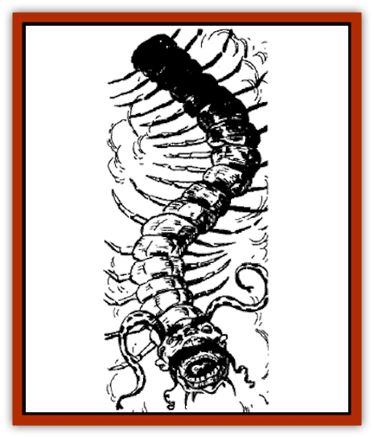

# Centipede - Spirit

| Statistic | **Greater** | **Least** | **Lesser** |
| --- | --- | --- | --- |
| **Activity Cycle:** | Any | Any | Any |
| **Alignment:** | Neutral | Neutral | Neutral |
| **Armor Class:** | 5 | 9 | 7 |
| **Climate/Terrain:** | Any nonarctic land | Any nonarctic land | Any nonarctic land |
| **Damage/Attack:** | 1-4 | 1 | 1-2 |
| **Diet:** | Special | Special | Special |
| **Frequency:** | Very rare | Very rare | Very rare |
| **Hit Dice:** | 5+5 | 1+5 | 3+5 |
| **Intelligence:** | Average (8-10) | Semi- (2-4) | Low (5-7) |
| **Magic Resistance:** | 25% | 10% | 15% |
| **Morale:** | Average (10) | Unsteady (5) | Average (8) |
| **Movement:** | See below | See below | See below |
| **No. Appearing:** | 1 | 1 | 1 |
| **No. of Attacks:** | 1 | 1 | 1 |
| **Organization:** | Solitary | Solitary | Solitary |
| **Size:** | S (4' long) | T (6&rdquo; long) | T (1' long) |
| **Special Attacks:** | Fog cloud | Fog cloud | Fog cloud |
| **Special Defenses:** | Nil | Nil | Nil |
| **THAC0:** | 15 | 19 | 17 |
| **Treasure:** | Nil | Nil | Nil |
| **XP Value:** | 975 | 120 | 270 |

The spirit [[Centipede|centipede]] is a poisonous shapeshifter that frequently administers punishments on behalf of the Celestial Bureaucracy. The creature resembles an enormous centipede about 4 feet long, complete with a segmented body, multiple legs, and two long feelers. However, it has a human face with a bald head, bushy moustache, and nine eyes evenly distributed about its head. The chitinous shell covering the length of its body alternates segments of green, scarlet, and silver.

The spirit centipede can utter simple phrases in trade language, as well as in languages common to the area it inhabits.

**Combat:** The greater spirit centipede can freely shapeshift between five forms, each representing one of the Five Venoms originally identified by the great Wa scholar Hujiiko Jiriki (centipede, [[Scorpion|scorpion]], [[Snake|snake]], [[Spider|spider]], and [[Toad_Giant|toad]]). Shapeshifting requires one full round, during which the centipede can take no other actions.

All five forms are about the same color and size. The creature also retains its Armor Class, hit points, and other attributes. Each form can bite or sting to inflict 1-4 hit points of damage. Additionally, each can cough up a black fog cloud with a 15' diameter.

As detailed below, movement rates and black cloud attacks vary between forms. Though the centipede can shapeshift an unlimited of times per day, it only can use a given fog cloud attack three times per day. Victims must contact the cloud to suffer its effects. (The creature itself is immune.) All effects are cumulative.

**Centipede.** Movement rate: 18. Fog cloud: Victims must save vs. paralyzation or become immobile for the next 2-8 (2d4) rounds.

**Scorpion.** Movement rate: 12. Fog cloud: Victims must save vs. spells. Failure means their vision is blurred for the next 2-8 (2d4) rounds. During that time, they suffer a -4 penalty to all to-hit rolls.

**Snake.** Movement rate: 15. Fog cloud: Victims suffer 1-10 hit points of poison damage. A successful saving throw vs. poison cuts this damage in half.

**Spider.** Movement rate: 18. Fog cloud: Victims are affected as if by a *pain* spell (Dexterity and Strength are reduced to 3, -3 penalty on to hit rolls, -1 on damage rolls, -3 on reaction attacking adjustment, +4 on reaction defensive adjustment) for the next 2-8 (2d4) rounds. A successful saving throw vs. spells negates this effect.

**Toad.** Movement rate: 9. Fog cloud: Victims immediately fall into a deathlike coma for 1-6 turns. A successful saving throw vs. death magic negates this effect.

**Habitat/Society:** Spirit centipedes have no permanent lairs. They roam from place to place in search of food, or travel as directed by the Celestial Bureaucracy to punish heretics or the unworthy.

**Ecology:** All spirit centipedes can eat most inorganic objects, but they have a special taste for minerals. When freely given, and kept in an earthenware jar inside a building, a scale from a greater spirit centipede has the same properties as a *charm of protection from disease*.

**Lesser Spirit Centipede**

The lesser spirit centipede is a smaller version of the greater spirit centipede, with a few changes. Its chitinous shell is entirely black. Its shapeshifting is limited to three forms, which move more slowly than noted above: centipede (MV 12), snake (MV 9), and toad (MV 6). Its fog clouds work the same, except the region of effect is reduced to a 10-foot diameter. Regardless of its current form, if a lesser spirit centipede crawls over the body of an ailing person, it mimics a *cure disease* spell.

**Least Spirit Centipede**

The least spirit centipede is a small version of the lesser spirit centipede, with a few changes. Its chitinous shell is entirely white. It can shapeshift only between two forms with these movement rates: centipede (MV 6) and toad (MV 3). Its fog clouds work the same, except the diameter of the cloud is reduced to 5 feet. A spirit centipede may give us its reincarnation as a favor or to repay a debt of honor. When it dies under these conditions, the creature's body turns to brass. The brass body works as a *charm of protection from spirits* when hung inside a building.

---
## Discovery & Documentation

**Source Publication:** MC6 Kara-Tur Appendix (1990)
**Campaign Setting:** Kara-Tur (Forgotten Realms)
**Author(s):** Rick Swan

### Other Creatures Found in This Source Book
   * [[Bajang|Bajang]]
   * [[Bakemono|Bakemono]]
   * [[Bisan|Bisan]]
   * [[Buso|Buso]]
   * [[Carp_Giant|Carp, Giant]]
   * [[Chu-u|Chu-u]]
   * [[Con-tinh|Con-tinh]]
   * [[Doc_cu'o'c|Doc cu'o'c]]
   * [[Duruch'i-lin|Duruch'i-lin]]
   * [[Flame_Spirit|Flame Spirit]]
   * [[Foo_Creature|Foo Creature]]
   * [[Gaki|Gaki]]
   * [[Gargantua|Gargantua]]
   * [[Goblin_Rat|Goblin Rat]]
   * [[Hai_Nu|Hai Nu]]
   * [[Hannya|Hannya]]
   * [[Hengeyokai|Hengeyokai]]
   * [[Hsing-sing|Hsing-sing]]
   * [[Hu_Hsien|Hu Hsien]]
   * [[Human_Kara-Tur|Human (Kara-Tur)]]
   * [[Ikiryo|Ikiryo]]
   * [[Jishin_Mushi|Jishin Mushi]]
   * [[Kala|Kala]]
   * [[Kaluk|Kaluk]]
   * [[Kappa|Kappa]]
   * [[Korobokuru|Korobokuru]]
   * [[Krakentua|Krakentua]]
   * [[Kuei|Kuei]]
   * [[Memedi|Memedi]]
   * [[Men-shen|Men-shen]]
   * [[Nat|Nat]]
   * [[Ningyo|Ningyo]]
   * [[Oni|Oni]]
   * [[P'oh|P'oh]]
   * [[P'oh_Gohei|P'oh, Gohei]]
   * [[Shan_Sao|Shan Sao]]
   * [[Shirokinukatsukami|Shirokinukatsukami]]
   * [[Spirit_Folk|Spirit Folk]]
   * [[Spirit_Nature|Spirit, Nature]]
   * [[Spirit_Stone|Spirit, Stone]]
   * [[Tako|Tako]]
   * [[Tengu|Tengu]]
   * [[Wang-Liang|Wang-Liang]]
   * [[Yuan-ti_Histachii|Yuan-ti, Histachii]]
   * [[Yuki-on-na|Yuki-on-na]]
