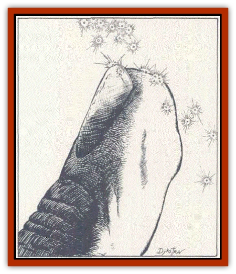

# Cerebral Parasite

| Statistic | **Cerebral Parasite** |
| --- | --- |
| **Activity Cycle:** | Any  |
| **Alignment:** | Neutral  |
| **Armor Class:** | Nil |
| **Climate/Terrain:** | Any/Any |
| **Damage/Attack:** | 0 |
| **Diet:** | Psionic Energy  |
| **Frequency:** | Rare  |
| **Hit Dice:** | Nil |
| **Intelligence:** | Non- (0)  |
| **Magic Resistance:** | Nil |
| **Morale:** | Nil |
| **Movement:** | Nil |
| **No. Appearing:** | 3d4 |
| **No. of Attacks:** | 0 |
| **Organization:** | Infestation  |
| **Size:** | T (flea-sized) |
| **Special Attacks:** | Psionic |
| **Special Defenses:** | Only affected by <i>cure disease</i> |
| **THAC0:** | Nil |
| **Treasure:** | Nil  |
| **XP Value:** | 35 |

**Psionics Summary**

| Level | Dis/Sci/Dev | Attack/Defense | Score | PSPs |
| --- | --- | --- | --- | --- |
| 1 | 2/1/2 | Nil/Nil | 18 | unlimited |

**Psychometabolism -** *Devotions:* ectoplasmic form, immovability

**Telepathy -** *Sciences:* probability travel

These tiny psionk parasites float about in the air. Colorless and nearly transparent, they cannot be seen by the human eye. They drift in the wind until they come across a psionic being. Then they attach themselves to the host's aura, and slowly drain psionic strength.

**Combat:** A cerebral parasite's attack is so subtle that a victim may not notice it for some time. When a psionically endowed individual comes within l fool o a parasite, the creature is mysteriously drawn to the characters (or monster's) aura. and attaches itself. This initial "attack'' usually will go completely unnoticed

Only a few psionic powers can detect cerebral parasites: aura sight, life detection, and psionic !iense. Magical spells which detect invisible or hidden objects are also effecthre. Of course, the infested host may realize that something is wrong when he uses his psionic powers.

Each time the victim uses a psionic power, the power costs 1 extra PSP for each parasite infesting an individual's aura. The power still works normally but tne parasite absorbs the extra PSP. After a particular parasite has absorbed 6 psionk points in this fashion, it can reproduce by splitting in two. Of course, both parasites will now feed. and the process continues. Eventually the victim may not have enough PSPs to feed the parasites when using a given power; in that case, the power fails.

Only two methods can rid a victim of cerebral parasites: 1) a *cure disease* spell or 2) refraining from spending PSPs until the threat of starvation forces the parasites to leave Each day the victim refrains from spending PSPs, there is a 1 % cumulative chance {95% maximum) that each parasite will detach itself. Since this check is made individually for each parasite, a heavily infested victim is not likely to shake all the pests un1ess he refrains from using his powers for three or four months.

**Habitat/Society:** Psionic parasites, as these infestation are often called, have existed ever since psionicists have been around. Sages claim that an ancient sect of wizards created the parasites to rid the planes o "false mages" -i.e., psionicists. Of course, this tale is very popular even today among most wizards, but its validity is uncertain. The parasites' ability to enter the astral and ethereal planes does lend credence to this theory, however. (Entering the ethereal plane is an innate ability. They use probability travel to enter the astral plane.)

Every 15 years, a plague of cerebral parasites infests the prime material plane. Their frequency becomes common and 4d8 will be encountered at once. Psionicists dread this time, and call it "the year of weakness."

**Ecology:** Cerebral parasites, if captured, make a wonderful weapon to use against psionicists. The only problem is that they can eventually escape even the mosl tightly sealed jar. Each has a 1 % cumulative chance of leaving the jar per day. Within several months, few if any will remam. Of course, this is because most of them will have left to search for food. Still, even a month of two of security is enough to prompt many to search the winds for these little clear specks.

---
## Discovery & Documentation

**Source Publication:** PHBR5 The Complete Psionics Handbook (1990)
**Campaign Setting:** Advanced Dungeons & Dragons 2nd Edition
**Author(s):** Blake Mobley, Andria Hayday, Steve Winter

### Other Creatures Found in This Source Book
   * [[Baku|Baku]]
   * [[Brain_Mole|Brain Mole]]
   * [[Intellect_Devourer_Larva_Ustilagor|Intellect Devourer, Larva (Ustilagor)]]
   * [[Intellect_Devourer|Intellect Devourer]]
   * [[Shedu|Shedu]]
   * [[Su-Monster|Su-Monster]]
   * [[Thought_Eater|Thought Eater]]
   * [[Vagabond|Vagabond]]
