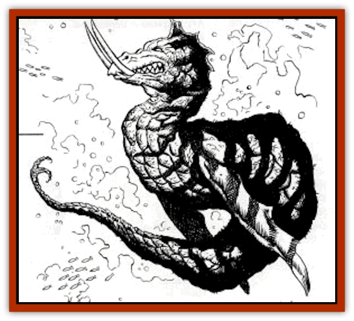

# Cetus - Lesser

| Statistic | **Cetus, Lesser** |
| --- | --- |
| **Activity Cycle:** | Day |
| **Alignment:** | Chaotic evil |
| **Armor Class:** | 1 |
| **Climate/Terrain:** | Subtropical/tropical seas |
| **Damage/Attack:** | 4-24 |
| **Diet:** | Carnivore |
| **Frequency:** | Very Rare |
| **Hit Dice:** | 13 |
| **Intelligence:** | Low (6) |
| **Magic Resistance:** | Nil |
| **Morale:** | Champion (16) |
| **Movement:** | 3, Swim 18 |
| **No. Appearing:** | 1 |
| **No. of Attacks:** | 1 |
| **Organization:** | Solitary |
| **Size:** | G (60' long) |
| **Special Attacks:** | Swallow whole |
| **Special Defenses:** | Immune to petrification |
| **THAC0:** | 7 |
| **Treasure:** | H,S,T |
| **XP Value:** | 8,000 |

A cetus resembles a thick-bodied serpent with a head that resembles a cross between a serpent's and a hound's Protruding from this head, however, are a pair of 10' ivory tusks. Its body is ringed in dark red and blue-green stripes, and it has both a blood-red crest on its head and a pair of vestigial fins up front of the same color. Its scales are so tightly packed as to resemble full plate armor.

**Combat:** The cetus has two attack forms, both of which inflict 4-24 hp damage to the target: a thrusting attack with the tusks or a lash of the powerful tail. So large and clumsy is this monster that only one of these attacks can be made at a time; it cannot thrust and lash out at once, even with a foe at either end of it. It may also swallow creatures of up to Size L whole on an attack roll of 18 or better, provided the attack roll is sufficient to hit. The initial swallowing attack causes no damage, but each round afterward, the victim suffers 1—6 hp damage from the creature's digestive fluids. Since it takes up to 10 rounds to cut open a dead cetus, the victim's chances of rescue are slim at best. The lesser cetus is also given a special defense besides its armor: it is immune to petrification-based attacks.

**Habitat/Society:** These creatures live alone, save for brief moments in the mating season. Even females abandon their eggs after laying them, burying them 50' deep in the sand in the most desolate and uninhabited wastes for added protection. A cetus lays 1-4 eggs at a time, and these take 6 months to hatch.

**Ecology:** Like a regular dragon, the cetus can eat anything to survive, even rock, and thus does not have a balanced place in the ecology of the ocean. Its only enemies are [[Dragon_Turtle|dragon turtles]]  and other aquatic dragons, the largest giant [[Shark|sharks]] and [[Whale|whales]], the occasional [[Squid_Giant|kraken]], and adventurers bold enough to hunt it. [[Turtle_Giant|Giant sea turtles]], [[Crocodile|giant crocodiles]], and the various forms of aquatic dragon life dig up cetus eggs on the beach whenever they can.

The cetus seems like a destructive force of nature when suitable nesting places for the eggs and young grow scarce. In general, this happens when expanding human, demihuman, or humanoid populations cover the local beaches with settlements, making solitary egg-laying missions impossible. The successful mass hunting of eggs by local authorities or bands of adventurers can also bring about this dilemma; the eggs are just too difficult to find. Whenever the inability to find secure nesting sites places the race's future in jeopardy, ceti from all over the world instinctively congregate on the inhabited area farthest removed from the major centers of civilization. Once there, they use their considerable powers to see to it that the area in question is no longer an inhabited area. Whenever possible, the targeted area will be an island; failing that, it will be a peninsula, preferably one connected to the mainland by a narrow neck of land that can easily be blocked. The monsters attack from all sides at once, using weight of numbers to surround the target and nullify the disadvantage of their slow speed.

A cetus' tusks are worth 4,000 gp each. This high value is due not merely to their size but also to their magical nature. Cetus tusks may be used to fashion any magical item made of ivory, such as the ivory cube used in making a *cube of force*, a *cube of frost resistance*, or the Ivory Goats version of *figurines of wondrous power*. The creature's hide may also be used to create a suit of armor equivalent to magical full or field plate *armor +1*.

---
## Discovery & Documentation

**Source Publication:** Dragon248 (1998)
**Campaign Setting:** Dragon Magazine
**Author(s):** Gregory W. Detwiler, Terry Dykstra

### Other Creatures Found in This Source Book
   * [[Amphitere|Amphitere]]
   * [[Dragonet|Dragonet]]
   * [[Dragon_Orange_Sodium|Dragon, Orange (Sodium)]]
   * [[Dragon_Purple_Energy|Dragon, Purple (Energy)]]
   * [[Dragon_Yellow_Salt|Dragon, Yellow (Salt)]]
   * [[Gargouille|Gargouille]]
   * [[Hai_Riyo|Hai Riyo]]
   * [[Peluda|Peluda]]
   * [[Sirrush|Sirrush]]
   * [[Vore_Lekiniskiy_Master_Fire_Worm|Vore Lekiniskiy, Master Fire Worm]]
