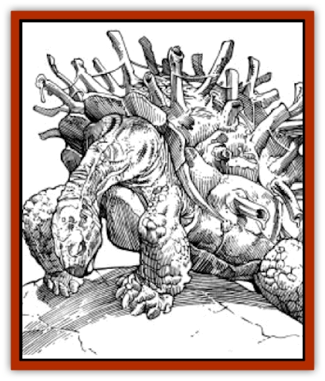

# Cha'thrang

| Statistic | **Cha'thrang** |
| --- | --- |
| **Activity Cycle:** | Any |
| **Alignment:** | Neutral |
| **Armor Class:** | -2 shell, 8 underbelly |
| **Climate/Terrain:** | Sandy wastes, stony barrens, and rocky badlands |
| **Damage/Attack:** | 1-4/1-4/1-12 |
| **Diet:** | Carnivore |
| **Frequency:** | Rare |
| **Hit Dice:** | 8+3 |
| **Intelligence:** | Animal (1) |
| **Magic Resistance:** | Nil |
| **Morale:** | Average (8) |
| **Movement:** | 3 |
| **No. Appearing:** | 3 |
| **No. of Attacks:** | 3 |
| **Organization:** | Trine |
| **Size:** | M (6' long) |
| **Special Attacks:** | Tethered darts |
| **Special Defenses:** | Camouflage, withdrawal |
| **THAC0:** | 11 |
| **Treasure:** | See below |
| **XP Value:** | 2,000 |

At first glance a cha'thrang appears to be a patch of broken bamboo - until it moves.

The cha'thrang is a tortoise-shaped creature with a multitude of short, reed-like appendages protruding from its shell. Dirty brown in color, the cha'thrang is frequently mistaken for a patch of dead plant growth. It has four strong limbs and curved foreclaws for digging and hugging the ground. The protrusions on the cha'thrang's shell are actually hollow, bone-like appendages. The creature secretes an alkaline lime from its back that creates its shell, which grows in size with the creature. A thin, sinewy fiber is also produced that enables the creature to adhere to the underside of the shell.

**Combat:** The cha'thrang will lie motionless for several hours until a low-flying creature passes overhead. While waiting, the cha'thrang forces an air pocket between its body and its shell. When an appropriate target flies within 50 yards, it expels that air up through the hollow, bone protrusions with a tremendous blast and "fires" tethered, lime-coated projectiles at the flying creature. While many are fired at once, only one projectile can hit the target, and if it does, it inflicts 1d6 damage. On a successful hit, the target must save vs poison to avoid the toxic effect of the lime on the tethers. (The lime is poison type A and does 15 points of damage if the save versus poison fails; no poison damage is taken if the save is successful.) The poison takes 10-30 rounds to take effect. Meanwhile, the victim is locked in a battle of strength against the cha'thrang to remain aloft. The cha'thrang immediately begins to dig into the ground to keep from being pulled or dragged by its flying prey. The sinewy tethers are very tough to break. (Successful bend bars/lift gates to break; for other creatures, huge and gargantuan flyers can break it automatically, man-sized can break it with a successful save versus paralyzation, and smaller flyers cannot break it.) Having tethered its prey, the cha'thrang now waits patiently for its victim to tire and land. Once the target lands, the cha'thrang turns and crawls along its own cord toward the prey. Thus, even if the victim attempts to fly away again, it has less cord to use. Eventually the cha'thrang captures and rends the victim to pieces with its powerful jaws (1d12). The cha'thrang can fire darts 1d4 times per day. The tethered cord is broken and discarded after each firing.

Because the hollow spines of the cha'thrang point upwards, they have only their foreclaws (1d3), bite (1d12), and the protection of their shells to defend themselves against attacks from ground-dwelling creatures. For this and other reasons, the cha'thrang almost never travel alone.

**Habitat/Society:** Cha'thrang travel in clusters of three called trines. Trines are usually composed of two females and one male. They live in loose-knit extended families, adopting other cha'thrang that they meet, and later breaking off into trines. Cha'thrang have difficulty mating and often die in the process. A single female will lay a single clutch of 1-6 eggs each year. Small predators devour most of the offspring before they are old enough to defend themselves. Cha'thrang can live hundreds of years, but they are usually killed by hungry enemies.

**Ecology:** The sinewy cord the cha'thrang uses to tether its prey is highly sought after to make rope. A single, dry strand will easily hold 50 pounds of weight. By braiding several cords, a thin but very strong rope can be crafted. Discarded strands vary in length from 20-50 (1d4+1 x10) yards each. Some desert traders will move between two or more separate trines of cha'thrang, collecting the spent cord.

Cha'thrang can be eaten if special care is taken in the preparation of the creature's flesh. If lime from the shell undercoating is used to cover the meat, that meat can be preserved for weeks without fear of spoilage. However, great care must be exercised in washing and cleaning the meat before eating it to insure that all of the toxic lime has been removed.

---
## Discovery & Documentation

**Source Publication:** MC12 Dark Sun Appendix I - Terrors of the Desert (1991)
**Campaign Setting:** Dark Sun
**Author(s):** Tom Prusa, Louis J. Prosperi, Walter M. Baas

### Other Creatures Found in This Source Book
   * [[Animal_Herd_Athas|Animal, Herd (Athas)]]
   * [[Animal_Household_Athas|Animal, Household (Athas)]]
   * [[Antloid_Desert|Antloid, Desert]]
   * [[Banshee_Dwarf|Banshee, Dwarf]]
   * [[Beetle_Agony|Beetle, Agony]]
   * [[Bog_Wader|Bog Wader]]
   * [[Brambleweed|Brambleweed]]
   * [[B'rohg|B'rohg]]
   * [[Burnflower|Burnflower]]
   * [[Cat_Psionic|Cat, Psionic]]
   * [[Cistern_Fiend|Cistern Fiend]]
   * [[Clam_Giant|Clam, Giant]]
   * [[Cloud_Ray|Cloud Ray]]
   * [[Drake_Athas_Air|Drake (Athas), Air]]
   * [[Drake_Athas_Earth|Drake (Athas), Earth]]
   * [[Drake_Athas_Fire|Drake (Athas), Fire]]
   * [[Drake_Athas_Water|Drake (Athas), Water]]
   * [[Dune_Runner|Dune Runner]]
   * [[Dune_Trapper|Dune Trapper]]
   * [[Elemental_Athas_Greater_Air|Elemental (Athas), Greater, Air]]
   * [[Elemental_Athas_Greater_Earth|Elemental (Athas), Greater, Earth]]
   * [[Elemental_Athas_Greater_Fire|Elemental (Athas), Greater, Fire]]
   * [[Elemental_Athas_Greater_Water|Elemental (Athas), Greater, Water]]
   * [[Elemental_Athas_Lesser_Air_Earth|Elemental (Athas), Lesser, Air/Earth]]
   * [[Elemental_Athas_Lesser_Fire_Water|Elemental (Athas), Lesser, Fire/Water]]
   * [[Elemental_Athas_General_Information|Elemental (Athas), General Information]]
   * [[Erdland|Erdland]]
   * [[Esperweed|Esperweed]]
   * [[Flailer|Flailer]]
   * [[Floater|Floater]]
   * [[Giant_Athas|Giant (Athas)]]
   * [[Golem_Athas_I|Golem (Athas) I]]
   * [[Golem_Athas_II|Golem (Athas) II]]
   * [[Golem_Athas_III|Golem (Athas) III]]
   * [[Golem_Athas_General_Information|Golem (Athas), General Information]]
   * [[Halfling_Renegade|Halfling, Renegade]]
   * [[Hej-kin|Hej-kin]]
   * [[Id_Fiend|Id Fiend]]
   * [[Insect_Swarm_Athas|Insect Swarm (Athas)]]
   * [[Kank_Wild|Kank, Wild]]
   * [[Kirre|Kirre]]
   * [[Megapede|Megapede]]
   * [[Mul_Wild|Mul, Wild]]
   * [[Nightmare_Beast|Nightmare Beast]]
   * [[Plant_Carnivorous_Athas|Plant, Carnivorous (Athas)]]
   * [[Pterran|Pterran]]
   * [[Pterrax|Pterrax]]
   * [[Pulp_Bee|Pulp Bee]]
   * [[Pyreen|Pyreen]]
   * [[Rasclinn|Rasclinn]]
   * [[Razorwing|Razorwing]]
   * [[Roc_Athas|Roc (Athas)]]
   * [[Sand_Bride|Sand Bride]]
   * [[Sand_Cactus|Sand Cactus]]
   * [[Sand_Vortex|Sand Vortex]]
   * [[Scrab|Scrab]]
   * [[Silt_Horror|Silt Horror]]
   * [[Silt_Runner|Silt Runner]]
   * [[Sink_Worm|Sink Worm]]
   * [[Sloth_Athas|Sloth (Athas)]]
   * [[So-ut|So-ut]]
   * [[Spider_Cactus|Spider Cactus]]
   * [[Spider_Crystal|Spider, Crystal]]
   * [[Spirit_of_the_Land|Spirit of the Land]]
   * [[T'Chowb|T'Chowb]]
   * [[Thrax|Thrax]]
   * [[Tohr-kreen_I|Tohr-kreen I]]
   * [[Villichi|Villichi]]
   * [[Zhackal|Zhackal]]
   * [[Zombie_Plant|Zombie Plant]]
