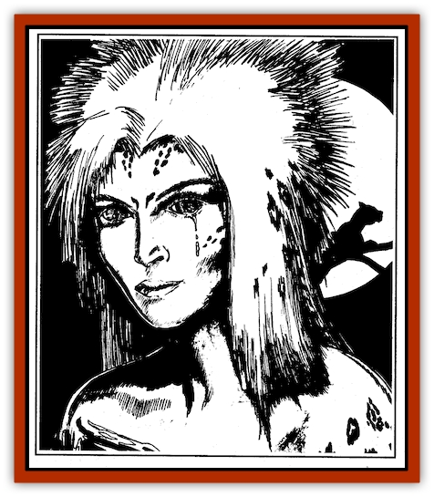
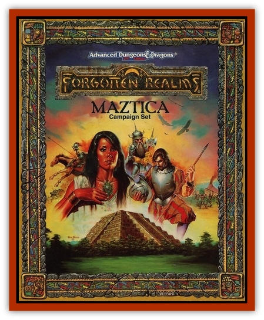

# Chac

| Statistic | **Chac** |
| --- | --- |
| **Activity Cycle:** | Any |
| **Alignment:** | Lawful neutral |
| **Armor Class:** | 4 |
| **Climate/Terrain:** | Mountain caves |
| **Damage/Attack:** | 1-3/1-3/1-3 |
| **Diet:** | Special |
| **Frequency:** | Very rare |
| **Hit Dice:** | 5 |
| **Intelligence:** | Very to high (11-14) |
| **Magic Resistance:** | 30% |
| **Morale:** | Steady (11-12) |
| **Movement:** | 12, Fl 12 |
| **No. Appearing:** | 1-4 |
| **No. of Attacks:** | 3 |
| **Organization:** | Clan |
| **Size:** | M (5-7' tall) |
| **Special Attacks:** | See below |
| **Special Defenses:** | See below |
| **THAC0:** | 15 |
| **Treasure:** | Special |
| **XP Value:** | 1,400 |

Chacs look much like slender [[Cat_Great|jaguars]]. They generally travel on all fours, but they may assume a bipedal stance as well where upon they look much like [[Lycanthrope_Werejaguar|werejaguars]].

These spirits help control the rains in Maztica. From their cave lairs high in the mountains, they send rain out to the countryside. Those rare people who see a chac will observe tears trickling incessantly down its cheeks. This is not from any kind of sadness, but rather a sign of the creature's aquatic affinities.

Chacs are associated with a certain color, depending on where they live. Those in northern Maztica are associated with blue, those in the east with black, those in the south with red, and those in the west with yellow. Chacs in central Maztica are associated with green. A chac's eyes are of the appropriate color, and when one assumes gaseous form the mist is tinted with that same color. Thus, a chac in southern Maztica has red eyes, and its mist is reddish.

**Combat:** Chacs always seek to avoid combat, fighting only if they are threatened and no escape is possible. They possess magical abilities which they will use to protect themselves if need be. A chac can cast spells as if it were a 5th level priest of Azul, but can cast only water-related spells from the elemental sphere. In addition, they can cast *weather summoning* once per week, and *assume gaseous form* (as per the potion) four times per day.

**Habitat/Society:** These creatures are nonviolent by nature, preferring to use their magical powers to govern the weather near their lairs. Though they use spells as if they were priests of Azul, only half are actually servants of the Giver of Rain and Taker of Breath. Those that serve Azul directly have evil tendencies, and some of these share lairs with [[Dragon_Maztica|rain dragons, or tlalocoatl]]. Most chacs may be appeased by local natives through gifts of food, while evil members of their race, especially those living with tlalocoatls, often demand a sacrifice of some sort.

If more than one chac is encountered, it will usually be a family group; with one male, one female, and one or two offspring (equal chance of either sex). Chacs have an elaborate mating ritual, involving merging essences while in gaseous form. The birth of a baby chac takes place a year later, and is often celebrated by all nearby chacs, who gather and produce a tremendous rainstorm.

Chacs tend to live long lives, some reaching ages of 100 years or more. A young chac stays with its parents until it reaches maturity (about five years). The death of a chac is generally followed by a drought of 1-4 weeks in length while nearby chacs are mourning, though some droughts last longer or are influenced by tlalocoatls.

Chacs are very shy and reclusive, and almost always avoid direct contact with intelligent humanoid life. Too many of their legends tell of chacs being captured by humans and harmed if they refused to produce rain in accordance with the whims of their captors. If a chac is captured, and other chacs find the identities of the offenders, they bring their combined powers to bear on the perpetrators, causing flooding or drought until the offenders release the prisoner and atone for their actions.

**Ecology:** Chacs eat a combination of things, including meat and cocoa beans, but water is their main source of nourishment.

Chacs always have a hoard of 100-1000 cocoa beans in their lair, and they use the beans to produce a chocolate drink of which they are very fond. Chacs also collect art objects, especially carved jade and turquoise, but rarely of gold or other metal. A typical chac lair contains art pieces worth 200-800 gq.

Chacs have no natural enemies, and they get along with most denizens of their areas. However, a rain dragon will sometimes attack a chac to gain the moisture in its body. The rare humans who find chacs will sometimes seek to capture it, thinking to thus gain control over the rains.

Chac skin may be used as a material component for *potions of gaseous form* or *sweetwater*, while their claws are useful for some forms of hishna magic.

---
## Discovery & Documentation

**Source Publication:** Maztica (boxed set) (1998)
**Campaign Setting:** Maztica (Forgotten Realms)
**Author(s):** Douglas Niles

### Other Creatures Found in This Source Book
   * [[Jagre|Jagre]]
   * [[Kamatlan|Kamatlan]]
   * [[Plumazotl|Plumazotl]]
