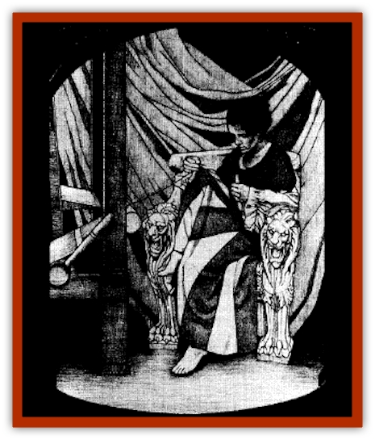

# Changeling - Kin

| Statistic | **Changeling (Kin)** |
| --- | --- |
| **Activity Cycle:** | Night |
| **Alignment:** | Neutral or as Arak |
| **Armor Class:** | 10 |
| **Climate/Terrain:** | The Shadow Rift |
| **Damage/Attack:** | 1d6 or better |
| **Diet:** | Faerie food |
| **Frequency:** | Uncommon |
| **Hit Dice:** | 3+2 |
| **Intelligence:** | Average (8-10) |
| **Magic Resistance:** | Nil |
| **Morale:** | Fearless (19-20) |
| **Movement:** | 9 or better |
| **No. Appearing:** | 1 or 2d6 |
| **No. of Attacks:** | 1 or more |
| **Organization:** | Solitary or Pack |
| **Size:** | M (6' tall) |
| **Special Attacks:** | Varies |
| **Special Defenses:** | Immune to <i>charm</i> and <i>hold</i> spells |
| **THAC0:** | 17 |
| **Treasure:** | Nil |
| **XP Value:** | 35 and up |

Changelings are people who have fallen under the spells of the [[Arak_General_Information|shadow elves]]. When an Arak creates a changeling, he or she takes the person's shadow, leaving behind the body, which continues to perform its daily duties in an imitation of its former existence. These husks all wear distant, glazed expressions, like sleepwalkers, and their eyes seem remote and dull, showing no spark of intelligence or imagination. In fact, these empty shells will not even defend themselves if attacked. In domains like Tepest and Nova Vaasa, these husks are known by many names; the most common of these are the elf-shot and shadow-reft.

The removed shadow (or changeling) lives on in the Shadow Rift, working to further perfect its craft and serve the Arak. In fact, the changeling is so completely engrossed in its work that it rarely thinks of anything else.

Changelings are drawn from all walks of life, with their dress and mannerisms dictated by their origins. These creatures know any languages that they knew in life, although they speak in flat tones with no hint of emotion.

**Combat:** Few changelings have any interest or skill in combat, except those transformed by the muryan, teg, or powrie. Most take no action to defend themselves even when attacked. The special abilities of the most common breeds of changelings are presented later in this entry. The numbers are given represent "unaligned" changelings; for those claimed by one of the Nine Breeds, use the ones detailed below as models.

**Habitat/Society:** Changelings are created by the various races of Arak. While most men and women would consider the transformation into a changeling a curse, the shadow elves view it as a reward.

The process by which a changeling is created robs it of all personality and imagination. Only the characteristics relating to its craft remain unaffected. Because of this removal of all distractions, the quality of a changeling's work exceeds that of a normal human. At the very least, an item created by a changeling is worth three times the value of a similar object made by a master craftsman. A changeling weaponsmith, for example, makes swords so perfect that they are treated as +2 weapons (although they lack any magical enchantment).

Shadow elves cannot create a changeling unless the participant gives his or her consent through willingly eating faerie food. It is worth noting that almost all Arak believe they are doing these folk a favor by transforming them and cannot understand why anyone would pass up the chance to leave their dull, brief mortal lives behind to come and live with the shadow elves. They look upon the process as a means of making a master craftsman even more skillful. While this is certainly true, the cost generally outweighs the benefits.

**Ecology:** To create a changeling, an Arak must sever the subject's shadow from his or her body. This process requires the subject's consent, which is typically given through eating faerie food. (Tepestani refer to this morsel as "faerie cake") The mortal need not understand the consequences of this act for it to take effect.

Shortly after someone takes a bite of faerie cake, he of she becomes drowsy and falls asleep. While in this magical slumber, the shadow elf illuminates the area with a magical black candle and sprinkles the body with ebony-colored dust. As the dust drifts down over the sleeping victim, the Arak slices off his or her shadow with a silver sickle and packs it into a small sack.

Before the candle burns down completely (which takes roughly five hours), the freshly harvested shadow must be taken into the Shadow Rift. If the candle is extinguished, either intentionally or through the passing of time, the stolen shadow returns immediately to its owner. While the candle burns, the victim cannot be awakened; only snuffing the flame restores consciousness.

As soon as the shadow is brought across the borders of the Arak kingdom, it assumes the shape of the person from whom it was cut. In that instant, back in the mortal world the candle flame flickers out and the victim's body rises, zombielike, to go about his or her daily affairs. The being that was formerly a mere shadow then comes to life, immediately ready to carry out the instructions of the Arak who carried it into the Shadow Rift. The lot of the changeling is simple enough: It is given the tools of its chosen trade and set to work.

## Alvenkin

Changelings created by the [[Arak_Alven|alven]] are inoffensive farmers, gardeners, and horticulturalists. To be sure, the flower beds and groves of the alvenkin are nothing less than miraculous. Alvenkin are not hostile, making no effort to defend themselves or their work.

## Bragkin

While the changelings created by the [[Arak_Brag|brag]] are generally strong (the better to shift stonework), they never use their might for anything other than manual labor. Bragkin do the majority of the building and structural repair work in the Shadow Rift. The buildings erected by the bragkin are masterpieces of design, as much works of art as functional structures, and each is an experiment incorporating some new architectural idea.

## Firkin

These changelings are skilled craftsmen who tend to all the intricate machinery found in the Arak lands. Timepieces and the like created by the firkin are masterpieces that function reliably and flawlessly. Although the [[Arak_Fir|fir]]kin are not suited for combat, they sometimes set traps and alarms. These are so skillfully crafted that any person attempting to find or disarm them suffers a -25% penalty to his or her chances of success.

## Muryankin

While most of the other changeling races are tame and inoffensive, the muryankin are deadly warriors. While less lethal than the [[Arak_Muryan|Dancing Men]], these berserkers are dangerous foes for the unwary. The muryankin defend the Shadow Rift and guard expeditions into the realms of mankind.

**Changeling, Muryankin:** AC 5; MV 12; HD 3+2; hp 26; THAC0 17; #AT 2; Dmg 2d4/2d4 (bastard sword) or 1d8/1d8 (spear); SA battle frenzy (+2 on attack and damage rolls); SD immune to *charm* and *hold* spells; SZ M; ML fearless (20); Int average (9); AL CN; XP 270.

*Personality:* Chaotic and violent.

## Portunekin

Those rare changelings spawned by the [[Arak_Portune|portune]] are the physicians of the Shadow Rift. They use their medical skills to care for the other changelings and even the Arak themselves. Any wounded person brought before the portunekin is tended to at once. A wounded individual under the care of these changelings heals from his or her injuries at three times the normal rate.

## Powriekin

Like their masters, the [[Arak_Powrie|powrie]]kin are stealthy assassins and spies. They are often sent into the world of mankind to carry out specific missions vital to the interests of Loht and the denizens of the Shadow Rift. These changelings are seldom encountered, for they sneak about, moving silently and hiding in shadows.

**Changeling, Powriekin:** AC 7; MV 15; HD 3+2; hp 17; THAC0 17; #AT 1 or 3: Dmg 1d4 (dagger) or 1d3/1d3/1d3 (darts); SA type-O poison on dagger and darts, backstab (+4 attack, 3x damage); SD immune to charm and hold spells, move silently (75%), hide in shadows (75%); SZ M; ML fearless (20); Int average (9); AL CE; XP 270.

*Personality:* Cunning and sadistic.

## Sheekin

The [[Arak_Shee|shee]]kin are entertainers who perform for the shadow elves. When telling tales and singing songs, they can be as animated as any bard. As soon as they have finished their performance, however, they fall silent and become more or less inert.

## Sithkin

Those who have seen the [[Arak_Sith|sith]]kin describe them as gaunt, silent figures, pale and lovely. Some have mistaken them for the walking dead, others for visions of death. The sithkin are not skilled warriors but can engage in combat at need. They are occasionally sent into the mortal world in order to obtain things associated with mortuaries and crypts. It is through the action of the sithkin that the saugh have been gathered. Sithkin move absolutely silently and never speak.

**Changeling, Sithkin:** AC 8; MV 12; HD 3+2; hp 9; THAC0 18; #AT 1; Dmg 1d6 (sickle); SA spells, command undead; SD immune to *charm* and *hold* spells, undead friendship; MR 15%; SZ M; ML fearless (20); Int genius (17); AL LE; XP 270.

Notes: *Command Undead* - Sithkin can command undead as an evil priest of 7th level. *Undead friendship* - no undead of less than domain lord stature will ever attack a sithkin.

*Personality:* elegant but morbid.

*Spells (3/2/1): chill touch* (x3), *spectral hand* (x2), *vampiric touch*.

## Tegkin

The [[Arak_Teg|teg]]kin are animalistic hunters. Thus, like the muryankin and powriekin, they can be dangerous enemies when encountered in battle. For the most part, however, they are encountered only when they are hunting for the animals who will find their way onto the tables of the Arak.

**Changeling, Tegkin:** AC 7; MV 15; HD 3+2; hp 17; THAC0 17; #AT 2; Dmg 1d6/1d6 (short bow); SA surprise (-2 penalty on enemy's surprise checks); SD immune to charm and hold spells, +2 bonus on surprise checks; SZ M; ML fearless (20); Int average (9); AL CN; XP 270.

*Personality:* Bestial and persistent.

---
## Discovery & Documentation

**Source Publication:** The Shadow Rift (1998)
**Campaign Setting:** Ravenloft
**Author(s):** William W. Connors, John D. Rateliff, Cindi Rice

### Other Creatures Found in This Source Book
   * [[Arak_General_Information|Arak, General Information]]
   * [[Arak_Alven|Arak, Alven]]
   * [[Arak_Brag|Arak, Brag]]
   * [[Arak_Fir|Arak, Fir]]
   * [[Arak_Muryan|Arak, Muryan]]
   * [[Arak_Portune|Arak, Portune]]
   * [[Arak_Powrie|Arak, Powrie]]
   * [[Arak_Shee|Arak, Shee]]
   * [[Arak_Sith|Arak, Sith]]
   * [[Arak_Teg|Arak, Teg]]
   * [[Avanc|Avanc]]
   * [[Crimson_Bones|Crimson Bones]]
   * [[Grim|Grim]]
   * [[Saugh_Dearg-Due|Saugh, Dearg-Due]]
   * [[Saugh_Gossamer|Saugh, Gossamer]]
   * [[Treant_Evil_Blackroot|Treant, Evil (Blackroot)]]
