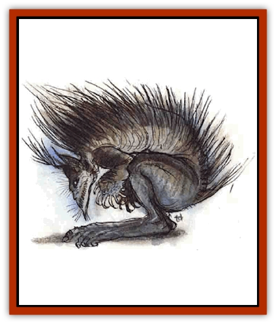

# Chaos Beast

| Statistic | **Chaos Beast** |
| --- | --- |
| **Activity Cycle:** | Any |
| **Alignment:** | Chaotic neutral |
| **Armor Class:** | 4 |
| **Climate/Terrain:** | Limbo |
| **Damage/Attack:** | 1d3 (&times;2) |
| **Diet:** | Chaos stuff |
| **Frequency:** | Very rare |
| **Hit Dice:** | 8-12 |
| **Intelligence:** | Average (8-10) |
| **Magic Resistance:** | 20% |
| **Morale:** | Fearless (19) |
| **Movement:** | 6 |
| **No. Appearing:** | 1 |
| **No. of Attacks:** | 2 |
| **Organization:** | Solitary |
| **Size:** | M (5-7' tall) |
| **Special Attacks:** | <i>Corporeal instability</i> |
| **Special Defenses:** | Nil |
| **THAC0:** | 8 HD: 13 / 9-10 HD: 11 / 11-12 HD: 9 |
| **Treasure:** | Nil |
| **XP Value:** | 2,000 + 1,000/die greater than 8 |

<i style="color:#4169e1">When seen the chaos beast is*

�a towering horror of hooks and fangs, all pulpy flesh and exposed veins. It shambles forward in lurching steps, tottering unsteadily on its three legs. Its face is a shivered mirror, eyes bent and tortured, nose hooked thrice on itself. It bellows in rage, voice ringing with its own pain;

�a slithering mass of ropy tentacles, each tipped in vermillion. Ten eyes swim in a viscous sac at the top of the body, which in turn is surrounded by a ring of smacking mouths. Scores of vestigial wings flitter helplessly, unable to lift its filmy mass from the plane;

�smoothly noble, striding gracefully through the primordial soup on its six legs, maned head raised high, three eyes flashing brilliantly over the passersby. Its arms are delicate and its skin bashes with the color of the sun;

�a piteous, mewling thing, scarcely larger than a man. Its body hangs on splintered bone like fallen dough. It can barely shuffle forward on stumplike feet, wretchedly grasping the air ahead with crablike hands. Empty eyesockets pit its balding head;

�the thundering charge of a mighty creature, all muscle and fury. Claws lash and glint in the frenzy of its attack. The great alligatorlike jaw snaps menacingly as it rushes forward;

�swiftly silent and deadly, its dark fur barely visible through the rippling sea of Limbo. Broad wings carry it toward its prey, the great talons dropping beneath its slender body. Two eyes glisten with cold hate as it shrills the attack upon its prey;

�a sprawled tangle, a warmly steaming sac of gut that rolls and tumbles over the landscape like flaccid sausages tumbling down a stair. Its folds loop and drape, slipping their warm wetness around all in its way. Blind and dumb it cascades through the soup;

�a carcass flayed from the inside until all that's left is the puffed-up shell, swollen with gases trapped inside the sealed husk. It bobs on the swells of Limbo, tangling the trailing ends of its own body with all who venture too near;

�the brilliant moth, its powdered wings etched with the stained-glass colors of sanctuaries. Its body is plump with feasting. The compound eyes sparkle with a thousand jewels as it scans the land for prey.

When seen the chaos beast is the person to the left.

When encountered, the chaos beast may encompass any or all of these forms. It is the culmination of all possibilities. Its form is the form that it was not in its yesterdays.

**Combat:** How many different attacks can a creature capable of any form have? In this case, only two.

For all its fearsome appearances, whether it has claws, fangs, pincers, tentacles, or spines, the chaos beast does little physical harm with its horrid limbs. Regardless of form, the creature seems unable to manage more than two attacks per round. Its continual transmutations may prevent the creature from acquiring the coordination needed to do more than this - or it may just be too dim.

The physical damage caused by these attacks is slight (only 1d3 points of harm), again regardless of form. Those struck by the beast describe blows from even the most fearsome-looking claws as "limp and yielding, like a half-filled waterskin". The buffet stings and bruises but is not an attack doughty adventures fear.

But bloods fear the chaos beast, because they know what it can really do. The monster has a far more subtle and delicious terror in its arsenal. A touch of the creature's body is sufficient to trigger a horrible magical transformation in any victim - *corporeal instability*, a dread and uncontrollable shifting of form and substance.

This threat of instability only comes into effect when the exposed flesh of chaos beast and victim meet. Thus, a hero can use his sword to slice a tentacle from the beast and have little risk of being affected, but should he punch the creature with his fist, he risks dire consequences. When a character's flesh contacts that of a chaos beast, the character must make a saving throw vs. death magic to avoid *corporeal instability*. If the character is protected by armor or clothing, the saving throw must still be made, although he or she gains +4 to the die roll. Evcn attacking with a melee weapon is a slight risk, though in this case the character gains a +6 to the saving throw. Clearly, the best method for dealing with a chaos beast is from a distance.

*Corporeal instability* is a terrifying magical effect. Those affected are suddenly stricken by a soft sponginess as their physical bodies suddenly lose all sense of form. Unless controlled through act of will, as if his own body were part of Limbo, the character's shape melts, flows, writhes, and boils.

The consequences are grim. Suddenly the character is unable to hold any item; his hands have no grip. Clothing, armor, rings, helmets, backpacks are all useless as his body bulges and ripples. Large constricting items - armor, backpacks, even shirts - hamper more than help, reducing the character's Dexterity by 4 points. As feet and legs go soft or become impossible shapes, movement is reduced to 3. Shearing pain courses along the nerves, so strong that the character cannot act coherently. No spells can be cast, magical items are unusable, and any attacks are made blindly, unable to distinguish friend from foe (-4 penalty to THAC0).

Although *corporeal instability* causes no physical damage, the psychic harm is tremendous. Every round until the victim gains control over his body, he must save vs. death magic. Those who succeed have the mental strength to resist the horror; those who fail lose 1 point of Wisdom. Those who lose all Wisdom become mindless, bodiless horrors of the plane.

Even if the character manages to retain his form once stricken by *corporal instability*, he (or others) must be forever watchful. His own body has betrayed him. If not maintained in its current form (like any other part of Limbo) the character immediately begins to change. Note that another can provide the needed stability, allowing the afflicted character to sleep.

---
## Discovery & Documentation

**Source Publication:** Planes of Chaos (1994)
**Campaign Setting:** Planescape
**Author(s):** Wolfgang Baur, L. W. Smith

### Other Creatures Found in This Source Book
   * [[Asrai|Asrai]]
   * [[Astral_Dreadnought|Astral Dreadnought]]
   * [[Bacchae|Bacchae]]
   * [[Fensir|Fensir]]
   * [[Abyssal_Lord|Abyssal Lord]]
   * [[Howler|Howler]]
   * [[Imp_Chaos|Imp, Chaos]]
   * [[Lillend|Lillend]]
   * [[Murska|Murska]]
   * [[Oread|Oread]]
   * [[Ratatosk|Ratatosk]]
   * [[Tanar'ri_Greater_Goristro|Tanar'ri, Greater, Goristro]]
   * [[Tanar'ri_Lesser_Armanite|Tanar'ri, Lesser, Armanite]]
   * [[Varrangoin|Varrangoin]]
   * [[Viper_Tree|Viper Tree]]
