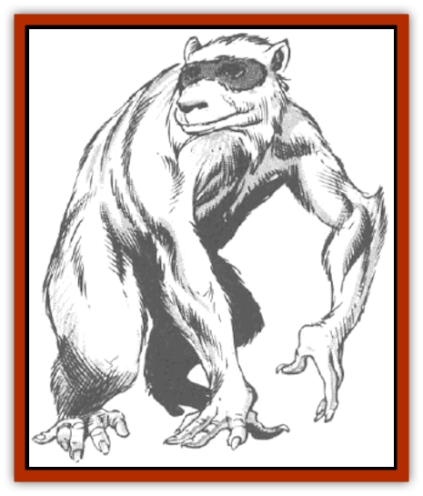

# Chattur

| Statistic | **Chattur** |
| --- | --- |
| **Activity Cycle:** | Any |
| **Alignment:** | Chaotic good |
| **Armor Class:** | 7 |
| **Climate/Terrain:** | Any space |
| **Damage/Attack:** | 1-4 (or by weapon) |
| **Diet:** | Omnivore |
| **Frequency:** | Common |
| **Hit Dice:** | 1-1 |
| **Intelligence:** | Low (5-7) |
| **Magic Resistance:** | Nil |
| **Morale:** | Average (10) |
| **Movement:** | 12 |
| **No. Appearing:** | 2-24 |
| **No. of Attacks:** | 1 |
| **Organization:** | Pack |
| **Size:** | S (1-2' tall) |
| **Special Attacks:** | Nil |
| **Special Defenses:** | Nil |
| **THAC0:** | 20 |
| **Treasure:** | B |
| **XP Value:** | 15 |

Chattur are small mammals that exhibit traits of both primates and rodents. They are slender and quick and have very dexterous front paws that are equipped with claw-tipped fingers and an opposable thumb. Their faces are wide and their eyes seem even wider, with an innocent stare that many humans find very appealing. A band of black fur surrounds the eyes of these creatures, much like the "mask" of raccoons. It is for this reason, and not for any inherent sense of maliciousness, that chattur have been dubbed "Space Bandits".

They can be found living on many spacefaring vessels - often without the knowledge of the crew. Usually their presence is tolerated when they are discovered - at least, if the discovery is made by a neutral or good-aligned crew.

Superstitions about chatter abound. Their presence on a vessel is supposed to bring good luck. Ill treatment of a chattur will reportably rebound against the abuser at some future time. Most significantly, if chattur are seen to be leaving a vessel, that is considered a dire warning about that vessel's immediate fate.

Chattur have their own language, which sounds much like the chirping of excited chipmunks. Many of the adults have learned to speak common from a lifetime of eavesdropping.

**Combat:** Not a very combative race, chattur fight only in defense of their nests, kin, or friends. The combination of their claws and bite accounts for the 1d4 points of damage. Chattur attempt to trip opponents, wrap them in nets or rope, and otherwise harass them during combat. They are ingenious at making the most of their opportunities.

After some training, large chattur can learn to use short swords, javelins (which they use as thrusting, not thrown, weapons), or tiny crossbows (1d4 points of damage, range 3/6/9, one bolt/round). Generally, about 20% of the chattur in a given den are capable of this armed combat.

**Habitat/Society:** Chattur do not gather in exceptionally large communities; to find 100 together is very rare. However, their clans and warrens can be found just about everywhere. They center around a patriarch or matriarch. Sex roles are indistinguishable except for childbirth; the females share the ranks of the trained fighters with the males in more or less equal numbers.

They are specialists at sneaking aboard ships and finding places to live where they can remain undiscovered for weeks, months, or years. They arrange very comfortable quarters, scavenging whatever items they can from around the ship.

Though chattur can live on a crowded ship in the midst of great activity, they rarely interfere with the operation of a vessel. This is one reason their presence is tolerated so good-naturedly, though their penchant for scavenging has brought them trouble on more than one occasion.

Chattur often fall victim to the attacks of the malicious [[Wryback|wrybacks]]. While no single chattur is a match for a wryback, the chattur's social structure enables them to band together. Often, a chaotic wryback can br lured into a trap and dealt with by a group of chattur.

**Ecology:** Chattur can thrive in all climes. They eat a variety of foods and readily adapt to new diets and surroundings. They have the ability to breed enough chattur to comfortably occupy whatever living space they have, without overpopulating.

When a given warren is comfortably populated, pairs of young adult chattur branch out on their own, trying to stow away aboard a spacefaring vessel or find a sheltered den on a world or asteroid.

---
## Discovery & Documentation

**Source Publication:** MC7 Spelljammer Appendix I (1990)
**Campaign Setting:** Advanced Dungeons & Dragons 2nd Edition
**Author(s):** various

### Other Creatures Found in This Source Book
   * [[Aartuk|Aartuk]]
   * [[Albari|Albari]]
   * [[Ancient_Mariner|Ancient Mariner]]
   * [[Argos|Argos]]
   * [[Beholder_Abomination_Astereater|Beholder (Abomination), Astereater]]
   * [[Blazozoid|Blazozoid]]
   * [[Chevall|Chevall]]
   * [[Clockwork_Horror|Clockwork Horror]]
   * [[Colossus|Colossus]]
   * [[Delphinid|Delphinid]]
   * [[Dizantar|Dizantar]]
   * [[Dog|Dog]]
   * [[Dog_Bog_Hound|Dog, Bog Hound]]
   * [[Esthetic|Esthetic]]
   * [[Focoid|Focoid]]
   * [[Fractine|Fractine]]
   * [[Giant_Spacesea|Giant, Spacesea]]
   * [[Golem_Furnace|Golem, Furnace]]
   * [[Golem_Radiant|Golem, Radiant]]
   * [[Gravislayer|Gravislayer]]
   * [[Grommam|Grommam]]
   * [[Hadozee|Hadozee]]
   * [[Hamster_Giant_Space|Hamster, Giant Space]]
   * [[Jammer_Leech|Jammer Leech]]
   * [[Lakshu|Lakshu]]
   * [[Lumineaux|Lumineaux]]
   * [[Lutum|Lutum]]
   * [[Mimic_Space|Mimic, Space]]
   * [[Misi|Misi]]
   * [[Moon_Rogue|Moon, Rogue]]
   * [[Mortiss|Mortiss]]
   * [[Murderoid|Murderoid]]
   * [[Nay-Churr|Nay-Churr]]
   * [[Phlog-Crawler|Phlog-Crawler]]
   * [[Plasman|Plasman]]
   * [[Plasmoid_DeGleash|Plasmoid, DeGleash]]
   * [[Plasmoid_DelNoric|Plasmoid, DelNoric]]
   * [[Plasmoid_General_Information|Plasmoid, General Information]]
   * [[Plasmoid_Ontalak|Plasmoid, Ontalak]]
   * [[Puffer|Puffer]]
   * [[Q'nidar|Q'nidar]]
   * [[Rastipede|Rastipede]]
   * [[Reigar|Reigar]]
   * [[Rock_Hopper|Rock Hopper]]
   * [[Slinker|Slinker]]
   * [[Spider_Asteroid|Spider, Asteroid]]
   * [[Spiritjam|Spiritjam]]
   * [[Survivor|Survivor]]
   * [[Syllix|Syllix]]
   * [[Symbiont_Power|Symbiont, Power]]
   * [[Vine_Infinity|Vine, Infinity]]
   * [[Wiggle|Wiggle]]
   * [[Wizshade|Wizshade]]
   * [[Wryback|Wryback]]
   * [[Zard|Zard]]
   * [[Zodar|Zodar]]
