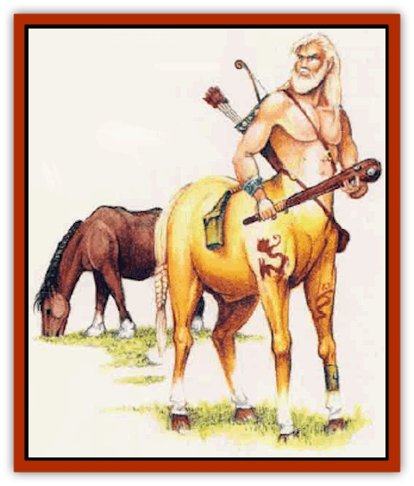

# Chevall

| Statistic | **Chevall** |
| --- | --- |
| **Activity Cycle:** | Day |
| **Alignment:** | Neutral good |
| **Armor Class:** | 2 (as horse) or 5 (as centaur) |
| **Climate/Terrain:** | Nonarctic plains, forests, mountains |
| **Damage/Attack:** | 1d6 (hoof)/1d6 (hoof)/1d8 (bite) or 1d6 (hoof)/1d6 (hoof)/by weapon |
| **Diet:** | Omnivore |
| **Frequency:** | Rare |
| **Hit Dice:** | 7 |
| **Intelligence:** | Very (11-12) |
| **Magic Resistance:** | Nil |
| **Morale:** | Champion (15) as horse / Elite (13) as centaur |
| **Movement:** | 24 (as horse) or 18 (as centaur) |
| **No. Appearing:** | 1d3 |
| **No. of Attacks:** | 3 |
| **Organization:** | Solitary |
| **Size:** | L (5' tall as horse, 7-8' tall as centaur) |
| **Special Attacks:** | Summon and command horses |
| **Special Defenses:** | Silver or +1 or better magical weapons to hit |
| **THAC0:** | 13 |
| **Treasure:** | M,Q (C) |
| **XP Value:** | 650 |

This sylvan creature can change at will between two forms: an intelligent [[Horse|horse]] and a powerful [[Centaur|centaur]].

As a horse, a chevall may be any color (though a given individual does not change shades). It is typically as large as a light war horse. In centaur form, it has the upper torso and arms of a human being and the lower body of a horse. This form tends to be somewhat smaller than most centaurs, on average, and its ears, unlike those of a standard centaur, are pointed and [[Elf|elfin]].

In either form, a chevall can talk to and understand horses, using sounds which, to human ears, are nothing more than neighs and whinnies. Using this whinnying language, a chevall can command any horse, wild or domesticated, to do its bidding. A paladin's warhorse, and other unusual mounts with average Intelligence or higher, are immune.

In centaur form, a chevall can speak Common, the language of centaurs, and woodland sylvan tongue.

**Combat:** As a horse, a chevall can kick and bite as noted above. In centaur form, it also bites, but usually wields a wooden club or short bow instead of kicking. In either form, it can only be harmed by silver weapons or magical weapons of +1 or better enchantment.

Once per day, a chevall can magically summon 1d3 medium war horses, which arrive in 1d4 rounds.

**Habitat/Society:** Chevalls strive to ensure the well-being of all horses. Once native to the plains, they now appear anywhere that wild or captive horses exist. They often go about in horse form, checking on the welfare of horses in the sewice of humans, demihumans, and humanoids. If a chevall finds a horse that is unhappy with its lot (because of maltreatment or neglect), the chevall will not rest until it has freed the animal.

A chevall travels alone or in groups of up to three. If three chevalls are encountered, there is a 50% chance the group is a mated pair and a foal (which has half the Hit Dice and inflicts half the damage of adult specimens).

Foraging sustains chevalls as they travel. They favor vegetables and grains, and may (in horse form) gain nourishment from grazing (although they consider grass a very bland food, and prefer tasty oats and barley). While they are omnivorous by nature, most chevalls adhere to a vegetarian diet. This may stem from moral conviction or sheer habit.

Chevalls may accumulate some treasure during their travels. They often trade this for food and goods, bargaining with centaurs and other friendly creatures.

**Ecology:** Although animals such as [[Dog|dogs]] are wary of chevalls, horses never fear them. Chevalls hate [[Wolf|wolves]] and are the blood enemies of [[Lycanthrope_Werewolf|werewolves]]. According to chevall lore, chevalls were created long ago by an Immortal who wished to protect horses mistreated by their human masters.

|  | Horse form | Centaur form |
| --- | --- | --- |
| Walk | 12 | 9 |
| Trot | 24 | 18 |
| Canter | 36 | 27 |
| Gallop | 48 | 36 |

A chevall can carry no more than 260 pounds and still travel at its full speed. It can travel at half speed while carrying up to 390 pounds, and can move at one-third speed while canying up to 520 pounds.

As noted in the *Player's Handbook* (Chapter 14), in a day of travel over good terrain, a creature can travel a number of miles equal to twice its normal movement rate (a trot); that is, a chevall in horse form can cover 48 miles. In dire circumstances, a chevall can push itself to a canter or gallop. A canter can be safely maintained for two hours, or a gallop for one hour, but then the chevall must walk for an hour before increasing its speed again. A chevall will not gallop if loaded with enough material to reduce its normal movement rate by half; nor will it canter or gallop if carrying a load which will reduce its normal movement rate to one-third normal.

---
## Discovery & Documentation

**Source Publication:** MC7 Spelljammer Appendix I (1990)
**Campaign Setting:** Advanced Dungeons & Dragons 2nd Edition
**Author(s):** various

### Other Creatures Found in This Source Book
   * [[Aartuk|Aartuk]]
   * [[Albari|Albari]]
   * [[Ancient_Mariner|Ancient Mariner]]
   * [[Argos|Argos]]
   * [[Beholder_Abomination_Astereater|Beholder (Abomination), Astereater]]
   * [[Blazozoid|Blazozoid]]
   * [[Chattur|Chattur]]
   * [[Clockwork_Horror|Clockwork Horror]]
   * [[Colossus|Colossus]]
   * [[Delphinid|Delphinid]]
   * [[Dizantar|Dizantar]]
   * [[Dog|Dog]]
   * [[Dog_Bog_Hound|Dog, Bog Hound]]
   * [[Esthetic|Esthetic]]
   * [[Focoid|Focoid]]
   * [[Fractine|Fractine]]
   * [[Giant_Spacesea|Giant, Spacesea]]
   * [[Golem_Furnace|Golem, Furnace]]
   * [[Golem_Radiant|Golem, Radiant]]
   * [[Gravislayer|Gravislayer]]
   * [[Grommam|Grommam]]
   * [[Hadozee|Hadozee]]
   * [[Hamster_Giant_Space|Hamster, Giant Space]]
   * [[Jammer_Leech|Jammer Leech]]
   * [[Lakshu|Lakshu]]
   * [[Lumineaux|Lumineaux]]
   * [[Lutum|Lutum]]
   * [[Mimic_Space|Mimic, Space]]
   * [[Misi|Misi]]
   * [[Moon_Rogue|Moon, Rogue]]
   * [[Mortiss|Mortiss]]
   * [[Murderoid|Murderoid]]
   * [[Nay-Churr|Nay-Churr]]
   * [[Phlog-Crawler|Phlog-Crawler]]
   * [[Plasman|Plasman]]
   * [[Plasmoid_DeGleash|Plasmoid, DeGleash]]
   * [[Plasmoid_DelNoric|Plasmoid, DelNoric]]
   * [[Plasmoid_General_Information|Plasmoid, General Information]]
   * [[Plasmoid_Ontalak|Plasmoid, Ontalak]]
   * [[Puffer|Puffer]]
   * [[Q'nidar|Q'nidar]]
   * [[Rastipede|Rastipede]]
   * [[Reigar|Reigar]]
   * [[Rock_Hopper|Rock Hopper]]
   * [[Slinker|Slinker]]
   * [[Spider_Asteroid|Spider, Asteroid]]
   * [[Spiritjam|Spiritjam]]
   * [[Survivor|Survivor]]
   * [[Syllix|Syllix]]
   * [[Symbiont_Power|Symbiont, Power]]
   * [[Vine_Infinity|Vine, Infinity]]
   * [[Wiggle|Wiggle]]
   * [[Wizshade|Wizshade]]
   * [[Wryback|Wryback]]
   * [[Zard|Zard]]
   * [[Zodar|Zodar]]
