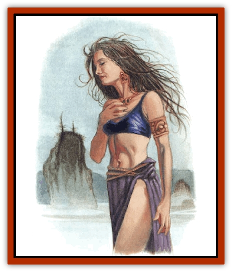

# Child of the Sea

| Statistic | **Accantus** | **Child of the Sea** |
| --- | --- | --- |
| **Activity Cycle:** | Any | Any |
| **Alignment:** | Chaotic neutral | Neutral |
| **Armor Class:** | 5 | 7 |
| **Climate/Terrain:** | Coast | Temperate ocean |
| **Damage/Attack:** | 1d8/1d8 | By weapon |
| **Diet:** | Omnivore | Omnivore |
| **Frequency:** | Very rare | Rare |
| **Hit Dice:** | 4 | 2 |
| **Intelligence:** | Average (8-10) | Very (11-12) |
| **Magic Resistance:** | Nil | Nil |
| **Morale:** | Steady (11-12) | Average (8-10) |
| **Movement:** | 6, Sw 15 | 12, Sw 12 |
| **No. Appearing:** | 1 | 1-2 |
| **No. of Attacks:** | 2 | 1 |
| **Organization:** | Solitary | Solitary |
| **Size:** | M (5-7' tall) | M (5-7' tall) |
| **Special Attacks:** | See below | Nil |
| **Special Defenses:** | See below | Nil |
| **THAC0:** | 17 | 19 |
| **Treasure:** | Nil | See below |
| **XP Value:** | 650 | 120 |

In secluded costal villages live people who are not people. Their faces betray a hint of the deep attraction the sea holds for them. Legends tell of handsome and beautiful strangers who visit, and the strange offspring of such unions.

Children of the Sea are a race apart, though they must breed with humans to produce offspring. They leave the children to be raised by their human parents. Though the humans often look down on them, they also hold these strange children in awe. When Children of the Sea reach maturity, they finally answer the call of the ocean waves, going down to the deeps to live out their lives - except for the occasional tryst with a human.

Children of the Sea look human, but always have a feature that gives them away, such as brilliantly green eyes, hair with a green tint, or exceptionally advanced webbing of the fingers or toes. All have an affinity for fish and for the sea.

**Combat:** Children of the Sea are generally peaceful, but will defend themselves if attacked. They can learn to use any weapon of humankind, they display talent with harpoons and nets. They will wear armor at the request of their parents (real or adoptive), but never by their own choice.

Children of the Sea have certain powers over the water and the denizen therein. At the age of 5, they gain the ability to *predict weather* in the area around them, up to 48 hours into the future and with 90% accuracy. At age 7, they can *summon fish*; once per day they can cause any fish within 60 yards to come to their location. At age 9, they gain the power to *raise* or *lower water* as the 4th-level priest spell, which they can use as if they were 7th level. At age 15, they gain the ability to breathe underwater. A Child of the Sea uses these innate abilities almost unconsciously, and will use them to aid his adoptive family unless he has not been treated well.

**Habitat/Society:** After growing up in a human home, Children of the Sea enter the ocean depths and lead a life that is largely solitary and nomadic. They sometimes recall their human childhoods and, craving the companioship they once had, venture onto land for a night or two. Children of the Sea are often the result of these visits. Male Children take no part in raising their offspring, though they may visit occasionally to leave a gift for mother or child. Female Children return to the ocean to bear their children and, once the child is born, attempt to leave it with its father or another human family.

**Ecology:** Children of the Sea are members of human society for part of their lives, and carry its mark. When they go off on their own, they live in relative harmony with nature, surviving on fish and aquatic plants. While they never kill for sport, they regard [[Shark|sharks]] and [[Sahuagin|sahuagin]] as their deadly enemies.

To reproduce, Children of the Sea must mate with humans. They are infertile with one another.

**Accantus**

  A Child of the Sea who is mistreated by his or her adoptive human family has a 5% chance, upon reaching maturity, to become an accantus. Accanta look like other Children of the Sea, and have the same abilities. As they approach maturity, however, they become more strange and wild, almost feral. They will leave their adoptive parents as early as possible, going off to live alone in seaside caves or ocean depths.

In becoming an accantus, a Child of the Sea gains two additional abilities. First, he can transform his body into water at will; second, he can summon [[Elemental_Water_Kin_Water_Weird|water weirds]] to his side. In water form, the accantus can strike with liquid fists for 1d8 points of damage each. In this form, the accantus is immune to blunt weapons and takes only half damage from edged weapons. Also, an accantus in watery form can alter his physical shape as desired, and can use this ability to slide under doors or through cracks and other obstructions that are not waterproof. An accantus in watery form can hide in bodies of water (such as pools) as if invisible.

The accantus can summon one water weird per day. The creature has maximum hit points. Water weirds will not attack accanta.

Accanta are seldom seen by humans who live to tell the tale. Evidence of their presence can be found, however - the family members who mistreated them are often found drowned in their beds in otherwise dry homes.

---
## Discovery & Documentation

**Source Publication:** Monstrous Compendium, 1997 Annual, Volume 4 (1995)
**Campaign Setting:** Advanced Dungeons & Dragons 2nd Edition
**Author(s):** Jon Pickens

### Other Creatures Found in This Source Book
   * [[Anemone_Giant_Sea|Anemone, Giant Sea]]
   * [[Asperii|Asperii]]
   * [[Bainligor|Bainligor]]
   * [[Beast_of_Chaos|Beast of Chaos]]
   * [[Blindheim|Blindheim]]
   * [[Bloodsipper_Far_Realm|Bloodsipper (Far Realm)]]
   * [[Bulette_Gohlbrorn|Bulette, Gohlbrorn]]
   * [[Clockwork_Horror|Clockwork Horror]]
   * [[Clockwork_Swordsman|Clockwork Swordsman]]
   * [[Coral|Coral]]
   * [[Darklore|Darklore]]
   * [[Dharculus|Dharculus]]
   * [[Dolphin_Athas|Dolphin (Athas)]]
   * [[Dragon_Neutral_Moonstone|Dragon, Neutral, Moonstone]]
   * [[Dragon_Prismatic|Dragon, Prismatic]]
   * [[Dream_Stalker|Dream Stalker]]
   * [[Dragon-kin_Albino_Wyrm|Dragon-kin, Albino Wyrm]]
   * [[Echyan|Echyan]]
   * [[Firestar|Firestar]]
   * [[Firetail|Firetail]]
   * [[Fish_Ascallion|Fish, Ascallion]]
   * [[Fish_Deep_Ocean|Fish, Deep Ocean]]
   * [[Fish_Tropical|Fish, Tropical]]
   * [[Fish_Vurgens|Fish, Vurgens]]
   * [[Fogwarden|Fogwarden]]
   * [[Fraal|Fraal]]
   * [[Giant_Crag|Giant, Crag]]
   * [[Gibberling_Brood|Gibberling, Brood]]
   * [[Glutton_Sea|Glutton, Sea]]
   * [[Golden_Ammonite|Golden Ammonite]]
   * [[Golem_Brass_Minotaur|Golem, Brass Minotaur]]
   * [[Golem_Gemstone|Golem, Gemstone]]
   * [[Golem_Maggot|Golem, Maggot]]
   * [[Groundling|Groundling]]
   * [[Hermit_Sea|Hermit, Sea]]
   * [[Hound_of_Law|Hound of Law]]
   * [[Human_Amazon|Human, Amazon]]
   * [[Human_Pygmy|Human, Pygmy]]
   * [[Inquisitor|Inquisitor]]
   * [[Kercpa|Kercpa]]
   * [[Kreel|Kreel]]
   * [[Lycanthrope_Lythari|Lycanthrope, Lythari]]
   * [[Mercurial|Mercurial]]
   * [[Mold_Chromatic|Mold, Chromatic]]
   * [[Mummy_Bog|Mummy, Bog]]
   * [[Neh-thalggu|Neh-thalggu]]
   * [[Nymph_Grain|Nymph, Grain]]
   * [[Nymph_Unseelie|Nymph, Unseelie]]
   * [[Octopus_Octo-Jelly|Octopus, Octo-Jelly]]
   * [[Puddingfish|Puddingfish]]
   * [[Sea_Demon|Sea Demon]]
   * [[Shade|Shade]]
   * [[Shadowrath|Shadowrath]]
   * [[Shark_Athas|Shark (Athas)]]
   * [[Siren_Ravenloft|Siren (Ravenloft)]]
   * [[Skeleton_Variant|Skeleton, Variant]]
   * [[Skyfish|Skyfish]]
   * [[Spectral_Scion|Spectral Scion]]
   * [[Spyder_Fiend|Spyder Fiend]]
   * [[Squid_Squark|Squid, Squark]]
   * [[Tanar'ri_Lesser_Uridezu|Tanar'ri, Lesser, Uridezu]]
   * [[Troll_Mutate|Troll Mutate]]
   * [[Vaati|Vaati]]
   * [[Vampire_Cerebral|Vampire, Cerebral]]
   * [[Varkha|Varkha]]
   * [[Wizshade|Wizshade]]
   * [[Worm_Lukhorn|Worm, Lukhorn]]
   * [[Wyste|Wyste]]
   * [[Yugoloth_Lesser_Gacholoth|Yugoloth, Lesser, Gacholoth]]
   * [[Zombie_Mud|Zombie, Mud]]
