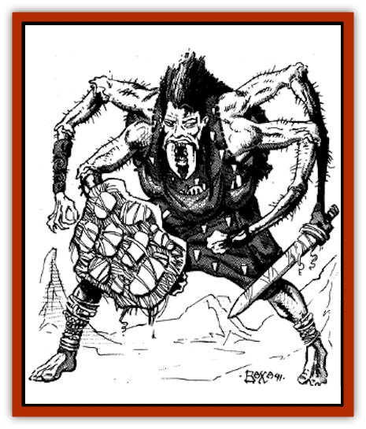

# Chitine

| Statistic | **Chitine** |
| --- | --- |
| **Activity Cycle:** | Any |
| **Alignment:** | Lawful evil |
| **Armor Class:** | 9 (6) |
| **Climate/Terrain:** | Any subterranean |
| **Damage/Attack:** | 1-6/1-6/1-6 |
| **Diet:** | Carnivore |
| **Frequency:** | Very rare |
| **Hit Dice:** | 2 |
| **Intelligence:** | Very (11-12) |
| **Magic Resistance:** | Nil |
| **Morale:** | Steady (11-12) |
| **Movement:** | 12, Wb 9 |
| **No. Appearing:** | 10-60 |
| **No. of Attacks:** | 3 |
| **Organization:** | Tribal |
| **Size:** | S (4' tall) |
| **Special Attacks:** | Webbing traps |
| **Special Defenses:** | Nil |
| **THAC0:** | 19 |
| **Treasure:** | D (K,Q) |
| **XP Value:** | 65 |

Chitines are small humanoids with four arms that build with webbing like humans build with stone or wood. This diminutive race of humanoids is most notable for its four arms which are jointed to allow for extra movement in ways that human limbs could never move. Their faces are human-looking, although they have multi-faceted eyes and mandibles protruding from their mouths. Long stringy black hair falls in a tangle from their skulls and grows down their backs, like the mane of a [[Horse|horse]].

The skin of the chitines is gray and mottled. A special oil is secreted that negates the adhesive effects of [[Spider|spider]] webbing. The palms of their hands and the soles of their feet are covered in dozens of tiny hooks, which allow them to climb textured surfaces with no loss of speed.

Chitines wear clothing made from dried and processed silk. Bits of colored rocks, carved bones, and such are frequently woven throughout. They always keep their hands and feet uncovered. They carry their tools in pouches woven into their clothing. Chitines speak the language of the [[Elf_Drow|drow]], and sometimes know a bit of other subterranean languages.

**Combat:** Chitines are most fond of traps and ambushes. Frequently they build a normal-looking spider web with a seemingly natural way around it. The web is a false trap and a pit, drop net, or similar trap that is sprung when the route is chosen. They are extremely clever and vicious with their traps. Their warriors commonly carry javelins and wear the webbing equivalent of studded leather armor. They carry short swords for melee combat. Usually they have weapons in three of their hands and a hardened webbing shield in the fourth. They are overly sensitive to sunlight and fight at a -1 penalty to THAC0 and damage when in sunlight.

Because the chitines are able to build with webbing, they may devise all sorts of nasty tricks. By sticking dust and rock chips to a mat of webbing, they can make a very convincing natural stone wall or floor. By means of a secret process, they can harden webbing into a bone-like material. It is slightly flexible, not sticky, and hard enough to slice or penetrate armor. They can weave such deadly spikes and edges into their traps to cause 1d6 points of damage per spike or edge.

Weapons and armor made from hardened webbing works just like normal items made by humans. However, the items deteriorate after several months if not treated with the oil secreted by their skin. Hardened webbing is susceptible to fire. Two rounds of contact with flame ignites hardened webbing, burning the item away in 2d4 rounds. Body armor made of hardened webbing cannot exceed Armor Class 4.

**Habitat/Society:** Chitines are only found underground. Their cavern villages are located in the center of a maze of trap-laden webbing. The hardened webbing dwellings resemble domed houses, complete with windows and decorative shapes adorning them. These homes can be located on any surface, including the ceiling. Bridges of webbing cross the town, providing easy pathways. Suspended in the center of the cavern is usually a heartshaped temple devoted to the evil goddess Lolth.

Chitines are cast-off experiments of the drow. They have increased in numbers over the centuries, and even now plot to overthrow the drow who are Lolth.s favorites. They are devoted to their spider queen and will do anything in her name. The priestesses of the chitines are rumored to be of a different and more powerful race, more akin to Lolth herself.

**Ecology:** A chitine can spin sticky spider webbing at the rate of one foot per round. The webbing is spun from an orifice in its stomach. Chitines eat anything that moves, sucking the fluids from the victim and leaving the dried remains on the cavern floor underneath their temple. Chitines are hunted by both drow and [[Elf_Drow|driders]].

---
## Discovery & Documentation

**Source Publication:** MC11 Forgotten Realms Appendix II (1991)
**Campaign Setting:** Advanced Dungeons & Dragons 2nd Edition
**Author(s):** Tim Beach, Tim Brown, William W. Connors, Dale Donovan, Ed Greenwood, Jeff Grubb, Bruce Heard, Slade Henson, Rob King, Colin McComb, Roger E. Moore, Bruce Nesmith, Jon Pickens, Jean Rabe, Dori Watry, Skip Williams

### Other Creatures Found in This Source Book
   * [[Alaghi|Alaghi]]
   * [[Alguduir|Alguduir]]
   * [[Beguiler|Beguiler]]
   * [[Bird_Toril|Bird (Toril)]]
   * [[Cantobele|Cantobele]]
   * [[Carapace|Carapace]]
   * [[Cat_Toril|Cat (Toril)]]
   * [[Cildabrin|Cildabrin]]
   * [[Dimensional_Warper|Dimensional Warper]]
   * [[Dragon_Deep|Dragon, Deep]]
   * [[Fachan_Toril|Fachan (Toril)]]
   * [[Fael|Fael]]
   * [[Feyr|Feyr]]
   * [[Firetail|Firetail]]
   * [[Frost|Frost]]
   * [[Gaund|Gaund]]
   * [[Gloomwing|Gloomwing]]
   * [[Golden_Ammonite|Golden Ammonite]]
   * [[Golem_Lightning|Golem, Lightning]]
   * [[Hamadryad|Hamadryad]]
   * [[Harrier|Harrier]]
   * [[Harrla|Harrla]]
   * [[Haun|Haun]]
   * [[Haundar|Haundar]]
   * [[Hendar|Hendar]]
   * [[Inquisitor|Inquisitor]]
   * [[Lhiannan_Shee|Lhiannan Shee]]
   * [[Loxo|Loxo]]
   * [[Manni|Manni]]
   * [[Manscorpion|Manscorpion]]
   * [[Mara|Mara]]
   * [[Morin|Morin]]
   * [[Naga_Dark|Naga, Dark]]
   * [[Orpsu|Orpsu]]
   * [[Plant_Carnivorous_Black_Willow|Plant, Carnivorous, Black Willow]]
   * [[Plant_Carnivorous_Toril|Plant, Carnivorous (Toril)]]
   * [[Plant_Dangerous_I|Plant, Dangerous I]]
   * [[Ring-Worm|Ring-Worm]]
   * [[Rohch|Rohch]]
   * [[Sand_Cat|Sand Cat]]
   * [[Saurial|Saurial]]
   * [[Sha'az|Sha'az]]
   * [[Silver_Dog|Silver Dog]]
   * [[Simpathetic|Simpathetic]]
   * [[Skuz|Skuz]]
   * [[Spider_Monkey|Spider, Monkey]]
   * [[Tren|Tren]]
