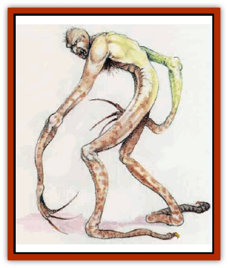

# Choker

| Statistic | **Choker** |
| --- | --- |
| **Activity Cycle:** | Night |
| **Alignment:** | Chaotic evil |
| **Armor Class:** | 4 |
| **Climate/Terrain:** | Subterranean |
| **Damage/Attack:** | 1d4 (tentacle) |
| **Diet:** | Carnivore |
| **Frequency:** | Rare |
| **Hit Dice:** | 3 |
| **Intelligence:** | Semi- (2-4) |
| **Magic Resistance:** | Nil |
| **Morale:** | Unsteady (7) |
| **Movement:** | 9, Br3 |
| **No. Appearing:** | 1d6 |
| **No. of Attacks:** | 1 |
| **Organization:** | Solitary |
| **Size:** | S (3½' tall) |
| **Special Attacks:** | Strangulation (1d8) |
| **Special Defenses:** | Nil |
| **THAC0:** | 17 |
| **Treasure:** | Nil |
| **XP Value:** | 120 |

The choker is a vicious little monster found in caves and caverns. It has mottled gray or stony brown flesh, and looks more or less humanoid-with two arms, two legs, a torso, and a head. The torso and head are as small and compact as a human baby's, but the arms and legs (and fingers!) are incredibly spindly and long. Stretched to its full length, an adult choker would stand nearly 6 feet tall.

This creature's limbs are like tentacles, having cartilage but no actual bones, with numerous knobby joints. The cartilage in its fingers juts out through the skin, and is stiff and razor-sharp. Because it lacks bones for support, the choker appears bowlegged and lopes with a strange, fluid gait. The creature is not completely [[Boneless|boneless]], however; it does have a bony skull, spine, and rib cage.

Chokers are vaguely intelligent and speak a primitive language.

**Combat:** A choker seeks out prey by crawling along the crevasses, dry underground river beds, and air shafts that accompany [[Dwarf|dwarven]] or other subterranean building sites. Upon finding an opening into an area where dwarves, humans, or humanoids might pass, it lies in wait. When a lone creature arrives, the choker reaches out and begins to strangle it. The intial hit causes 1d4 points of damage; thereafter the choker automatically inflicts 1d8 points of damage each round as it strangles its victim. The choker's hold can be broken only by killing or incapacitating the creature.

If the prey puts up too much resistance, however, or the choker has not slain it in 2 to 6 rounds, the creature quickly flees; chokers do not care for extended struggles.

Once the victim is dead, a choker uses the cutting cartilage on its fingers to came its prey into readily-transportable pieces. Then it carts them all away. If it cannot ambush a victim or is comered by pursuers, a choker lashes out with its sharp fingers, inflicting 1d4 points of damage per attack.

**Habitat/Society:** Chokers are so primitive that they do not make or use tools. They can carve through solid rock with their fingers, and their lack of bones allows them to squeeze through openings impossible even for creatures of [[Goblin|goblin]] size.

Because chokers are inherently shy, they would have difficulty locating mates were it not for their special call. To attract a partner, both males and females keen. This whine (which humans and others find extremely irritating) echoes through the deep caverns the chokers call home. When a choker hears the keen of a potential mate, it answers. Then each creature keens in turn to draw the other near, until at last they meet. A few months later, the female gives birth to two to six young. The family stays together for three years, until the offspring have fully matured. Once the offspring have moved on, the parents separate and seek new mates.

**Ecology:** The choker has a high metabolism. It burns an enormous number of calories, especially for a creature of its light weight. Consequently it is always on the lookout for victims on which to feed, and it consumes them rapidly. (A goblin provides about two days' food, for example.)

Goblins are, in fact, the choker's favorite food. Chokers devour other races, such as dwarves or humans, but prefer the meat of goblins above all else.

A legend among goblins says that chokers descended from a goblin band which, beset by hardship, turned to cannibalism. Youngsters in this tribe devoured their elders. Over time, the band degenerated. With the twisting of their minds came a reshaping of their bodies; their arms grew long and their fingers steely, enabling them to better grab and strangle prey. They no longer fed upon each other, but continued to crave the flesh of normal goblins.

As mentioned earlier, chokers can be driven off if their would-be victims prove an able match in combat. In areas infested with chokers, goblins and dwarves also take advantage of the chokers' caution by making a lot of noise, pounding weapons on shields and the like, to scare the chokers away. This tactic sometimes backfires, however, as the noise tends to attract other, more dangerous monsters.

---
## Discovery & Documentation

**Source Publication:** Mystara Appendix (1994)
**Campaign Setting:** Mystara
**Author(s):** John Nephew, Teeuwynn Woodruff, John Terra, Skip Williams

### Other Creatures Found in This Source Book
   * [[Actaeon|Actaeon]]
   * [[Agarat|Agarat]]
   * [[Ash_Crawler|Ash Crawler]]
   * [[Baldandar|Baldandar]]
   * [[Bargda|Bargda]]
   * [[Bhut|Bhut]]
   * [[Bird_Mystara|Bird (Mystara)]]
   * [[Blackball|Blackball]]
   * [[Coltpixie|Coltpixie]]
   * [[Crone_of_Chaos|Crone of Chaos]]
   * [[Darkhood|Darkhood]]
   * [[Darkwing|Darkwing]]
   * [[Decapus|Decapus]]
   * [[Deep_Glaurant|Deep Glaurant]]
   * [[Diabolus|Diabolus]]
   * [[Dimensional_Warper|Dimensional Warper]]
   * [[Dragon_Mystara_Crystalline|Dragon (Mystara), Crystalline]]
   * [[Dragon_Mystara_Jade|Dragon (Mystara), Jade]]
   * [[Dragon_Mystara_Onyx|Dragon (Mystara), Onyx]]
   * [[Dragon_Mystara_Ruby|Dragon (Mystara), Ruby]]
   * [[Drake_Mystara|Drake (Mystara)]]
   * [[Dragonfly|Dragonfly]]
   * [[Dusanu|Dusanu]]
   * [[Elemental_of_Chaos_Air_Earth|Elemental of Chaos, Air/Earth]]
   * [[Elemental_of_Chaos_Fire_Water|Elemental of Chaos, Fire/Water]]
   * [[Elemental_of_Law_Air_Earth|Elemental of Law, Air/Earth]]
   * [[Elemental_of_Law_Fire_Water|Elemental of Law, Fire/Water]]
   * [[Familiar_Mystara|Familiar (Mystara)]]
   * [[Frost_Salamander|Frost Salamander]]
   * [[Fundamental_Air_Earth|Fundamental, Air/Earth]]
   * [[Fundamental_Fire_Water|Fundamental, Fire/Water]]
   * [[Gargantua_Mystara|Gargantua (Mystara)]]
   * [[Geonid|Geonid]]
   * [[Ghostly_Horde|Ghostly Horde]]
   * [[Giant_Athach|Giant, Athach]]
   * [[Giant_Hephaeston|Giant, Hephaeston]]
   * [[Golem_Drolem|Golem, Drolem]]
   * [[Golem_Mystara_I|Golem (Mystara) I]]
   * [[Golem_Mystara_II|Golem (Mystara) II]]
   * [[Golem_Mystara_III|Golem (Mystara) III]]
   * [[Gray_Philosopher|Gray Philosopher]]
   * [[Guardian_Warrior|Guardian Warrior]]
   * [[Gyerian|Gyerian]]
   * [[Herex|Herex]]
   * [[Hivebrood|Hivebrood]]
   * [[Horde|Horde]]
   * [[Hsiao|Hsiao]]
   * [[Huptzeen|Huptzeen]]
   * [[Hutaakan|Hutaakan]]
   * [[Imp_Mystara|Imp (Mystara)]]
   * [[Jellyfish_Giant_Mystara|Jellyfish, Giant (Mystara)]]
   * [[Kna|Kna]]
   * [[Kopru|Kopru]]
   * [[Lizard_Mystara|Lizard (Mystara)]]
   * [[Lizard-kin_Mystara|Lizard-kin (Mystara)]]
   * [[Lupin|Lupin]]
   * [[Lycanthrope_Werejaguar_Mystara|Lycanthrope, Werejaguar (Mystara)]]
   * [[Lycanthrope_Wereswine|Lycanthrope, Wereswine]]
   * [[Magen|Magen]]
   * [[Manikin|Manikin]]
   * [[Mek|Mek]]
   * [[Mujina|Mujina]]
   * [[Nagpa|Nagpa]]
   * [[Neh-thalggu|Neh-thalggu]]
   * [[Nightshade_Mystara|Nightshade (Mystara)]]
   * [[Nuckalavee|Nuckalavee]]
   * [[Pegataur|Pegataur]]
   * [[Phanaton|Phanaton]]
   * [[Plant_Dangerous_Mystara|Plant, Dangerous (Mystara)]]
   * [[Plasm|Plasm]]
   * [[Rakasta|Rakasta]]
   * [[Rock_Man|Rock Man]]
   * [[Sabreclaw|Sabreclaw]]
   * [[Sacrol|Sacrol]]
   * [[Scamille|Scamille]]
   * [[Shapeshifter|Shapeshifter]]
   * [[Shargugh|Shargugh]]
   * [[Shark-kin|Shark-kin]]
   * [[Sollux|Sollux]]
   * [[Spectral_Death|Spectral Death]]
   * [[Spectral_Hound|Spectral Hound]]
   * [[Spider-kin|Spider-kin]]
   * [[Spirit_Mystara|Spirit (Mystara)]]
   * [[Statue_Living|Statue, Living]]
   * [[Surtaki|Surtaki]]
   * [[Tabi|Tabi]]
   * [[Thoul|Thoul]]
   * [[Thunderhead|Thunderhead]]
   * [[Tiger_Ebon|Tiger, Ebon]]
   * [[Topi|Topi]]
   * [[Tortle|Tortle]]
   * [[Vampire_Velya|Vampire, Velya]]
   * [[White_Fang|White Fang]]
   * [[Worm_Mystara|Worm (Mystara)]]
   * [[Wyrd|Wyrd]]
   * [[Yowler|Yowler]]
   * [[Zombie_Lightning|Zombie, Lightning]]
