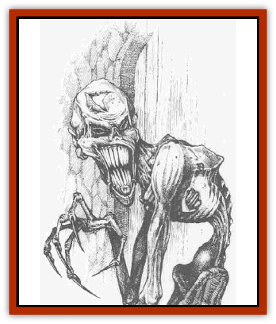

# Chosen One

| Statistic | **Chosen One** |
| --- | --- |
| **Activity Cycle:** | Any |
| **Alignment:** | Chaotic evil |
| **Armor Class:** | 7 |
| **Climate/Terrain:** | Any |
| **Damage/Attack:** | 1d4/1d4/1d8 (or weapon and 1d8) |
| **Diet:** | Carnivore |
| **Frequency:** | Rare |
| **Hit Dice:** | 3 |
| **Intelligence:** | Low (5-7) |
| **Magic Resistance:** | Nil |
| **Morale:** | Fanatic (18) |
| **Movement:** | 12 |
| **No. Appearing:** | 5-30 |
| **No. of Attacks:** | 3 or 2 |
| **Organization:** | Band |
| **Size:** | M |
| **Special Attacks:** | Poison |
| **Special Defenses:** | Nil |
| **THAC0:** | 17 |
| **Treasure:** | Nil |
| **XP Value:** | 175 |

Chosen ones were once human slaves, but have been turned into violent guardians under the control of their creators. The process has subjected them to torture and arcane magical procedures of the worst type. The Red Wizards of Thay are known to create these creatures.

Driven by rage, chosen ones seek to avenge themselves upon those who caused their pain and suffering, but their anger has been redirected by their diabolical creators. In effect, each chosen one is compelled to see everyone except its creator and his companions as the cause of its pain and consequently attacks all others with unstoppable fury.

The magical spells that create a chosen ones twist his appearance into a hideous caricatures of a human; the face contorts, teeth elongate, and the skin transforms into a tough, leathery protective sheathing. Chosen ones' hands are gnarled and stretched, ending in wicked, filthy claws.

**Combat:** If a Red Wizard is compelled or held hostage, a special code word can be uttered to compel the chosen ones to attack their creator's captor.

In battle, chosen ones attack fearlessly, biting with fangs and slashing with filthy claws. Some chosen ones are equipped with weapons that replace the claw attacks.

Creatures bitten by a chosen one must make a successful saving throw vs. poison or suffer an additional 1d8 points of damage per round for the next 1d6 rounds.

Chosen ones are not completely reliable. Occasionally, their conditioning breaks down and memories of their past lives as well as the the cause of their pain flood their heads. Each round a chosen one is in combat after the fifth, there is a 1% cumulative chance that it goes berserk (for example, the chance increases to 5% after 10 rounds). If that happens, the chosen one screams horribly and immediately leaves combat, running away to find its master and take revenge as quickly as possible, fighting only those who stand in its way.

**Habitat/Society:** Chosen ones make effective, if somewhat vicious, guards. They are most useful, and terrifying, when released to chase down a trespasser or other miscreant. They are consumed with white-hot rage against all in their vicinity, held back only by the authority of their master; and they may lash out suddenly if disturbed unless the creator forcefully orders them to hold back.

The occasional instability of chosen ones is a price their creators are willing to pay for useful slaves. The death of the Red Wizard Thamarrak and several of his guests whose 20 chosen ones unaccountably went berserk simultanously during a dinner party, is considered an aberration. (On the other hand, several Thayans have speculated that it was the work of one of Thamarrak's enemies, who discovered how to circumvent the magical programming).

**Ecology:** The Red Wizards use chosen ones as guards for their homes or important places such as laboratories, treasure vaults, and dungeons. Once created, a chosen one can only be restored to humanity by a *wish* or similar powerful magic.

Chosen ones occasionally escape into the wild. These nearly always terrorize innocents for a time before being hunted down and destroyed.

Many Red Wizards foresee the military applications of the chosen ones - the creation of legions of chosen ones that can be unleashed upon neighboring states without commanders. The current political tumult in Thay has so far prevented this. Of course, the possibility of large numbers of chosen ones going berserk and taking vengeance in Thay may put an end to the plan until chosen ones can be more readily stabilized.

<h3>Create Chosen One</h3>
| 5th-level Wizard Spell |
| --- |
| Sphere: Alteration |
| Range: Touch |
| Components: V, S, M |
| Duration: Permanent |
| Casting Time: 1 hour |
| Area of Effect: Special |
| Saving Throw: None |

Only wizards of evil alignment may cast this spell, which consists of a series of magical rituals and torments intended to turn a normal human (of up to 3 HD) into a maddened, murderous creature known as a Chosen One. Victims must be bound and helpless in order for the spell to work. After its casting is completed, the victim must successfully save vs. death magic or be transformed into a chosen one under the control of its creator.

---
## Discovery & Documentation

**Source Publication:** Monstrous Compendium, 1996 Annual, Volume 3 (1995)
**Campaign Setting:** Advanced Dungeons & Dragons 2nd Edition
**Author(s):** Jon Pickens

### Other Creatures Found in This Source Book
   * [[Alaghi|Alaghi]]
   * [[Alhoon|Alhoon]]
   * [[Aranea_Savage_Coast|Aranea (Savage Coast)]]
   * [[Arcane_Head|Arcane Head]]
   * [[Banedead|Banedead]]
   * [[Banelich|Banelich]]
   * [[Bat_Bonebat|Bat, Bonebat]]
   * [[Beetle|Beetle]]
   * [[Belgoi|Belgoi]]
   * [[Bladeling|Bladeling]]
   * [[Braxat|Braxat]]
   * [[Bunyip|Bunyip]]
   * [[Burbur|Burbur]]
   * [[Bvanen|Bvanen]]
   * [[Cat_Great_Snow_Tiger|Cat, Great, Snow Tiger]]
   * [[Chronovoid|Chronovoid]]
   * [[Cildabrin|Cildabrin]]
   * [[Coffer_Corpse|Coffer Corpse]]
   * [[Disenchanter|Disenchanter]]
   * [[Dog_Temporal|Dog, Temporal]]
   * [[Dragon_Cerilia|Dragon (Cerilia)]]
   * [[Dragon_Ghost|Dragon, Ghost]]
   * [[Dragon_Lesser_Undead|Dragon, Lesser Undead]]
   * [[Dragon_Neutral_Amber|Dragon, Neutral, Amber]]
   * [[Dread_Warrior|Dread Warrior]]
   * [[Dreamweaver|Dreamweaver]]
   * [[Dream_Spawn_Greater_Ennui|Dream Spawn, Greater, Ennui]]
   * [[Dream_Spawn_Lesser_Morph|Dream Spawn, Lesser, Morph]]
   * [[Dwarf_Arctic|Dwarf, Arctic]]
   * [[Dwarf_Urdunnir|Dwarf, Urdunnir]]
   * [[Eel_Giant_Moray|Eel, Giant Moray]]
   * [[Elemental_Fire_Kin_Tome_Guardian|Elemental, Fire Kin, Tome Guardian]]
   * [[Elf_Rockseer|Elf, Rockseer]]
   * [[Ethyk|Ethyk]]
   * [[Faerie_Faerie_Fiddler|Faerie, Faerie Fiddler]]
   * [[Faerie_Petty_Bramble|Faerie, Petty, Bramble]]
   * [[Faerie_Petty_Gorse|Faerie, Petty, Gorse]]
   * [[Faerie_Petty|Faerie, Petty]]
   * [[Firenewt|Firenewt]]
   * [[Formian|Formian]]
   * [[Gargoyle_II|Gargoyle II]]
   * [[Giant_Cerilia|Giant (Cerilia)]]
   * [[Goblin_Cerilia|Goblin (Cerilia)]]
   * [[Golem_Magic|Golem, Magic]]
   * [[Golem_Shaboath|Golem, Shaboath]]
   * [[Hag_Bheur|Hag, Bheur]]
   * [[Hamadryad|Hamadryad]]
   * [[Hound_of_Ill-Omen|Hound of Ill-Omen]]
   * [[Human_Cerilia|Human (Cerilia)]]
   * [[Hybsil|Hybsil]]
   * [[Ibrandlin|Ibrandlin]]
   * [[Imp_Chaos|Imp, Chaos]]
   * [[Ixitxachitl_Ixzan|Ixitxachitl, Ixzan]]
   * [[Jabberwock|Jabberwock]]
   * [[Kyton|Kyton]]
   * [[Kyuss_Son_of|Kyuss, Son of]]
   * [[Lillend|Lillend]]
   * [[Life-Shaped_Creation_Guardian|Life-Shaped Creation, Guardian]]
   * [[Life-Shaped_Creation_Transport|Life-Shaped Creation, Transport]]
   * [[Lycanthrope_Werecrocodile|Lycanthrope, Werecrocodile]]
   * [[Lycanthrope_Werespider|Lycanthrope, Werespider]]
   * [[Magedoom|Magedoom]]
   * [[Manotaur|Manotaur]]
   * [[Mastiff_Shadow|Mastiff, Shadow]]
   * [[Meazel|Meazel]]
   * [[Mist_Scarlet_Dancer|Mist, Scarlet Dancer]]
   * [[Needleman|Needleman]]
   * [[Orc_Neo-Orog|Orc, Neo-Orog]]
   * [[Orc_Ondonti|Orc, Ondonti]]
   * [[Owlbear_II|Owlbear II]]
   * [[Pegataur|Pegataur]]
   * [[Phaerimm|Phaerimm]]
   * [[Reggelid|Reggelid]]
   * [[Render|Render]]
   * [[Saurial|Saurial]]
   * [[Scalamagdrion|Scalamagdrion]]
   * [[Sharn|Sharn]]
   * [[Snake_Messenger|Snake, Messenger]]
   * [[Spirit_Forest_Uthraki|Spirit, Forest, Uthraki]]
   * [[Spirit_Forest_Wood_Man|Spirit, Forest, Wood Man]]
   * [[Spirit_Ice_Orglash|Spirit, Ice, Orglash]]
   * [[Spirit_Rock_Thomil|Spirit, Rock, Thomil]]
   * [[Strider_Giant|Strider, Giant]]
   * [[Tembo|Tembo]]
   * [[Temporal_Glider|Temporal Glider]]
   * [[Temporal_Stalker|Temporal Stalker]]
   * [[Tether_Beast|Tether Beast]]
   * [[Thessalmonster|Thessalmonster]]
   * [[Time_Dimensional|Time Dimensional]]
   * [[Tomb_Tapper|Tomb Tapper]]
   * [[Undead_Dragon_Slayer|Undead Dragon Slayer]]
   * [[Unicorn_Black_Toril|Unicorn, Black (Toril)]]
   * [[Vaath|Vaath]]
   * [[Vortex_Spider|Vortex Spider]]
   * [[Weredragon|Weredragon]]
   * [[Zhentarim_Spirit|Zhentarim Spirit]]
