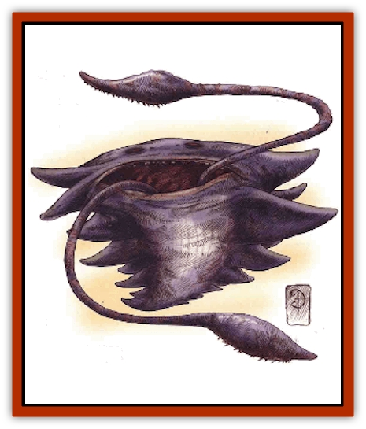

# Chososion

| Statistic | **Chososion** |
| --- | --- |
| **Activity Cycle:** | Any |
| **Alignment:** | Neutral |
| **Armor Class:** | -5 |
| **Climate/Terrain:** | Inner Planes |
| **Damage/Attack:** | 1d8/1d8 |
| **Diet:** | Inner-planar nature |
| **Frequency:** | Very rare |
| **Hit Dice:** | 8 |
| **Intelligence:** | High (13-14) |
| **Magic Resistance:** | 95% |
| **Morale:** | Elite (14) |
| **Movement:** | Fl 12 (A) |
| **No. Appearing:** | 1 |
| **No. of Attacks:** | 2 |
| **Organization:** | Solitary |
| **Size:** | M (6' across) |
| **Special Attacks:** | Discorporating poison |
| **Special Defenses:** | Struck only by +4 or better weapons, immunities |
| **THAC0:** | 13 |
| **Treasure:** | Nil |
| **XP Value:** | 8,000 |

A creature found (or, at least, seen) only on the Ethereal and the Inner Planes. the chososion seeps mainly through the e1emental worlds. Most who've spied it, however, would say that it never really enters the space the rest of us inhabit. That is, it's always just out of touch. More than simply ethereal - like a [[Ghost|ghost]] on a prime-material world - the chososion is intangible on any plane. Even sorcery can barely affect it.

Despite this quality, the chososion appears substantial when a basher manages to lay eyes on one (they're extraordinarily rare). Its wide body, colored black or dark blue, is composed primarily of many winglike flaps of flesh. The entire creature seems to be in constant motion, as though the waving of its strange appendages keeps it within physical reality as it's understood. Chant is that if these flexible ridges stop their rippling motion, the chososion disappears. Beyond the ever-moving mass of the creature, a mouthlike opening lies buried in its fluttering fins.

First encountered by the [[Shad|shad]] of the Elemental Plane of earth, the chososion gets its name from that race's word for "out of reach".

**Combat:** So how does a cutter harm a creature that's not really all there? A better question might be why he'd want to. Still, the chososion can become a threat to planewalkers and natives to the realms through which it seeps. If disturbed, the beast is likely to react with violence.

Graybeards don't wholly understand the chososion's means of attack. When the creature grows angry, two long, flexible pseudopods ending in flat grasping pads stretch out from its mouth. Unlike the rest of the beast's body, the pseudopods're fully corporeal and covered with thousands of tiny, razor-sharp hooks. They inflict terrible injuries on any sod they strike (1d8 points of damage each), but the real danger comes from the poison secreted into the wounds by the grasping pads.

A chososion's poison is, by most standards, magical. If the victim fails a saving throw versus poison, he becomes paralyzed in 1d6 rounds. Once paralyzed, the sod must make a saving throw versus death magic. If he makes that save, he merely remains paralyzed for 3d6 rounds. But if he fails the second saving throw, the poison completely discorporates him (treat the victim as if disintegrated). Some folks claim that the poor bark leaves our reality and enters the chososion's realm - beyond any known plane. But popular chant says the victim's just gone, period. See, most folks believe that there are no planes beyond those already known and named, and even if there were, why would the chososion bring a foe to its home, where presumably it's more vulnerable?

A body can accept whichever theory he likes. Either way, he'll never again see a friend lost to chososion poison.

Fighting back against the creature is sodding difficult. Fact is, a basher'd be much better off just running away. With a 95% resistance to magic, a chososion's affected by only a few choice spells. It's not bothered by the environmental hazards of the Inner Planes; truth is, it seems not even to notice them. What's more, the beast completely shrugs off all nonmagical attacks (poison, gas, heat, cold, acid, and so on).

Fighting it with a weapon is just as hard, if not harder - only those with an enchantment of +4 or greater can wound the beast. And as any planewalker knows, it's tricky enough to keep any enchantment to a blade when hopping around the multiverse, let alone as mighty a dweomer as that.

However, the chososion does have a weak spot: the corporeal pseudopods (tongues?) that protrude from its mouth. These are quite real and solid, capable of touching and being touched. Each pseudopod has 2 Hit Dice and an Armor Class of 4, and its hit points are separate from the creature's total. In fact, these strange extensions are more like organic tools than actual parts of the chososion's body, and the monster treats them as if they were completely expendable.

All chososions can grow new pseudopods to replace destroyed members. Most require 1d6 hours to do so. However, sometimes (25% of the time) a chososion already has 1d4 replacement limbs tucked away inside its body, ready to shoot out immediately when needed. But no chososion can operate more than two pseudopods at once.

**Habitat/Society:** If the theory that the chososion actually inhabits some unknown plane is true, then it may also be true that the creature can intersect the known multiverse only at its most primal, basic point - the Innter Planes. Supporters of this idea claim that the chososion is most likely fully tangible on its own plane, as is an ethereal creature on the Ethereal Plane.

In fact, a graybeard named Vivan who holds to this theory speculates that the creature's home plane intersects and permeates the multiverse only in the Inner Planes, similar to the way the Ethereal touches the Inner Planes and the Prime. Vivan also believes that this unknown plane, which he calls the Macrocosm, could act as a bridge to an entirely different multiverse. 'Course, Vivan now resides in the Madhouse with all the other barmies in Sigil.

Here's what's known for sure: The chososion haunts the Inner Planes looking for food. It never congregates in groups, nor does it have a perceivable society. Though the creature seems highly intelligent, no one's discovered any proof that it can (or will) communicate with others. Its method of reproduction is a mystery and will most likely remain dark. However, if Vivan is correct, the chososion may have a complex society and culture on its mysterious home plane, complete with young - but how would anyone ever know?

**Ecology:** The chososion interacts with the environment around it only by accident. It apparently feeds on the primal nature of the Inner Planes, but not the elements or beings within the planes themselves. It need never encounter another creature (native or otherwise), but sometimes bad luck brings a poor sod right into a chososion's path. Perhaps misunderstanding the newcomer's intentions, the chososion always reacts defensively and usually attacks on sight.

On the other hand, it's possible that a hostile chososion attacks only because it's confused by or fearful of a basher's very nature. See, Vivan claims that the chososion regards inhabitants of the known planes the same way most folks view environmental dangers of the Inner Planes (heat from the plane of Fire, fumes from the paraplane of Smoke, and so on) - as something to be avoided or conquered.

---
## Discovery & Documentation

**Source Publication:** Planescape III (1996)
**Campaign Setting:** Planescape
**Author(s):** Monte Cook

### Other Creatures Found in This Source Book
   * [[Animental|Animental]]
   * [[Archomental_Evil|Archomental, Evil]]
   * [[Archomental_Good|Archomental, Good]]
   * [[Belker|Belker]]
   * [[Bzastra|Bzastra]]
   * [[Darklight|Darklight]]
   * [[Devete|Devete]]
   * [[Devourer_Planescape|Devourer (Planescape)]]
   * [[Dharum_Suhn|Dharum Suhn]]
   * [[Egarus|Egarus]]
   * [[Elemental_Athas_Lesser_Air_Earth|Elemental (Athas), Lesser, Air/Earth]]
   * [[Elemental_Athas_Lesser_Fire_Water|Elemental (Athas), Lesser, Fire/Water]]
   * [[Elemental_Fire_Kin_Salamander_II|Elemental, Fire Kin, Salamander II]]
   * [[Entrope|Entrope]]
   * [[Facet|Facet]]
   * [[Frost_Salamander|Frost Salamander]]
   * [[Fundamental_Air_Earth|Fundamental, Air/Earth]]
   * [[Fundamental_Fire_Water|Fundamental, Fire/Water]]
   * [[Fundamental_All_Elements|Fundamental, All Elements]]
   * [[Garmorm|Garmorm]]
   * [[Homunculus_Elemental|Homunculus, Elemental]]
   * [[Immoth|Immoth]]
   * [[Khargra|Khargra]]
   * [[Klyndes|Klyndes]]
   * [[Magran|Magran]]
   * [[Menglis|Menglis]]
   * [[Nathri|Nathri]]
   * [[Ooze_Sprite|Ooze Sprite]]
   * [[Paraelemental|Paraelemental]]
   * [[Phirblas|Phirblas]]
   * [[Psurlon|Psurlon]]
   * [[Quasielemental_Negative|Quasielemental, Negative]]
   * [[Quasielemental_Positive|Quasielemental, Positive]]
   * [[Rast|Rast]]
   * [[Ravid|Ravid]]
   * [[Ruvoka|Ruvoka]]
   * [[Scile|Scile]]
   * [[Shad|Shad]]
   * [[Shocker|Shocker]]
   * [[Sislan|Sislan]]
   * [[Suisseen|Suisseen]]
   * [[Terithran|Terithran]]
   * [[Thoqqua|Thoqqua]]
   * [[Trilloch|Trilloch]]
   * [[Tsnng|Tsnng]]
   * [[Ungulosin|Ungulosin]]
   * [[Vacuous|Vacuous]]
   * [[Wavefire|Wavefire]]
   * [[Xag-Ya_Xeg-Yi|Xag-Ya/Xeg-Yi]]
   * [[Xill|Xill]]
