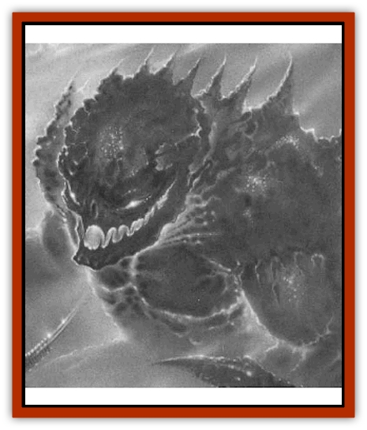
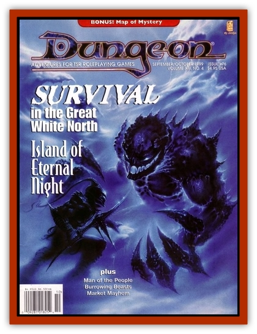

# Chraal

| Statistic | **Chraal** |
| --- | --- |
| **Activity Cycle:** | Any |
| **Alignment:** | Neutral evil |
| **Armor Class:** | 2 |
| **Climate/Terrain:** | Paraelemental Plane of Ice |
| **Damage/Attack:** | 2-12/2-12 |
| **Diet:** | None |
| **Frequency:** | Very rare |
| **Hit Dice:** | 8+8 |
| **Intelligence:** | Low (5-7) |
| **Magic Resistance:** | Nil |
| **Morale:** | Fanatic (17-18) |
| **Movement:** | 15 |
| **No. Appearing:** | 1 |
| **No. of Attacks:** | 2 |
| **Organization:** | Solitary |
| **Size:** | L (8' tall) |
| **Special Attacks:** | Breath weapon |
| **Special Defenses:** | Impervious to cold |
| **THAC0:** | 11 |
| **Treasure:** | Nil |
| **XP Value:** | 4,000 |

When a particularly evil and hateful being perishes on the Paraelemental Plane of Ice, his life force is sometimes captured by the planar powers and coalesced into a chraal (pl. chraal). The chraal retains no knowledge of its past life and exists as a radiant cloud of cold energy trapped inside a monstrous shell of hard, bluish-black ice.

The hulking chraal stands 8 feet tall. Its head rests atop two broad shoulders, and its thick arms end in wicked claws strong enough to crush stone. The cold, radiant life force of the creature is visible through the eyes, mouth, and cracked joints of the chraal's frigid exostructure.

A chraal cannot speak or communicate in any way, but it has rudimentary intelligence and can be commanded to follow orders. (A *charm monster* spell is needed to maintain control of the creature, and care must be taken to ensure the charm is not dispelled, as the chraal is then 75% likely to turn on its controller.) A chraal is cruel and rapacious, relishing any chance to inflict harm on the living.

**Combat:** The chraal attacks with its sharp claws, causing 2-12 points of damage each. Once per turn, the chraal can breathe a cone of cold 60 feet long and 10 feet wide at the terminus. Those caught in the cane of cold suffer 8d4+8 points of damage; a successful saving throw vs. breath weapon reduces the damage by half.

The chraal is impervious to cold-based attacks, magical and nonmagical. Conversely, the chraal suffers double damage from magical fire-based attacks. When a chraal is slain, it explodes in a nonmagical wave of cold energy, inflicting 3-18 points of damage to all creatures within 20'; a successful saving throw vs. spell reduces the damage by half.

A single chraal may be summoned to the Prime Material Plane by means of a *monster summoning VII* spell or similar magic. Chraal have also been known to enter the Prime Material Plane via magical gates, although the creators of such portals exert no control over the disgruntled chraal and are readily attacked.

Chraal do not survive long in nonarctic climates. Warmth is anathema to them, and they suffer 1 point of damage per round in temperate climes and 2d4 points of damage per round in tropical or arid environments.

Although created from the life essence of a slain malevolent being, the chraal is not undead and cannot be turned.

**Habitat/Society:** Chraal are solitary creatures and do not intermingle or procreate. They do not generally attack one another and will sometimes combine their strength to defeat a common enemy before going their separate ways.

On the Paraelemental Plane of Ice, chraal normally dwell in icy cysts until they detect the presence of a living creature nearby, at which time they emerge and stalk their prey until it is slain or the chraal itself is destroyed.

Chraal summoned to the Prime Material Plane are often used as guardians and stalkers. A chraal that is not permitted to hunt and kill prey invariably turns against its summoner. Thus, they can be difficult to control without the aid of a *charm monster* spell.

**Ecology:** Chraal contribute little to their environment. They are tireless hunters and merciless killers. They are completely destroyed when slain, leaving nothing behind that can be salvaged or used to benefit their slayers.

---
## Discovery & Documentation

**Source Publication:** Dungeon #76 (1999)
**Campaign Setting:** Dungeon Magazine
**Author(s):** Raymond E. Dyer, Toren Atkinson

### Other Creatures Found in This Source Book
   * [[Death_Linnen|Death Linnen]]
   * [[Living_Hair|Living Hair]]
   * [[Sawfly_Demonic|Sawfly, Demonic]]
