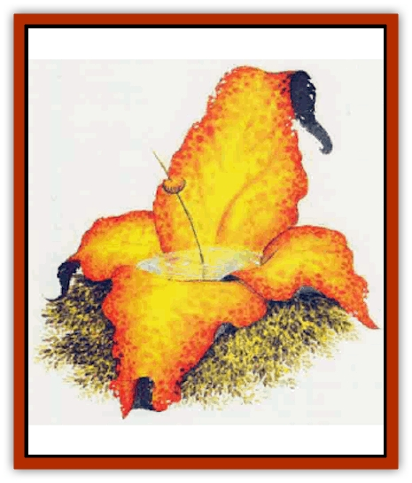

# Chronolily

| Statistic | **Chronolily** |
| --- | --- |
| **Activity Cycle:** | Any |
| **Alignment:** | Neutral |
| **Armor Class:** | 10 |
| **Climate/Terrain:** | Ethereal Plane |
| **Damage/Attack:** | Nil |
| **Diet:** | Special |
| **Frequency:** | Very rare |
| **Hit Dice:** | 3 |
| **Intelligence:** | Semi- (2-4) |
| **Magic Resistance:** | Nil |
| **Morale:** | Nil |
| **Movement:** | Nil |
| **No. Appearing:** | 1 |
| **No. of Attacks:** | Nil |
| **Organization:** | Solitary |
| **Size:** | G (50' diameter) |
| **Special Attacks:** | See below |
| **Special Defenses:** | See below |
| **THAC0:** | Nil |
| **Treasure:** | Nil |
| **XP Value:** | 65 |

Chronolilies are sentent flowers whose nectar reveals images of the past, present, and future. The chronolily is an immense flower nearly 50 feet ia diameter, its petals forming a bowl filled with golden nectar. It has a short stalk at the base and a thick stamen and pistil centered in its bowl. Thousands of tiny green leaves surround the perimeter.

There are three types of chronolily, distinguished only by the color of their petals: yellow, violet, and orange. Shimmering images continually appear in the nectar of the chronolily, the end of one image dissolving into the beginning of the next. Yellow chronolilies reveal images from the future, violet chronolilies reveal images from the present, and orange chronolilies reveal images from the past. The images are randomly generated. A typical image lasts less than 30 seconds. No sound accompanies these images.

**Combat:** When a chronolily is reduced to 0 hit points, it instantly decomposes into a poisonous cloud 50 feet in diameter. All those either touched by the cloud or within 50 feet of it suffer 3d6 points of damage (roll a successful saving throw vs. poison for half damage).

Chronolilies can use *know alignment* at will. In the presence of a character of evil alignment, chronolilis cause their nectar to turn black, thus denying such characters the opportunity to conjure specific image (as described in the "Using Chronolilies" section).

**Habitat/Society:** Chronolilies can grow in any solid material, including rock, so long as they are exposed to any type of light. They are self-pollinating, generating tiny seeds that resemble black spheres. Most chronolilies encountered on the Prime Material Plane will be tended by wizards in magical gardens.

**Ecology:** Chronolilies can absorb all necessary nutrients from any type of light. Their nectar, which tastes like honey, can be used as a component for *potions of clairvoyance*.

**Using Chronolilies**

A few exceptionally skilled wizards who study extra-planar plants have learned to use chronolilies to conjure images of specific events. This technique involves plucking the plant's leaves in a precise sequence and is extremely difficult to master.

However, there is a second less dependable technique available to less-skilled users, usually taught by those who have had previous experience with chronolilies. This technique requires the user to immerse his hand in the nectar of the chronolily (or otherwise make contact with the nectar) and concentrate on the event he wishes to observe. The event appears in the nectar in 10d6 rounds, subject to the following restrictions:

<ul><li>The user must not be of evil alignment</li><li>The user must be using a chronolily of the appropriate color (that is, if he is attempting to view an event from the past, he must be using an orange chronolily).</li><li>The user must concentrate on a specific image. For instance, if he concentrates on the country of his birth, the attempt will fail. However, if he concentrates on a specific house in a specific village of that country, the attempt may succeed.</li><li>Only one attempt per day can be made on any given chronolily using this method, regardless of whether the attempt succeeds or fails.</li></ul> 

Success with a chronolily is not automatic. A user's base chance of success is 20%. The base is modified as follows, to a maximum of 90% or a minimum of 5%.

**Apply modifiers from any of the following:**
+25% - The character is a wizard or a priest
+20% - The character has observed the event in the same chronolily before.
+5% - Per point of Wisdom above 15
-20% - The event occurred, is occurring, or will occur on a plane of existence different from the home plane of the character making the attempt.

**Apply only one of the following modifiers (past and present events only):**
+20% - The character participated in the event (past events only).
+10% - The character is well-informed about the event.
+5% - The character is slightly informed about the event.

---
## Discovery & Documentation

**Source Publication:** Monstrous Compendium, 1995 Annual, Volume 2 (1995)
**Campaign Setting:** Advanced Dungeons & Dragons 2nd Edition
**Author(s):** Jon Pickens

### Other Creatures Found in This Source Book
   * [[Aboleth_Savant|Aboleth, Savant]]
   * [[Addazahr|Addazahr]]
   * [[Amiq_Rasol|Amiq Rasol]]
   * [[Arch-Shadow|Arch-Shadow]]
   * [[Automaton_Scaladar|Automaton, Scaladar]]
   * [[Automaton_Trobriand's|Automaton, Trobriand's]]
   * [[Bat_Sporebat|Bat, Sporebat]]
   * [[Beetle_Dragon|Beetle, Dragon]]
   * [[Bi-nou|Bi-nou]]
   * [[Boggle|Boggle]]
   * [[Brownie_Dobie|Brownie, Dobie]]
   * [[Brownie_Quickling|Brownie, Quickling]]
   * [[Cat_Crypt|Cat, Crypt]]
   * [[Cat_Great_Cath_Shee|Cat, Great, Cath Shee]]
   * [[Centaur-kin_Dorvesh|Centaur-kin, Dorvesh]]
   * [[Centaur-kin_Gnoat|Centaur-kin, Gnoat]]
   * [[Centaur-kin_Ha'pony|Centaur-kin, Ha'pony]]
   * [[Centaur-kin_Zebranaur|Centaur-kin, Zebranaur]]
   * [[Curst|Curst]]
   * [[Darktentacles|Darktentacles]]
   * [[Dinosaur_Aquatic|Dinosaur, Aquatic]]
   * [[Dinosaur_II|Dinosaur II]]
   * [[Dinosaur_III|Dinosaur III]]
   * [[Doppelganger_Greater|Doppelganger, Greater]]
   * [[Dragon_Brine|Dragon, Brine]]
   * [[Dragon_Half-|Dragon, Half-]]
   * [[Dragon-kin_Sea_Wyrm|Dragon-kin, Sea Wyrm]]
   * [[Dwarf_Wild|Dwarf, Wild]]
   * [[Ekimmu|Ekimmu]]
   * [[Elemental_Nature|Elemental, Nature]]
   * [[Elf_Winged|Elf, Winged]]
   * [[Fish_Great_Glacier|Fish (Great Glacier)]]
   * [[Fish_Subterranean|Fish, Subterranean]]
   * [[Fish_Toril|Fish (Toril)]]
   * [[Flareater|Flareater]]
   * [[Flumph|Flumph]]
   * [[Froghemoth|Froghemoth]]
   * [[Ghost_Casurua|Ghost, Casurua]]
   * [[Ghost_Ker|Ghost, Ker]]
   * [[Ghul|Ghul]]
   * [[Ghul-Kin|Ghul-Kin]]
   * [[Giant_Half-giant|Giant, Half-giant]]
   * [[Golem_Burning_Man|Golem, Burning Man]]
   * [[Golem_Phantom_Flyer|Golem, Phantom Flyer]]
   * [[Gulguthhydra|Gulguthhydra]]
   * [[Hakeashar|Hakeashar]]
   * [[Horse_Moon-|Horse, Moon-]]
   * [[Human_Dragonslayer|Human, Dragonslayer]]
   * [[Human_Vistana|Human, Vistana]]
   * [[Jellyfish_Giant|Jellyfish, Giant]]
   * [[Kalin|Kalin]]
   * [[Kholiathra|Kholiathra]]
   * [[Laerti|Laerti]]
   * [[Leucrotta_Greater|Leucrotta, Greater]]
   * [[Lich_Suel|Lich, Suel]]
   * [[Lurker_Shadow|Lurker, Shadow]]
   * [[Lycanthrope_Werepanther|Lycanthrope, Werepanther]]
   * [[Lycanthrope_Wereshark|Lycanthrope, Wereshark]]
   * [[Mammal_Herd_II|Mammal, Herd II]]
   * [[Marl|Marl]]
   * [[Meenlock|Meenlock]]
   * [[Mimic_Greater|Mimic, Greater]]
   * [[Mold_II|Mold II]]
   * [[Mummy_Creature|Mummy, Creature]]
   * [[Nyth|Nyth]]
   * [[Ooze_Slime_Jelly_Ghaunadan|Ooze/Slime/Jelly, Ghaunadan]]
   * [[Palimpsest|Palimpsest]]
   * [[Peltast|Peltast]]
   * [[Plant_Dangerous_II|Plant, Dangerous II]]
   * [[Pleistocene_Animal|Pleistocene Animal]]
   * [[Pudding_Subterranean|Pudding, Subterranean]]
   * [[Raggamoffyn|Raggamoffyn]]
   * [[Snake_Serpent|Snake, Serpent]]
   * [[Snake_Serpent_Vine|Snake, Serpent Vine]]
   * [[Sphinx_Draco-|Sphinx, Draco-]]
   * [[Sprite_Seelie_Faerie|Sprite, Seelie Faerie]]
   * [[Sprite_Unseelie_Faerie|Sprite, Unseelie Faerie]]
   * [[Squealer|Squealer]]
   * [[Turtle_Giant|Turtle, Giant]]
   * [[Umpleby|Umpleby]]
   * [[Vizier's_Turban|Vizier's Turban]]
   * [[Wall_Walker|Wall Walker]]
   * [[Webbird|Webbird]]
   * [[Yak-Man|Yak-Man]]
   * [[Zorbo|Zorbo]]
