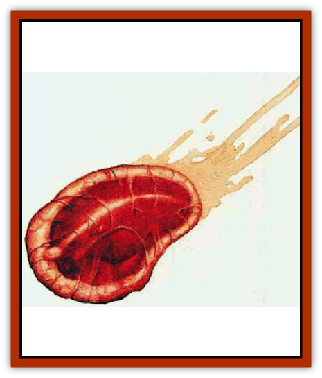

# Chronovoid

| Statistic | **Chronovoid** |
| --- | --- |
| **Activity Cycle:** | Any |
| **Alignment:** | Chaotic neutral |
| **Armor Class:** | 6 |
| **Climate/Terrain:** | Demiplane of Time |
| **Damage/Attack:** | 2d6 |
| **Diet:** | Omnivore |
| **Frequency:** | Common |
| **Hit Dice:** | 12+1 (total) |
| **Intelligence:** | Average (8-10) |
| **Magic Resistance:** | 40% |
| **Morale:** | Average (10) |
| **Movement:** | 6 |
| **No. Appearing:** | 1-12 |
| **No. of Attacks:** | 1 |
| **Organization:** | Colony |
| **Size:** | See below |
| **Special Attacks:** | Absorption |
| **Special Defenses:** | See below |
| **THAC0:** | 9 |
| **Treasure:** | G |
| **XP Value:** | 9,000 (total), see below |

Chronovoids cannot exist in reality, but they form one of the greatest creature hazards to adventurers on Demiplane of Time. They are a common occurrence and are strongly attracted to linear (Prime Material Plane) creatures. A chronovoid appears as a blob of gelatinous matter that holds a roughly ovoid form. The surface of the chronovoid is an iridescent film, not unlike a drop of oil on the surface of water, and its internals are a dull gelatin. The size of the creature varies, since it is a communal organism and can separate into smaller forms. Its largest formation is a huge creature (10-11-foot diameter, 12+1 HD) which can divide into three large creatures (6-7-foot diameter, 4+1 HD). After this division, the separate entities can divide in half two more times, creating up to six medium creatures (5-foot diameter, 2+1 HD) or 12 small creatures (3-4-foot diameter, 1+1 HD). Any combination of these is possible, but it takes one round for each division or merging.

A chronovoid usually travels as three large creatures, so it takes only two rounds for maximum division or one round to reform as a huge creature. It can usually accomplish this before entering melee.

**Combat:** A chronovoid can sense linear organisms from over 50 feet away and will immediately move toward them. A chronovoid has a variety of useful abilities. The first of these is the ability to divide into smaller versions. Each separate entity is allowed one attack at the original THAC0 and AC, but the Hit Dice are according to size. Any chronovoid that divides or reforms gets no attack that round. Combinations can be assembled, like one large, three mediums, and two smalls.

The main defense of a chronovoid lies in its gelatinous form. Most material passes through it without hurting the bubble at all. Nomagical weapons do no damage, and damage from magical weapons and spells depends on the bonus or spell level. For every +1 that a weapon has, or for every three spell levels, only 50% of normal damage is applied to the chronovoid. A *sword +1* or a 1st-3rd-level spell does half damage (including half of Strength or specialization bonuses), and a sword +2 or 4th-6th-level spell does full damage. A +3 weapon or 7th-9th spell does 150% full damage, and a +4 weapon does double damage (again including double Strength and specialization bonuses). A chronovoid attacked by magical weapons or spells identifies the greatest danger to it and concentrates all attacks on that foe until that creature is dead or incapacitated.

A chronovoid attacks by moving up to a victim and attempting to envelop it. On any successful attack in which a 20 was not rolled, the victim manages to pull free whatever part of him entered the bubble, taking only 2d6 points of damage from advanced decay of living flesh. On a 20, the bubble sncceeds in absorbing the creature. Any absorbed creature can inflict damage only on a roll of 19 or 20, and the decay damage increases to 3d6 hit points per round. The only limit on absorption is that the bubble must be of the same size class as the creature or bigger. This makes a difference in strategies by the chronovoid, since it always maintains at least one portion of itself large enough to absorb the intended creature.

Any part of the chronovid damaged beyond its hit points bursts into thousands of drops that drift to the nearest lifeline, where they remain. A chronovoid can exist and rebuild itself as long as at least one small-sized portion gets away, and such a portion is usually held off to one side in case things go badly. Characters gain 750 XP for every 1+1 Hit Dice of the creature that is slain, with a 1,000 XP bonus if the entire creature is destroyed.

**Habitat/Society:** Chronovoids usually ignore the creatures of Demiplane of Time as they drift around the timestream. They do not move around lifelines, except in the event of a tangle, but simply let the line pass through them. It is common to see a chronovoid with a silver lifeline running through its middle as it follows a lifeline up or downstream. Only if a temporal creature gets within 10 feet of a chronovoid does the chronovoid attack.

**Ecology:** Chronovoids may have some kind of relationship with tempsynth (a type of temporal mold that coats lifelines in patches in the Demiplane of Time), as a chronovoid does not harm tempsynth as it passes along the lifelines. Chronovoids have no lair, but they do possess treasure. Within their gelatinous mass, they store the nonorganic matter from creatures and beings they have ingested. Tnis includes coins, gems, metal weapons, and anything magical - though magical items with an organic base, such as a staff or leather boots, must save vs. acid or become useless). Large items are still carried by the chronovoid, but pieces of them may stick out.

---
## Discovery & Documentation

**Source Publication:** Monstrous Compendium, 1996 Annual, Volume 3 (1995)
**Campaign Setting:** Advanced Dungeons & Dragons 2nd Edition
**Author(s):** Jon Pickens

### Other Creatures Found in This Source Book
   * [[Alaghi|Alaghi]]
   * [[Alhoon|Alhoon]]
   * [[Aranea_Savage_Coast|Aranea (Savage Coast)]]
   * [[Arcane_Head|Arcane Head]]
   * [[Banedead|Banedead]]
   * [[Banelich|Banelich]]
   * [[Bat_Bonebat|Bat, Bonebat]]
   * [[Beetle|Beetle]]
   * [[Belgoi|Belgoi]]
   * [[Bladeling|Bladeling]]
   * [[Braxat|Braxat]]
   * [[Bunyip|Bunyip]]
   * [[Burbur|Burbur]]
   * [[Bvanen|Bvanen]]
   * [[Cat_Great_Snow_Tiger|Cat, Great, Snow Tiger]]
   * [[Chosen_One|Chosen One]]
   * [[Cildabrin|Cildabrin]]
   * [[Coffer_Corpse|Coffer Corpse]]
   * [[Disenchanter|Disenchanter]]
   * [[Dog_Temporal|Dog, Temporal]]
   * [[Dragon_Cerilia|Dragon (Cerilia)]]
   * [[Dragon_Ghost|Dragon, Ghost]]
   * [[Dragon_Lesser_Undead|Dragon, Lesser Undead]]
   * [[Dragon_Neutral_Amber|Dragon, Neutral, Amber]]
   * [[Dread_Warrior|Dread Warrior]]
   * [[Dreamweaver|Dreamweaver]]
   * [[Dream_Spawn_Greater_Ennui|Dream Spawn, Greater, Ennui]]
   * [[Dream_Spawn_Lesser_Morph|Dream Spawn, Lesser, Morph]]
   * [[Dwarf_Arctic|Dwarf, Arctic]]
   * [[Dwarf_Urdunnir|Dwarf, Urdunnir]]
   * [[Eel_Giant_Moray|Eel, Giant Moray]]
   * [[Elemental_Fire_Kin_Tome_Guardian|Elemental, Fire Kin, Tome Guardian]]
   * [[Elf_Rockseer|Elf, Rockseer]]
   * [[Ethyk|Ethyk]]
   * [[Faerie_Faerie_Fiddler|Faerie, Faerie Fiddler]]
   * [[Faerie_Petty_Bramble|Faerie, Petty, Bramble]]
   * [[Faerie_Petty_Gorse|Faerie, Petty, Gorse]]
   * [[Faerie_Petty|Faerie, Petty]]
   * [[Firenewt|Firenewt]]
   * [[Formian|Formian]]
   * [[Gargoyle_II|Gargoyle II]]
   * [[Giant_Cerilia|Giant (Cerilia)]]
   * [[Goblin_Cerilia|Goblin (Cerilia)]]
   * [[Golem_Magic|Golem, Magic]]
   * [[Golem_Shaboath|Golem, Shaboath]]
   * [[Hag_Bheur|Hag, Bheur]]
   * [[Hamadryad|Hamadryad]]
   * [[Hound_of_Ill-Omen|Hound of Ill-Omen]]
   * [[Human_Cerilia|Human (Cerilia)]]
   * [[Hybsil|Hybsil]]
   * [[Ibrandlin|Ibrandlin]]
   * [[Imp_Chaos|Imp, Chaos]]
   * [[Ixitxachitl_Ixzan|Ixitxachitl, Ixzan]]
   * [[Jabberwock|Jabberwock]]
   * [[Kyton|Kyton]]
   * [[Kyuss_Son_of|Kyuss, Son of]]
   * [[Lillend|Lillend]]
   * [[Life-Shaped_Creation_Guardian|Life-Shaped Creation, Guardian]]
   * [[Life-Shaped_Creation_Transport|Life-Shaped Creation, Transport]]
   * [[Lycanthrope_Werecrocodile|Lycanthrope, Werecrocodile]]
   * [[Lycanthrope_Werespider|Lycanthrope, Werespider]]
   * [[Magedoom|Magedoom]]
   * [[Manotaur|Manotaur]]
   * [[Mastiff_Shadow|Mastiff, Shadow]]
   * [[Meazel|Meazel]]
   * [[Mist_Scarlet_Dancer|Mist, Scarlet Dancer]]
   * [[Needleman|Needleman]]
   * [[Orc_Neo-Orog|Orc, Neo-Orog]]
   * [[Orc_Ondonti|Orc, Ondonti]]
   * [[Owlbear_II|Owlbear II]]
   * [[Pegataur|Pegataur]]
   * [[Phaerimm|Phaerimm]]
   * [[Reggelid|Reggelid]]
   * [[Render|Render]]
   * [[Saurial|Saurial]]
   * [[Scalamagdrion|Scalamagdrion]]
   * [[Sharn|Sharn]]
   * [[Snake_Messenger|Snake, Messenger]]
   * [[Spirit_Forest_Uthraki|Spirit, Forest, Uthraki]]
   * [[Spirit_Forest_Wood_Man|Spirit, Forest, Wood Man]]
   * [[Spirit_Ice_Orglash|Spirit, Ice, Orglash]]
   * [[Spirit_Rock_Thomil|Spirit, Rock, Thomil]]
   * [[Strider_Giant|Strider, Giant]]
   * [[Tembo|Tembo]]
   * [[Temporal_Glider|Temporal Glider]]
   * [[Temporal_Stalker|Temporal Stalker]]
   * [[Tether_Beast|Tether Beast]]
   * [[Thessalmonster|Thessalmonster]]
   * [[Time_Dimensional|Time Dimensional]]
   * [[Tomb_Tapper|Tomb Tapper]]
   * [[Undead_Dragon_Slayer|Undead Dragon Slayer]]
   * [[Unicorn_Black_Toril|Unicorn, Black (Toril)]]
   * [[Vaath|Vaath]]
   * [[Vortex_Spider|Vortex Spider]]
   * [[Weredragon|Weredragon]]
   * [[Zhentarim_Spirit|Zhentarim Spirit]]
