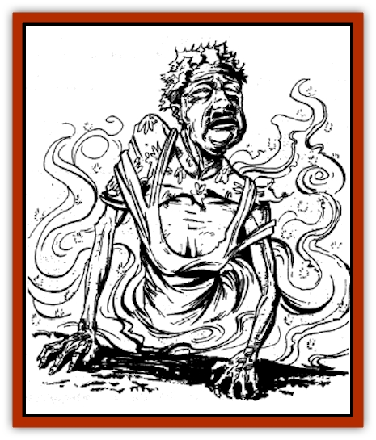

# Chu-u

| Statistic | **Chu-u** |
| --- | --- |
| **Activity Cycle:** | Night |
| **Alignment:** | Chaotic neutral |
| **Armor Class:** | 1 or -2 (see below) |
| **Climate/Terrain:** | Any subterranean |
| **Damage/Attack:** | 1-4 |
| **Diet:** | None |
| **Frequency:** | Very rare |
| **Hit Dice:** | 8 |
| **Intelligence:** | Average (8-10) |
| **Magic Resistance:** | 20% |
| **Morale:** | Steady (12) |
| **Movement:** | 3 |
| **No. Appearing:** | 1 |
| **No. of Attacks:** | 1 |
| **Organization:** | Solitary |
| **Size:** | M (5' tall) |
| **Special Attacks:** | See below |
| **Special Defenses:** | Can be hit only by +1 or better weapons |
| **THAC0:** | 13 |
| **Treasure:** | Nil |
| **XP Value:** | 3,000 |

The chu-u is a greater spirit. It seeks benevolent travelers who will testify on its behalf, so that it may be released from its tragic existence. It is also known as the "legless [[Ghost|ghost]]".

From the waist up, the chu-u resembles an elderly human. This humanlike portion of the chu-u rests in a pool of shimmering mist about 5 feet in diameter. The color of the pool continually shifts from red to white to black. The visage of the chu-u may be male or female, but its face is always lined with wrinkles and it always has a mournful frown. Its flesh is greenish, and its eyes are milky slits. It wears red garments and a crown of thistles and mint. It moves by dragging itself along the ground with its hands, a process requiring great effort that is always accompanied by wails of agony.

The chu-u speaks all the languages it knew in its former life.

**Combat:** The chu-u can cast *ghost light* once per round at an unlimited range. It usually uses this ability to create a man-shaped figure to beckon travelers. If the travelers respond (and don't panic), the ghostly figure leads them to the chu-u.

When it encounters travelers, a chu-u immediately begins to plead for help, pointing out its pathetic condition and begging for them to hear its tale describing how it came to this sorry state. If the travelers declines to listen, the angry chu-u vows vengeance, turns to mist (an ability it can use at will), then is instantly sucked away through a crack in the earth or similar opening.

If travelers agree to listen, the chu-u relates the story of its life as a human. The story is always sad and is told in great detail, beginning with the bad decisions the chu-u made as a child, continuing through its sorrowful experiences as an adult, and ending with the circumstances of its death, usually the result of cowardice or ineptitude. The story lasts for 2-8 (2d4) hours. After the first hour, all those listening to the chu-u must make a successful saving throw vs. spells, or they become so overwhelmed with sympathy for the chu-u that their despair hinders their actions for the next 24 hours, causing them to make all attack rolls at a -1 penalty. If the listener (or listeners) interrupt the chu-u's story before it finishes, it vows vengeance and disappears as described above.

If the chu-u finishes its story it then asks the listeners to testify on its behalf to the King Judge (see below). If they agree, the chu-u leads them to the spirit court. (Scholars disagree as to whether this is an actual journey or a spirit-induced dream.) If they refuse, it vows vengeance and disappears. Likewise, if the listeners attack the chu-u at any point, it disappears.

A wronged chu-u will exact its vengeance sometime in the distant future. It attacks when its victims least expect it, usually when they are asleep. The chu-u has the ability to turn its arms to mist and stretch them for an unlimited distance. Each misty arm snakes along the ground, through cracks and crevasses, under doors and windows, until it unerringly finds it mark. Since the chu-u has two arms, it can attack two victims at once - even if the victims are at opposite ends of the world.

The chu-u makes a normal attack roll for its misty assault; if successful, it chokes and strangles its victim, inflicting 1-4 hit points of damage per round. In each subsequent round, the choking hand continues to inflict 1-4 hit points of damage. At this point, no additional attack rolls are necessary; the victim cannot wrench the ghostly hand from his neck. The hand has an AC of -2; if it receives at least 10 hp of damage (from +1 weapons or better) or is magically negated (by dispel magic or a similar spell), it releases its victim and withdraws.

Wary victims may manage to prevent the chu-u's attack. If a victim-to-be visits a shukenja, who performs a successful purification ritual for this purpose, the chu-u will not exact its revenge.

**Habitat/Society:** Chu-u roam the shores of the River of the Tree Routhes. They were neither virtuous enough to pass the judges' examinations nor malevolent enough to merit additional sentencing. If a chu-u can convince a traveler to testify, the King Judge listens, then sends the traveler on his way. The chu-u will not approach that traveler again. The traveler may not learn the outcome of his testimony, since the King Judge often takes up to 100 years to decide a chu-u's fate.

**Ecology:** If the tears of a chu-u are collected in an opaque flask, they may be used as *oil of etherealness*.

---
## Discovery & Documentation

**Source Publication:** MC6 Kara-Tur Appendix (1990)
**Campaign Setting:** Kara-Tur (Forgotten Realms)
**Author(s):** Rick Swan

### Other Creatures Found in This Source Book
   * [[Bajang|Bajang]]
   * [[Bakemono|Bakemono]]
   * [[Bisan|Bisan]]
   * [[Buso|Buso]]
   * [[Carp_Giant|Carp, Giant]]
   * [[Centipede_Spirit|Centipede, Spirit]]
   * [[Con-tinh|Con-tinh]]
   * [[Doc_cu'o'c|Doc cu'o'c]]
   * [[Duruch'i-lin|Duruch'i-lin]]
   * [[Flame_Spirit|Flame Spirit]]
   * [[Foo_Creature|Foo Creature]]
   * [[Gaki|Gaki]]
   * [[Gargantua|Gargantua]]
   * [[Goblin_Rat|Goblin Rat]]
   * [[Hai_Nu|Hai Nu]]
   * [[Hannya|Hannya]]
   * [[Hengeyokai|Hengeyokai]]
   * [[Hsing-sing|Hsing-sing]]
   * [[Hu_Hsien|Hu Hsien]]
   * [[Human_Kara-Tur|Human (Kara-Tur)]]
   * [[Ikiryo|Ikiryo]]
   * [[Jishin_Mushi|Jishin Mushi]]
   * [[Kala|Kala]]
   * [[Kaluk|Kaluk]]
   * [[Kappa|Kappa]]
   * [[Korobokuru|Korobokuru]]
   * [[Krakentua|Krakentua]]
   * [[Kuei|Kuei]]
   * [[Memedi|Memedi]]
   * [[Men-shen|Men-shen]]
   * [[Nat|Nat]]
   * [[Ningyo|Ningyo]]
   * [[Oni|Oni]]
   * [[P'oh|P'oh]]
   * [[P'oh_Gohei|P'oh, Gohei]]
   * [[Shan_Sao|Shan Sao]]
   * [[Shirokinukatsukami|Shirokinukatsukami]]
   * [[Spirit_Folk|Spirit Folk]]
   * [[Spirit_Nature|Spirit, Nature]]
   * [[Spirit_Stone|Spirit, Stone]]
   * [[Tako|Tako]]
   * [[Tengu|Tengu]]
   * [[Wang-Liang|Wang-Liang]]
   * [[Yuan-ti_Histachii|Yuan-ti, Histachii]]
   * [[Yuki-on-na|Yuki-on-na]]
