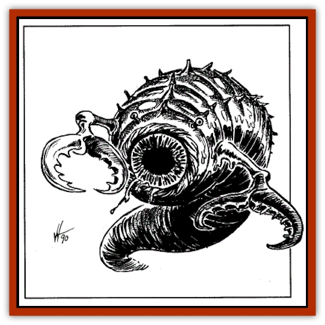

# Chulcrix

| Statistic | **Chulcrix** |
| --- | --- |
| **Activity Cycle:** | Any |
| **Alignment:** | Chaotic evil |
| **Armor Class:** | -2 |
| **Climate/Terrain:** | Ethereal plane |
| **Damage/Attack:** | 3d6/3d6 |
| **Diet:** | Carnivore |
| **Frequency:** | Very rare |
| **Hit Dice:** | 13 |
| **Intelligence:** | Low (5-7) |
| **Magic Resistance:** | 20% |
| **Morale:** | Steady (12) |
| **Movement:** | Fl 18 (B) |
| **No. Appearing:** | 1 |
| **No. of Attacks:** | 2 |
| **Organization:** | Solitary |
| **Size:** | G (100' long) |
| **Special Attacks:** | See below |
| **Special Defenses:** | See below |
| **THAC0:** | 7 |
| **Treasure:** | Nil |
| **XP Value:** | 18,000 |

The chulcrix is a vicious, repugnant carnivore that dwells primarily in the Ethereal plane.

The chulcrix resembles a gigantic worm, its plump body covered with black, chitinous skin that secretes glistening mucus that reeks of rotten meat. The chulcrix is typically 100 feet long and 20 feet thick, but some have been known to grow to lengths of 300 feet or more.

The entire front end of the chulcrix consists of a round valve that functions as its mouth. When the chulcrix is preparing to feed, its mouth can expand to a diameter of 30 feet (for larger specimens, the mouth can expand to a diameter equal to half its body length). Small tendrils lining its toothless mouth serve as sensory organs. The tendrils can sense motion, odor, and body heat up to ten miles distant.

Two 30-foot-long arms extend from the creature's neck; these end in writhing and snapping pincers.

The chulcrix is moderately intelligent and can communicate telepathically in simple phrases, though it does so only rarely.

**Combat:** A voracious carnivore, the chulcrix is motivated primarily by its desire to eat. It seldom makes physical attacks against potential prey, as it prefers its victims intact and undamaged when it eats them.

When a chulcrix encounters potential prey, it unhinges its jaws, causing its mouth to expand to a diameter of 30 feet. This process takes two rounds. Once its mouth has expanded, the chulcrix activates its attract victims power.

While the chulcrix continues to hover in place, an invisible cone of force radiates from its open mouth; the cone is 100 feet long with a 25-foot radius. All victims within the cone must roll a successful saving throw vs. spell. Those rolling successful saving throws are unaffected by the attract victims ability.

Victims failing their saving throws begin to float toward the chulcrix's mouth at a rate of ten feet per round. These victims must also roll a saving throw vs. paralyzation. Those failing their throws are paralyzed, unable to move or take any other actions as they float toward the chulcri's mouth. Those rolling successful saving throws vs. paralyzation can make missile attacks, cast spells, and take similar actions; however, they continue to move inexorably toward the creature's mouth.

Those affected by the chulcrix's attract victims ability continue to move toward the creature's mouth until they are consumed by the chulcrix, the chulcrix withdraws, or they are rescued by a companion.

Victims drawn into the chulcrix's mouth pass through a valve leading to the creature's stomach. Once in the stomach, victims are no longer paralyzed. Victims inside the stomach suffer an automatic 1d4 points of damage per round from acidic digestive gasses (no saving throw). Victims in the stomach can attempt to hack themselves free but, because of the churning movement of the stomach and the debilitating effect of the acidic gasses, all attacks by swallowed victims are made with a -2 penalty; maximum damage is 1 point per round (plus magical and Strength bonuses).

If a chulcrix in the process of consuming victims loses half its hit points, it turns itself inside out, instantly plane shifting to another location. All victims inside its stomach are left behind. When the chulcrix arrives at its new location, it automatically resumes its normal shape.

The chulcrix can also attack with its pincers, each inflicting 3d6 points of damage on opponents who either have resisted its *attract victims ability* or aren't desirable as food.

The chulcrix regenerates 1d4 lost points per round. It is immune to normal and magical fires, all cold-based attacks, and all forms of dragon breath.

**Habitat/Society:** The chulcrix has no permanent lair, instead spending its days roaming the Ethereal plane in search of prey. It has no formal societies and does not collect treasure.

The chulcrix lives to be about 10,000 years old. Once every thousand years, the asexual chulcrix lays a single egg, resembling a sphere of black crystal about 25 feet in diameter. The egg grows and expands for a century until it reaches a diameter of 100 feet, at which time the egg bursts open to release a fully mature chulcrix.

**Ecology:** The chulcrix is solitary by nature, though it occasionally associates with eyewings that serve as its scouts and aides. Chulcrix are sometimes employed as servitors by dark gods and their more powerful minions, usually in exchange for a promise of new and unusual prey. No prey is too small for a chulcrix and few are too large; chulcrix have been seen consuming small dragons.

---
## Discovery & Documentation

**Source Publication:** DLA3 Dragon's Rest (1990)
**Campaign Setting:** Dragonlance
**Author(s):** Rick Swan, Mike Breault, Valerie Valusek

### Other Creatures Found in This Source Book
   * [[Chronolily|Chronolily]]
   * [[Gk'lok-Lok|Gk'lok-Lok]]
