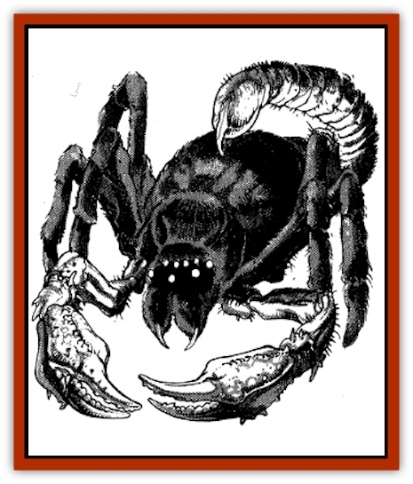

# Cildabrin

| Statistic | **Cildabrin** |
| --- | --- |
| **Activity Cycle:** | Any |
| **Alignment:** | Neutral evil |
| **Armor Class:** | 5 |
| **Climate/Terrain:** | Warm subterranean areas |
| **Damage/Attack:** | 1-12/1-12/1-6 |
| **Diet:** | Carnivore |
| **Frequency:** | Very rare |
| **Hit Dice:** | 11 |
| **Intelligence:** | Average (8-10) |
| **Magic Resistance:** | 20% |
| **Morale:** | Elite (14) |
| **Movement:** | 15 |
| **No. Appearing:** | 1-2 |
| **No. of Attacks:** | 3 |
| **Organization:** | Solitary |
| **Size:** | H (13' across, 6-10' high) |
| **Special Attacks:** | See below |
| **Special Defenses:** | Nil |
| **THAC0:** | 9 |
| **Treasure:** | C or D |
| **XP Value:** | 7,000 |

Cildabrins are a race of either huge, intelligent [[Spider|spiders]] with elements of a giant [[Scorpion|scorpion's]] anatomy, or a race of huge scorpions with elements of a spider's anatomy. No one knows for certain. Cildabrins never give the same answer twice, if they stop trying to eat the questioner long enough to answer at all.

A cildabrin's body is black and furry. The cildabrin's eight eyes are turquoise blue. The front two legs end in scorpion-like pincers, and there is a supple, fur-covered tail with an 8-inch stinger at its tip. They have infravision with a 120-foot range.

**Combat:** When in melee, cildabrins attack with their claws and their stinger. If the cildabrin hits with a pincer, the victim must make a successful saving throw vs. bend bars to escape. If the saving throw is not successful, the victim automatically takes 7-12 points of crushing damage in the subsequent round. The victim can attempt to escape once per round, until the cildabrin releases him at its death, or until the victim loses consciousness. The stinger can reach any medium-sized or larger targets that are in melee with it. The stinger is equipped with Type O poison.

Perhaps because of the presence of a tail, these beasts lack spinnerets. Fortunately, they are a highly magical race with several magical abilities to compensate for this weakness. The cildabrin can cast *web of darkness 15' radius*, and *silence, 15' radius* three times a day, one per round. Cildabrins also have a permanent *spider climb* effect. They are immune to all *web* spells.

Cildabrins prefer to ambush their prey from where they hide, usually from within an area of silence. They often cast a *web* spell and move into melee. A *darkness* spell is usually saved to protect the creature as it retreats.

**Habitat/Society:** As solitary creatures, cildabrins come together only to mate. If two cildabrins are encountered, there is doubtless a nest of 10-40 large, purple eggs nearby, probably in an area of *darkness*. Cildabrins appreciate the value of treasure and often leave some visible to attract prey. It is also valuable for those occasions when the cildabrin wishes to bribe or buy items it deems valuable or items it wishes to protect, such as its eggs.

**Ecology:** Cildabrins eat any animal that they can catch. Once the food is caught and paralyzed or killed, the cildabrin retreats to its lair to eat. The lair is usually a warm, dark cave. It cannot consume inorganic material, so items like armor, shields, and weapons are stripped from the prey and set aside, either in a pile in the rear of the cave or on the cildabrin's "bait piles".

---
## Discovery & Documentation

**Source Publication:** MC11 Forgotten Realms Appendix II (1991)
**Campaign Setting:** Advanced Dungeons & Dragons 2nd Edition
**Author(s):** Tim Beach, Tim Brown, William W. Connors, Dale Donovan, Ed Greenwood, Jeff Grubb, Bruce Heard, Slade Henson, Rob King, Colin McComb, Roger E. Moore, Bruce Nesmith, Jon Pickens, Jean Rabe, Dori Watry, Skip Williams

### Other Creatures Found in This Source Book
   * [[Alaghi|Alaghi]]
   * [[Alguduir|Alguduir]]
   * [[Beguiler|Beguiler]]
   * [[Bird_Toril|Bird (Toril)]]
   * [[Cantobele|Cantobele]]
   * [[Carapace|Carapace]]
   * [[Cat_Toril|Cat (Toril)]]
   * [[Chitine|Chitine]]
   * [[Dimensional_Warper|Dimensional Warper]]
   * [[Dragon_Deep|Dragon, Deep]]
   * [[Fachan_Toril|Fachan (Toril)]]
   * [[Fael|Fael]]
   * [[Feyr|Feyr]]
   * [[Firetail|Firetail]]
   * [[Frost|Frost]]
   * [[Gaund|Gaund]]
   * [[Gloomwing|Gloomwing]]
   * [[Golden_Ammonite|Golden Ammonite]]
   * [[Golem_Lightning|Golem, Lightning]]
   * [[Hamadryad|Hamadryad]]
   * [[Harrier|Harrier]]
   * [[Harrla|Harrla]]
   * [[Haun|Haun]]
   * [[Haundar|Haundar]]
   * [[Hendar|Hendar]]
   * [[Inquisitor|Inquisitor]]
   * [[Lhiannan_Shee|Lhiannan Shee]]
   * [[Loxo|Loxo]]
   * [[Manni|Manni]]
   * [[Manscorpion|Manscorpion]]
   * [[Mara|Mara]]
   * [[Morin|Morin]]
   * [[Naga_Dark|Naga, Dark]]
   * [[Orpsu|Orpsu]]
   * [[Plant_Carnivorous_Black_Willow|Plant, Carnivorous, Black Willow]]
   * [[Plant_Carnivorous_Toril|Plant, Carnivorous (Toril)]]
   * [[Plant_Dangerous_I|Plant, Dangerous I]]
   * [[Ring-Worm|Ring-Worm]]
   * [[Rohch|Rohch]]
   * [[Sand_Cat|Sand Cat]]
   * [[Saurial|Saurial]]
   * [[Sha'az|Sha'az]]
   * [[Silver_Dog|Silver Dog]]
   * [[Simpathetic|Simpathetic]]
   * [[Skuz|Skuz]]
   * [[Spider_Monkey|Spider, Monkey]]
   * [[Tren|Tren]]
