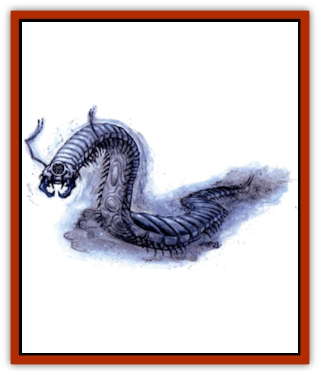

# Cilops

| Statistic | **Cilops** |
| --- | --- |
| **Activity Cycle:** | Any |
| **Alignment:** | Neutral |
| **Armor Class:** | 3 |
| **Climate/Terrain:** | Salt flats/Stony Barrens |
| **Damage/Attack:** | 2-12 |
| **Diet:** | Carnivore |
| **Frequency:** | Rare |
| **Hit Dice:** | 5 |
| **Intelligence:** | Animal (1) |
| **Magic Resistance:** | Nil |
| **Morale:** | Elite (13) |
| **Movement:** | 15 |
| **No. Appearing:** | 1-4 |
| **No. of Attacks:** | 2 (See below) |
| **Organization:** | None |
| **Size:** | H (15') |
| **Special Attacks:** | Stun |
| **Special Defenses:** | Nil |
| **THAC0:** | 15 |
| **Treasure:** | Nil |
| **XP Value:** | 420 |

**Psionics Summary**

| Level | Dis/Sci/Dev | Attack/Defense | Score | PSPs |
| --- | --- | --- | --- | --- |
| 3 | 2/1/3 | -/M- | 15 | 40 |

**Clairsentience -** *Sciences:* object reading, sensitivity to psychic impressions; *Devotion:* danger sense.

**Telepathy -** *Sciences:* nil; *Devotions:* life detection, mind blank.

Life detection: special ability, no cost

Cilops are relentless hunters who are prized by the templars of all the city-states for their unique tracking abilities. The creatures look like enormous [[Centipede|centipedes]] that reach lengths exceeding 15'. Their segmented bodies are long and flat and form a hard exoskeleton. Their hooked legs allow them to crawl onto virtually any surface and to scale walls with ease. Their oval heads have a large single compound eye and three pairs of pincerlike jaws. Two prehensile antennae grow from either side of the jaws and reach lengths of 3' to 5'. Cilops have a protective coloration that reflects their native terrain. The cilops of the salt flats often display a chalky blue-white to steel gray color while the cilops of the rocky badlands vary from rust orange to dark brown.

**Combat:** Cilops seem to require no sleep and will track their prey for weeks without stopping. Their unique *object reading* ability allows them to touch an object and then associate that object with an individual. While they ordinarily track by scent, if they are in danger of losing a trail, they will use an ability similar to *sensitivity to psychic impressions*. This ability allows a cilops to detect the psychic residue of its prey and to resume tracking. Its *danger sense* ability generally prevents the cilops from being ambushed or surprised by its prey. When tracking by scent, use the tracking nonweapon proficiency with a bonus of +2.

When the cilops engages in combat, it uses its antennae to stun its opponent. A successful hit by an antenna requires the target to make a saving throw vs. paralysis. Victims failing their saving throw suffer a shock to their nervous system which results in being stunned for 1 turn.

The cilops can also deliver a vicious series of bites. While listed above as one attack, the cilops may actually attempt to bite one target three times. If the first set of pincers hits the target, the second and third set automatically hit. This will inflict a total of 3d6 points of damage. If the first set of pincers misses, the cilops may attempt to hit on the same target with the second set. If this attack succeeds, the third set will automatically hit for a total of 2d6 point of damage. If the second attack misses, the cilops may try to hit the same target with the third set of pincers. A hit with the third set of pincers will deliver 1d6 points of damage.

The cilops will concentrate its attack on one individual until it is disabled before turning its attention to another threat.

**Habitat/Society:** Cilops have no lairs or consistent nesting areas, but constantly roam in search of food. They will occasionally hunt in small pack, but there appears to be no clear structure to the group. The cilops can be captured and trained. The creature seems to become familiar with its handler and can be used to hunt individuals if it is provided a fresh trail or an object that has been handled by the victim. Cilops have not been successfully bred in captivity and must be captured. Templars from the city-states usually try to find cilops in the salt flats, where it is easier to spot them. Cilops have even been used to track others of their kind.

**Ecology:** Native to the salt flats of Athas, the cilops have developed their extraordinary tracking abilities in order to find food in the barren wastes. Their protective coloration helps them to avoid predators, but they are particularly vulnerable to attack from flying creatures. Their poor depth of vision makes them rely upon their innate *life detection* ability and *danger sense* to warn them of predators.

Cilops will pick up the trail of their prey and track the victim relentlessly, even as they come across more vulnerable and more attractive targets. The cilops will fix on a particular target for as long as a week before selecting a new trail. Cilops will feed on just about any moving creature - they prefer live prey. A cilops requires one [[Dwarf_Athas|dwarf]]-sized meal per week.

---
## Discovery & Documentation

**Source Publication:** The Ivory Triangle (1993)
**Campaign Setting:** Dark Sun
**Author(s):** Curtis Scott, Kirk Botula

### Other Creatures Found in This Source Book
   * [[Bloodvine|Bloodvine]]
   * [[Treant_Athas|Treant (Athas)]]
   * [[Zombie_Salt|Zombie, Salt]]
