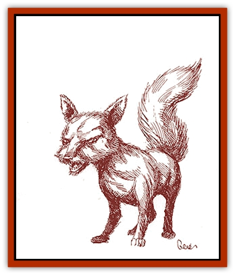

# Cinnavixen

| Statistic | **Cinnavixen** |
| --- | --- |
| **Activity Cycle:** | Dusk, dawn |
| **Alignment:** | Neutral |
| **Armor Class:** | 5 |
| **Climate/Terrain:** | Temperate forest and mountain |
| **Damage/Attack:** | 1d4 |
| **Diet:** | Carnivore |
| **Frequency:** | Uncommon |
| **Hit Dice:** | 1+1 |
| **Intelligence:** | Semi- (2-4) |
| **Magic Resistance:** | Nil |
| **Morale:** | Unsteady (5-7) |
| **Movement:** | 20 |
| **No. Appearing:** | 1d4 |
| **No. of Attacks:** | 1 |
| **Organization:** | Family |
| **Size:** | S (3' long) |
| **Special Attacks:** | Bleeding, <i>vermilia</i> |
| **Special Defenses:** | Nil |
| **THAC0:** | 19 |
| **Treasure:** | Nil |
| **XP Value:** | 65 |

Though this [[Mammal_Small|fox]]like mammal is sometimes hunted for its pelt, it is desired mostly for its ability to sniff out *cinnabryl* deposits.

Cinnavixens possess a beautiful, dark red coat with burnt orange swirls on the chest, paws, ears, and sometimes around the eyes. They are nearly three feet long, including a one-foot-long, bushy tail. Cinnavixens have dark brown eyes and a mouth full of sharp teeth. They possess a high-pitched yipping bark and a strange howl that sounds very much like high-pitched laughter.

**Combat:** Cinnavixens prefer to flee rather than fight, except when hunting for food or protecting their pups. They will not hold still if they feel threatened; instead, they will run around in circles, their incredible speed and nimble reflexes making them incredibly hard to hit. This makes things even more difficult for pelt dealers who are also trying not to damage the cinnavixen's coat. Cinnavixens attack with a bite and then leap back, gauging the damage if hunting or offering a truce if defending themselves.

The bite of a cinnavixen can be extremely troublesome. Blood from the wound will continue to flow until direct pressure is applied; this pressure cannot be removed until the wound has been bandaged for over 24 hours. Blood loss causes 1 hit point of damage per round per bite. The cinnavixen bite also has a 20% chance of infecting the wound with vermilia. (See the "[[Parasite_Savage_Coast|Parasite]]" entry for more information.)

**Habitat/Society:** A cinnavixen spends its first summer roaming the forests, finding temporary shelter each night under rock overhangs or nestled between tree roots. Toward fall when it is finally ready to settle down, it seeks a mate. The two of them then dig a burrow in which to raise a family. A normal litter usually consists of four to six pups. Pups stay in the burrow until early summer, when they leave to wander the forest themselves. Cinnavixens stay with their mates for life.

Cinnavixens always know where local deposits of *cinnabryl* are located. Though some cagey humanoids try to follow the cinnavixen as it hunts for food, this is no easy task. The creature is very cunning and uses many tricks to prevent anyone from tracking it.

Because of their soft and beautiful features, these creatures are often taken and tamed as pets. However, a tamed cinnavixen can no longer locate *cinnabryl* as it is now lost in the wild.

**Ecology:** The cinnavixen ability to locate *cinnabryl* is actually a useful side effect of its hunting process. Cinnavixens feed on rodents and are especially fond of the [[Voat|voat]], which eats the scarlet pimpernel plant. Cinnavixens seek out this plant, knowing that voats cannot be far off. Once a cinnavixen detects the presence of voats in an area, it will lie in wait to catch one.

The pelt of a cinnavixen, properly treated and unblemished, is worth up to five gold pieces. Because of the need for *cinnabryl*, most residents of the Savage Coast frown on those who hunt them or display the pelt. Inheritors go out of their way to protect the creatures.

Because of the [[Parasite_Savage_Coast|cardinal ticks]] which often infest the small mammal, cinnavixens often develop symbiotic relationships with the [[Lyra_Bird_Saragón|Sarag�n lyra bird]].

---
## Discovery & Documentation

**Source Publication:** Monstrous Compendium Savage Coast Appendix (Online Exclusive) (1995)
**Campaign Setting:** Mystara
**Author(s):** Loren L Coleman, Ted James, Thomas Zuvich, Cindi M. Rice

### Other Creatures Found in This Source Book
   * [[Aranea_Savage_Coast|Aranea (Savage Coast)]]
   * [[Arashaeem|Arashaeem]]
   * [[Batracine|Batracine]]
   * [[Cat_Marine|Cat, Marine]]
   * [[Clockwork_Swordsman|Clockwork Swordsman]]
   * [[Critter_Temple|Critter, Temple]]
   * [[Cursed_One|Cursed One]]
   * [[Deathmare|Deathmare]]
   * [[Dragon_Savage_Coast_Crimson|Dragon (Savage Coast), Crimson]]
   * [[Dragon_Savage_Coast_Red_Hawk|Dragon (Savage Coast), Red Hawk]]
   * [[Echyan|Echyan]]
   * [[Ee'aar|Ee'aar]]
   * [[Enduk|Enduk]]
   * [[Fachan_Savage_Coast|Fachan (Savage Coast)]]
   * [[Feliquine|Feliquine]]
   * [[Fiend_Narvaezan|Fiend, Narvaezan]]
   * [[Frelôn|Frelôn]]
   * [[Ghriest|Ghriest]]
   * [[Glutton_Sea|Glutton, Sea]]
   * [[Goatman|Goatman]]
   * [[Golem_Naâruk|Golem, Naâruk]]
   * [[Golem_Savage_Coast|Golem (Savage Coast)]]
   * [[Grudgling|Grudgling]]
   * [[Heraldic_Servant_I|Heraldic Servant I]]
   * [[Heraldic_Servant_II|Heraldic Servant II]]
   * [[Heraldic_Servant_III|Heraldic Servant III]]
   * [[Heraldic_Servant_IV|Heraldic Servant IV]]
   * [[Heraldic_Servant_V|Heraldic Servant V]]
   * [[Heraldic_Servant_General_Information|Heraldic Servant, General Information]]
   * [[Hermit_Sea|Hermit, Sea]]
   * [[Jorri|Jorri]]
   * [[Juhrion|Juhrion]]
   * [[Kla'a-tah|Kla'a-tah]]
   * [[Leech_Legacy|Leech, Legacy]]
   * [[Lich_Inheritor|Lich, Inheritor]]
   * [[Lizard_Kin_Savage_Coast|Lizard Kin (Savage Coast)]]
   * [[Lupasus|Lupasus]]
   * [[Lupin|Lupin]]
   * [[Lyra_Bird_Saragón|Lyra Bird, Saragón]]
   * [[Malfera|Malfera]]
   * [[Manscorpion_Nimmurian|Manscorpion, Nimmurian]]
   * [[Mythuínn_Folk|Mythuínn Folk]]
   * [[Neshezu|Neshezu]]
   * [[Nikt'oo|Nikt'oo]]
   * [[Nosferatu|Nosferatu]]
   * [[Omm-wa|Omm-wa]]
   * [[Omshirim|Omshirim]]
   * [[Parasite_Savage_Coast|Parasite (Savage Coast)]]
   * [[Phanaton|Phanaton]]
   * [[Plant_Savage_Coast|Plant (Savage Coast)]]
   * [[Pudding_Vermilion|Pudding, Vermilion]]
   * [[Rakasta|Rakasta]]
   * [[Ray_Forest|Ray, Forest]]
   * [[Shedu_Greater_Savage_Coast|Shedu, Greater (Savage Coast)]]
   * [[Shimmerfish|Shimmerfish]]
   * [[Skinwing|Skinwing]]
   * [[Spawn_of_Nimmur|Spawn of Nimmur]]
   * [[Spider-spy|Spider-spy]]
   * [[Spirit_Heroic|Spirit, Heroic]]
   * [[Spirit_Walleran|Spirit, Walleran]]
   * [[Succulus|Succulus]]
   * [[Swampmare|Swampmare]]
   * [[Symbiont_Shadow|Symbiont, Shadow]]
   * [[Tortle|Tortle]]
   * [[Troll_Legacy|Troll, Legacy]]
   * [[Trosip|Trosip]]
   * [[Tyminid|Tyminid]]
   * [[Utukku|Utukku]]
   * [[Voat|Voat]]
   * [[Voat_Herathian|Voat, Herathian]]
   * [[Vulturehound|Vulturehound]]
   * [[Wallara|Wallara]]
   * [[Wurmling|Wurmling]]
   * [[Wynzet|Wynzet]]
   * [[Yeshom|Yeshom]]
   * [[Zombie_Red|Zombie, Red]]
