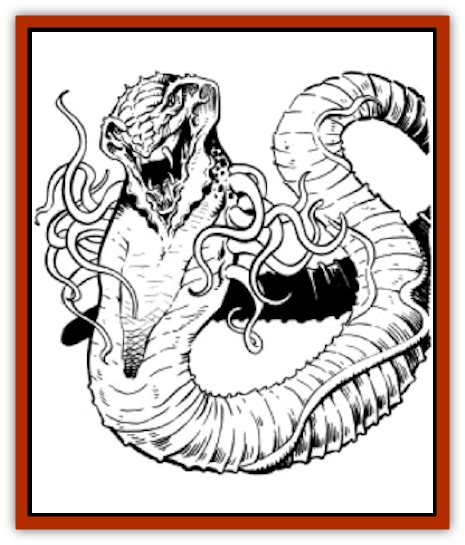

# Cistern Fiend

| Statistic | **Cistern Fiend** |
| --- | --- |
| **Activity Cycle:** | Any |
| **Alignment:** | Neutral |
| **Armor Class:** | 0 |
| **Climate/Terrain:** | Any water |
| **Damage/Attack:** | Special |
| **Diet:** | See below |
| **Frequency:** | Rare |
| **Hit Dice:** | 10+10 |
| **Intelligence:** | Animal (1) |
| **Magic Resistance:** | Nil |
| **Morale:** | Champion (15) |
| **Movement:** | 12 |
| **No. Appearing:** | 1 |
| **No. of Attacks:** | Special |
| **Organization:** | Solitary |
| **Size:** | G (40'+ long) |
| **Special Attacks:** | See below |
| **Special Defenses:** | Regeneration |
| **THAC0:** | 9 |
| **Treasure:** | Water |
| **XP Value:** | 10,000 |

**Psionics Summary**

| Level | Dis/Sci/Dev | Attack/Defense | Score | PSPs |
| --- | --- | --- | --- | --- |
| 7 | 1/2/6 | PB,EW,MT/IF,MB,TS | 16 | 100 |

**Telepathy -** *Sciences:* mind link, psionic blast; *Devotions:* contact, ego whip, inflict pain, life detection, mind thrust, synaptic static, thought shield, mental barrier, intellect fortress.

Life detection: special ability, no cost

This terrible creature is believed to have been conjured from the twisted mind of some long-dead sage. Frequently, unsuspecting victims of the cistern fiend think they have found a safe or unguarded water supply; this is usually their last conscious thought.

The cistern fiend appears as a giant, vaguely green but translucent worm with a great mass of coiling pinkish tentacles surrounding a hideous mouth. The cistern fiend is virtually invisible when totally submersed in water. The creature's size depends on its age and the amount of water available, but most cistern fiends average 40' to 50' in length.

**Combat:** The cistern fiend attacks with its bite. If a successful attack is made, the victim's body fluids are sucked out through the proboscis. A hapless victim will lose � of his normal total hit points from loss of body fluids each round until the victim's hit points reach zero. The loss will also stop if the cistern fiend is killed. The creature simultaneously attacks with its poison tentacles. Surrounding the mouth are a dozen 10-foot-long tentacles. The tentacles secrete a highly toxic, paralyzing fluid from sacs located in the base of each tentacle. Victims struck by the tentacles must make a Constitution check. A failed check means the victim's heart muscle stops beating, resulting in death. A successful check means the victim is only paralyzed for 1d10 turns. The cistern fiend will attempt to drain bodily fluids from any creature that it paralyzes; paralyzed victims are automatically hit by the fiends proboscis attack, and so will be killed in four rounds unless assisted.

The creature also has very basic psionic abilities. It uses its abilities to turn away other creatures from the water supply it protects, while shielding its mind from attack.

Hard to see in water, victims receive a - 3 penalty to surprise rolls. The spell detect invisible will reveal the monster's presence.

**Habitat/Society:** The cistern fiend, or water [[Worm|worm]], feeds in two different ways. It lives day-by-day filtering nutrients from the water supply in which it dwells. It filters the water through its mouth pores and gains sustenance from the minor biological and mineral impurities in the water. For this reason alone cistern fiends are beneficial to any community's water supply. The fiend also feeds as described above (see "Combat"). To the cistern fiend, all creatures are intruders and potential sources to add fluid to the existing water supply. A slain victim's body fluids are filtered by the cistern fiend and the resulting pure water is expelled into the existing water supply.Cistern fiends are hermaphroditic and reproduce asexually only once every 10 years. The single offspring grows inside the membranous tissue that comprises the fiends body and emerges through an eruption in the outer skin layer. During this 24 hour "delivery" period, the parent creature becomes docile. If the single offspring is not removed from the water source by the end of the 24-hour period, it will be killed by the parent creature. Needless to say, a town or city's water source tends to be quite heavily watched during this time.

A cistern fiend must stay immersed in water or it will die in 1d4 turns. For this reason it is very protective of its water supply.

**Ecology:** The cistern fiend was possibly bred by some long-dead and forgotten king. The creature was originally created for the sole purpose of guarding and purifying caches of water. These creatures are sometime stolen (most likely as newborn offspring) and can be encountered in any large water source. If two adult creatures are introduced into the same water supply, the stronger one will slay the weaker.

---
## Discovery & Documentation

**Source Publication:** MC12 Dark Sun Appendix I - Terrors of the Desert (1991)
**Campaign Setting:** Dark Sun
**Author(s):** Tom Prusa, Louis J. Prosperi, Walter M. Baas

### Other Creatures Found in This Source Book
   * [[Animal_Herd_Athas|Animal, Herd (Athas)]]
   * [[Animal_Household_Athas|Animal, Household (Athas)]]
   * [[Antloid_Desert|Antloid, Desert]]
   * [[Banshee_Dwarf|Banshee, Dwarf]]
   * [[Beetle_Agony|Beetle, Agony]]
   * [[Bog_Wader|Bog Wader]]
   * [[Brambleweed|Brambleweed]]
   * [[B'rohg|B'rohg]]
   * [[Burnflower|Burnflower]]
   * [[Cat_Psionic|Cat, Psionic]]
   * [[Cha'thrang|Cha'thrang]]
   * [[Clam_Giant|Clam, Giant]]
   * [[Cloud_Ray|Cloud Ray]]
   * [[Drake_Athas_Air|Drake (Athas), Air]]
   * [[Drake_Athas_Earth|Drake (Athas), Earth]]
   * [[Drake_Athas_Fire|Drake (Athas), Fire]]
   * [[Drake_Athas_Water|Drake (Athas), Water]]
   * [[Dune_Runner|Dune Runner]]
   * [[Dune_Trapper|Dune Trapper]]
   * [[Elemental_Athas_Greater_Air|Elemental (Athas), Greater, Air]]
   * [[Elemental_Athas_Greater_Earth|Elemental (Athas), Greater, Earth]]
   * [[Elemental_Athas_Greater_Fire|Elemental (Athas), Greater, Fire]]
   * [[Elemental_Athas_Greater_Water|Elemental (Athas), Greater, Water]]
   * [[Elemental_Athas_Lesser_Air_Earth|Elemental (Athas), Lesser, Air/Earth]]
   * [[Elemental_Athas_Lesser_Fire_Water|Elemental (Athas), Lesser, Fire/Water]]
   * [[Elemental_Athas_General_Information|Elemental (Athas), General Information]]
   * [[Erdland|Erdland]]
   * [[Esperweed|Esperweed]]
   * [[Flailer|Flailer]]
   * [[Floater|Floater]]
   * [[Giant_Athas|Giant (Athas)]]
   * [[Golem_Athas_I|Golem (Athas) I]]
   * [[Golem_Athas_II|Golem (Athas) II]]
   * [[Golem_Athas_III|Golem (Athas) III]]
   * [[Golem_Athas_General_Information|Golem (Athas), General Information]]
   * [[Halfling_Renegade|Halfling, Renegade]]
   * [[Hej-kin|Hej-kin]]
   * [[Id_Fiend|Id Fiend]]
   * [[Insect_Swarm_Athas|Insect Swarm (Athas)]]
   * [[Kank_Wild|Kank, Wild]]
   * [[Kirre|Kirre]]
   * [[Megapede|Megapede]]
   * [[Mul_Wild|Mul, Wild]]
   * [[Nightmare_Beast|Nightmare Beast]]
   * [[Plant_Carnivorous_Athas|Plant, Carnivorous (Athas)]]
   * [[Pterran|Pterran]]
   * [[Pterrax|Pterrax]]
   * [[Pulp_Bee|Pulp Bee]]
   * [[Pyreen|Pyreen]]
   * [[Rasclinn|Rasclinn]]
   * [[Razorwing|Razorwing]]
   * [[Roc_Athas|Roc (Athas)]]
   * [[Sand_Bride|Sand Bride]]
   * [[Sand_Cactus|Sand Cactus]]
   * [[Sand_Vortex|Sand Vortex]]
   * [[Scrab|Scrab]]
   * [[Silt_Horror|Silt Horror]]
   * [[Silt_Runner|Silt Runner]]
   * [[Sink_Worm|Sink Worm]]
   * [[Sloth_Athas|Sloth (Athas)]]
   * [[So-ut|So-ut]]
   * [[Spider_Cactus|Spider Cactus]]
   * [[Spider_Crystal|Spider, Crystal]]
   * [[Spirit_of_the_Land|Spirit of the Land]]
   * [[T'Chowb|T'Chowb]]
   * [[Thrax|Thrax]]
   * [[Tohr-kreen_I|Tohr-kreen I]]
   * [[Villichi|Villichi]]
   * [[Zhackal|Zhackal]]
   * [[Zombie_Plant|Zombie Plant]]
