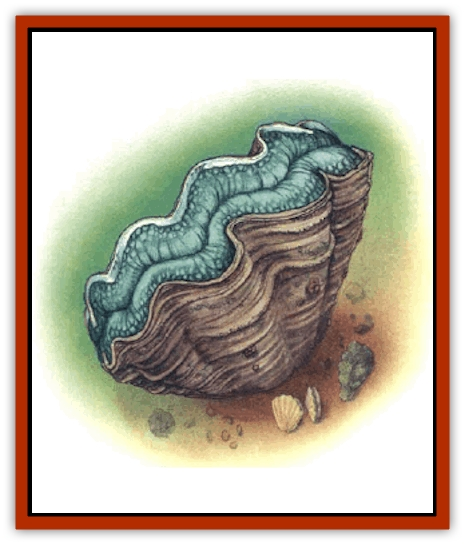

# Clam - Giant

| Statistic | **Carnivorous Scallop** | **Giant Clam (Oyster)** |
| --- | --- | --- |
| **Activity Cycle:** | Any | Any |
| **Alignment:** | Neutral | Neutral |
| **Armor Class:** | 4 (10) | 3 (10) |
| **Climate/Terrain:** | Tropical shallows | Ocean shallows |
| **Damage/Attack:** | 1d10 | See below |
| **Diet:** | Carnivore | Omnivore |
| **Frequency:** | Very rare | Rare |
| **Hit Dice:** | 4+4 | 3+3 |
| **Intelligence:** | Animal (1) | Non- (0) |
| **Magic Resistance:** | Nil | Nil |
| **Morale:** | Average (8-10) | Unsteady (5-7) |
| **Movement:** | 1, Sw 3 + special | 1 |
| **No. Appearing:** | 1-4 | 1-4 |
| **No. of Attacks:** | 1 ram | See below |
| **Organization:** | Solitary | Solitary |
| **Size:** | M (6' diameter) | M (6' diameter) |
| **Special Attacks:** | Surprise, poison cloud, entrapment | Entrapment |
| **Special Defenses:** | Nil | Nil |
| **THAC0:** | 15 | 17 |
| **Treasure:** | See below | See below |
| **XP Value:** | 650 | 175 |

Giant clams (including oysters, scallops, and similar shellfish) are found in shallow water, to a maximum depth of 200 feet. The soft-bodied mollusk lives in a hard, protective shell that it opens for feeding and closes against predators. The upper shell of the giant clam is a light brown (some have white markings), the lower shell is white. The clam has tiny blue eye-spots located near the edge of its shell. These can distinguish between light and shadow and detect movement, but cannot estimate size. Special organs near the front of the mantle cavity, where the soft body of the clam sits, detect and analyze chemical traces in the water.

Communication with giant clams is probably not possible except on the most basic empathic levels.

**Combat:** The giant clam is not a direct threat, but can be dangerous if approached incautiously. When threatened or when something tries to reach inside the shell, the shellfish reacts by closing its shell. The clam's adductor muscles, which act as a hinge for the shell, are quite powerful; a successful bend bars roll is required to force the shell open again.

Some species have wavy-edged shells that are very sharp. On a natural roll of 19 or 20, they will sever a trapped limb.

**Habitat/Society:** The giant clam is not usually found in large numbers, though rumors persist of large beds. An individual clam's location is not fixed, as it can use its inhalent and exhalent siphons to move across the sea bottom when the supply of food in an area runs low.

The giant clam filters small shrimp and sea animals from the water; it also lives on algae colonies growing inside the shell mantle. The clam's external cilia have evolved into small tentacles about 2 feet long. They are used to grasp prey and move it to the clam's stomach. The cilia are too weak to cause damage or hold any creature with a Strength greater than 6.

**Ecology:** Some undersea races, such as [[Triton|tritons]], tend beds where domesticated giant clams or oysters are grown. The most important predator of giant clams and oysters are [[Starfish_Giant|giant starfish]] and, of course, greedy humans seeking wealth. The inside of the shell is lined with mother-of-pearl, with a base value of 50 gp and a maximum value of 500 gp (use the *DMG* gem tables to find the value of the shell within these limits). A giant clam has a 5% chance for a single giant pearl worth 500 to 1,000 gp, depending on its size and quality. The pearl might be as large as a fist, but will not be as lustrous as smaller pearls from common pearl oysters. The chance for a giant oyster to have a pearl is 25%, and the base values are doubled. While giant clams do not actively accumulate treasure, there is a 5% chance that, scattered about or buried in the sediment around the clam, one can find a few coins, accouterments, or minor magical items from an unfortunate victim who was caught and drowned.

Larger or smaller giant shellfish can be generated by assuming 1+1 Hit Die per two feet of shell diameter and adjusting other characteristics accordingly. Unconfirmed rumors suggest the possibility of intelligent or even psionic clam and oyster colonies.

**Giant Carnivorous Scallop**

  The giant carnivorous scallop is, to the uninitiated, virtually indistinguishable from a giant clam. However, it has evolved a slightly higher intelligence than its cousin, and actively hunts for prey. This creature can actually swim by making a butterfly movement with its shell. It can, by a sudden expulsion of water, jet backward, ramming an opponent within 30 feet for 1d10 points of damage.

The carnivorous scallop's usual method of attack is to expel a mild neurotoxin through its exhalent siphon. The toxin disperses in a 10-foot diameter cloud that paralyzes for 1d12 rounds any creature that fails to make a successful saving throw vs. poison. The paralyzed prey is then grasped by the external cilia and either drawn directly into the stomach (where it suffers 1 point per round of damage while being digested) or cut into smaller pieces by sawing motions of the shell (which inflict 1d3 points per round).

Sometimes a giant carnivorous scallop buries itself in a sandy ocean bottom to hide from predators or surprise prey. When the clam is concealed, opponents have a -5 penalty to their surprise rolls.

---
## Discovery & Documentation

**Source Publication:** MC12 Dark Sun Appendix I - Terrors of the Desert (1991)
**Campaign Setting:** Dark Sun
**Author(s):** Tom Prusa, Louis J. Prosperi, Walter M. Baas

### Other Creatures Found in This Source Book
   * [[Animal_Herd_Athas|Animal, Herd (Athas)]]
   * [[Animal_Household_Athas|Animal, Household (Athas)]]
   * [[Antloid_Desert|Antloid, Desert]]
   * [[Banshee_Dwarf|Banshee, Dwarf]]
   * [[Beetle_Agony|Beetle, Agony]]
   * [[Bog_Wader|Bog Wader]]
   * [[Brambleweed|Brambleweed]]
   * [[B'rohg|B'rohg]]
   * [[Burnflower|Burnflower]]
   * [[Cat_Psionic|Cat, Psionic]]
   * [[Cha'thrang|Cha'thrang]]
   * [[Cistern_Fiend|Cistern Fiend]]
   * [[Cloud_Ray|Cloud Ray]]
   * [[Drake_Athas_Air|Drake (Athas), Air]]
   * [[Drake_Athas_Earth|Drake (Athas), Earth]]
   * [[Drake_Athas_Fire|Drake (Athas), Fire]]
   * [[Drake_Athas_Water|Drake (Athas), Water]]
   * [[Dune_Runner|Dune Runner]]
   * [[Dune_Trapper|Dune Trapper]]
   * [[Elemental_Athas_Greater_Air|Elemental (Athas), Greater, Air]]
   * [[Elemental_Athas_Greater_Earth|Elemental (Athas), Greater, Earth]]
   * [[Elemental_Athas_Greater_Fire|Elemental (Athas), Greater, Fire]]
   * [[Elemental_Athas_Greater_Water|Elemental (Athas), Greater, Water]]
   * [[Elemental_Athas_Lesser_Air_Earth|Elemental (Athas), Lesser, Air/Earth]]
   * [[Elemental_Athas_Lesser_Fire_Water|Elemental (Athas), Lesser, Fire/Water]]
   * [[Elemental_Athas_General_Information|Elemental (Athas), General Information]]
   * [[Erdland|Erdland]]
   * [[Esperweed|Esperweed]]
   * [[Flailer|Flailer]]
   * [[Floater|Floater]]
   * [[Giant_Athas|Giant (Athas)]]
   * [[Golem_Athas_I|Golem (Athas) I]]
   * [[Golem_Athas_II|Golem (Athas) II]]
   * [[Golem_Athas_III|Golem (Athas) III]]
   * [[Golem_Athas_General_Information|Golem (Athas), General Information]]
   * [[Halfling_Renegade|Halfling, Renegade]]
   * [[Hej-kin|Hej-kin]]
   * [[Id_Fiend|Id Fiend]]
   * [[Insect_Swarm_Athas|Insect Swarm (Athas)]]
   * [[Kank_Wild|Kank, Wild]]
   * [[Kirre|Kirre]]
   * [[Megapede|Megapede]]
   * [[Mul_Wild|Mul, Wild]]
   * [[Nightmare_Beast|Nightmare Beast]]
   * [[Plant_Carnivorous_Athas|Plant, Carnivorous (Athas)]]
   * [[Pterran|Pterran]]
   * [[Pterrax|Pterrax]]
   * [[Pulp_Bee|Pulp Bee]]
   * [[Pyreen|Pyreen]]
   * [[Rasclinn|Rasclinn]]
   * [[Razorwing|Razorwing]]
   * [[Roc_Athas|Roc (Athas)]]
   * [[Sand_Bride|Sand Bride]]
   * [[Sand_Cactus|Sand Cactus]]
   * [[Sand_Vortex|Sand Vortex]]
   * [[Scrab|Scrab]]
   * [[Silt_Horror|Silt Horror]]
   * [[Silt_Runner|Silt Runner]]
   * [[Sink_Worm|Sink Worm]]
   * [[Sloth_Athas|Sloth (Athas)]]
   * [[So-ut|So-ut]]
   * [[Spider_Cactus|Spider Cactus]]
   * [[Spider_Crystal|Spider, Crystal]]
   * [[Spirit_of_the_Land|Spirit of the Land]]
   * [[T'Chowb|T'Chowb]]
   * [[Thrax|Thrax]]
   * [[Tohr-kreen_I|Tohr-kreen I]]
   * [[Villichi|Villichi]]
   * [[Zhackal|Zhackal]]
   * [[Zombie_Plant|Zombie Plant]]
