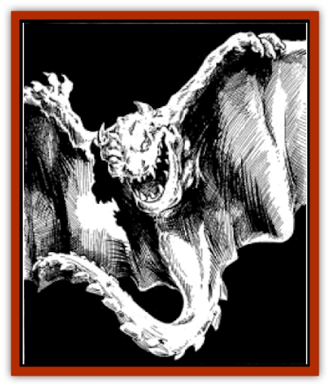

# Cloaker Lord

| Statistic | **Cloaker Lord** |
| --- | --- |
| **Activity Cycle:** | Any |
| **Alignment:** | Chaotic neutral |
| **Armor Class:** | 3 (1) |
| **Climate/Terrain:** | Any |
| **Damage/Attack:** | 2-8 + victim's AC/2-12 |
| **Diet:** | Carnivore |
| **Frequency:** | Very rare |
| **Hit Dice:** | 9 |
| **Intelligence:** | Genius (17-18) |
| **Magic Resistance:** | 30% |
| **Morale:** | Fanatic (17-18) |
| **Movement:** | 2, Fl 19 (C) |
| **No. Appearing:** | 1 |
| **No. of Attacks:** | 2 + special |
| **Organization:** | Solitary or Community (leading cloakers) |
| **Size:** | H (12'+ long) |
| **Special Attacks:** | Special |
| **Special Defenses:** | Special |
| **THAC0:** | 11 |
| **Treasure:** | C,V |
| **XP Value:** | 2,000 |

Cloaker lords are a superior sub-race of the feared subterranean race of [[Cloaker|cloakers]]. They look just like large cloakers, appearing either as a black cloak, such as an [[Ogre|ogre]] or small giant might wear - or unfurling to reveal their [[Bat|bat]]like true form, with ivory-clawed black wings, a flattish body whose white underside is inset with a red-eyed, needle-fanged, horned face, and a lashing, whiplike tail.

**Combat:** Cloaker lords fly at targets and try to engulf them. A successful attack roll means a cloaker lord has wrapped itself around a target's body. An engulfed victim cannot use any weapon longer than the arm wielding it, but automatically hits the cloaker with smaller weapons, at a -3 damage penalty. The cloaker lord also automatically bites the engulfed victim, doing 2d4 (plus the victim's unadjusted Armor Class, ignoring shields) points of damage per round. Cloaker lords absorb blood through their skins, devouring victims until only cleaned bones remain, to spill out of the unfurling "cloak". Attacks against an engulfing cloaker lord inflict half their damage on the monster, and half on the trapped victim. Area effect spells such as *fireball* inflict full damage on both cloaker lord and victim.

While engulfing a victim, a cloaker lord can use its thick-muscled, bone-barbed tail to lash any nearby creature for 2d6 damage. The tail is AC1, and is severed if dealt more than 24 points of damage.

The cloaker lord's moan attack can cause an 90-foot-range unease and numbing, forcing all creatures in range to attack at -2, and suffer a -2 penalty on all damage rolls. Any creature who remains in range, and hears the moaning for six consecutive rounds is forced into a trance that lasts as long as the moaning continues. Entranced victims cannot make attacks or cast spells, and cannot defend themselves (anything attacking them does so at +6 on all attack rolls).

Alternatively, a cloaker's moan can act as a *fear* spell, affecting all beings within 40 feet of the cloaker lord. They must save vs. spell, or flee at full movement rate for 2 rounds.

The third intensity of moaning affects creatures in a conical area, extending 40 feet from the monster, and widening to 30 feet across at its open end. All beings in the area must save vs. poison at -1, or be overcome by nausea and weakness for 1d4 + 1 rounds (during this time, they are unable to take any deliberate action).

The fourth moan strength acts as a *hold monster* spell, affecting only one being, who must be within 50 feet. Its effects last 6 rounds - unless the monster attacks another target with this moan, which instantly frees a previously-*held* victim.

By means of *shadow shifting*, a cloaker lord can obscure the vision of opponents, raising its own effective Armor Class to 1 by cloaking itself in swirls of darkness. Most often, the cloaker creates duplicates of itself, to draw away enemy attacks; treat this effect as a *mirror image* spell that creates 1d4+2 images. A cloaker lord can use only one *shadow shifting* effect per round, but it can moan, attack physically (except biting, which makes moaning impossible), and employ *shadow shifting*, all in the same round.

**Habitat/Society:** Cloaker lords can elude most mind-communication and -influencing psionics and spells because of their strange thought processes (determine what occurs on a case-by-case basis; attackers will have more success, the more practice they have in using such powers against cloaker lords). Cloaker lords hold a natural domination over cloakers, and have recently come to rule their lesser brethren, drawing normally-solitary cloakers together into loose raiding bands, and forcing other monsters (such as deepspawn, subdued by moans) into servitude.

**Ecology:** A cloaker lord that reaches a certain age or is near death will find a cloaker and devour it. If the cloaker lord survives 2d4 days longer, it splits apart, giving birth to a cloaker lord and 1d6 cloakers, all "babies" of miniature size. All can moan at birth, but their attacks do only half damage, and they can't yet control their *shadow shifting*. Instinct drives them to fly in different directions, to seek prey and master their powers.

---
## Discovery & Documentation

**Source Publication:** Menzoberranzan (1992)
**Campaign Setting:** Forgotten Realms
**Author(s):** Greenwood, Niles, and Salvatore

### Other Creatures Found in This Source Book
   * [[Alhoon|Alhoon]]
   * [[Foulwing|Foulwing]]
   * [[Lizard_Subterranean_Toril|Lizard, Subterranean (Toril)]]
   * [[Riding_Lizard|Riding Lizard]]
   * [[Wingless_Wonder|Wingless Wonder]]
