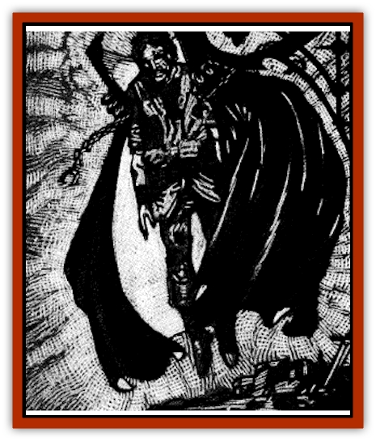

# Cloaker - Resplendent

| Statistic | **Cloaker, Resplendent** |
| --- | --- |
| **Activity Cycle:** | Day |
| **Alignment:** | Chaotic neutral |
| **Armor Class:** | 5 |
| **Climate/Terrain:** | Ravenloft |
| **Damage/Attack:** | Nil |
| **Diet:** | Special |
| **Frequency:** | Very rare |
| **Hit Dice:** | 6 |
| **Intelligence:** | High (13-14) |
| **Magic Resistance:** | Nil |
| **Morale:** | Unsteady (5-7) |
| **Movement:** | 12, Fl 15 (D) |
| **No. Appearing:** | 1 |
| **No. of Attacks:** | 0 |
| **Organization:** | Solitary |
| **Size:** | M (7' long) |
| **Special Attacks:** | See below |
| **Special Defenses:** | See below |
| **THAC0:** | 15 |
| **Treasure:** | Nil |
| **XP Value:** | 2,000 |

Shunned by many as an ill omen, the resplendent [[Cloaker|cloaker]] is a mournful creature that must alleviate the suffering of others in order to survive. This benign symbiont attaches itself to the nape of a host's neck and feeds by healing his wounds. While this can be a very valuable service, there is a drawback. The resplendent cloaker gives off a dazzling glow that makes it and its host highly visible.

The resplendent cloaker appears to be a large cloak with a scintillating dorsal surface and a bright white underside. Its claws appear to be gold clasps and what passes for a collar of burning, multi-colored jewels serve as the creature's eyes.

It is thought that resplendent cloakers may communicate with one another by varying the intensity of their glow. Attempts to make direct mental contact with a cloaker require a madness check.

**Combat:** The resplendent cloaker often lies in wait by draping itself on the floor or across a piece of furniture. When a potential host comes near, it attacks by emitting a sudden blinding burst of light that acts like the *color spray* of a 6th level wizard. This power can be used three times per day.

Once its victim has been dazzled by its color spray, the cloaker flies at its target and attempts to attach itself to the target's neck. A successful Attack Roll does no damage but allows it to affix itself to the victim. Once in place, the resplendent cloaked acts a *ring of regeneration*.

The resplendent cloaker also has the ability to engulf its victims. Each round the victim is affected as if by a *color spray* spell. An engulfed victim can make no attacks and may not employ spells or powers that have a somatic or verbal component. While a victim is engulfed, any damage done to the cloaker is divided evenly between the creature and the trapped victim. Area effect spells such as *fireball* do full damage to both the cloaker and its victim.

If the resplendent cloaker takes damage, it will immediately (in the same round) replenish the lost hit points by draining them from its host. When it heals itself, it must absorb 2 points for every 1 that it is regaining. If it kills its host by fully draining it of life the resplendent cloaker will then disengage itself and seek a new host.

If a cloaker is forcibly removed torn from its host, a feat that requires a bend bars/lift gates roll, both the cloaker and host must make a system shock roll or die instantly. A successful roll still leaves the host stunned and paralyzed until treated with a *heal* spell.

Attempts to smother the glow of the cloaker with heavy robes or by casting *darkness* on it will cause it to lose 1 hit point each round. It will replenish each lost hit point by immediately draining 2 from its host if possible.

A resplendent cloaker must heal at least 1 hit point each day in order to sustain itself. After 4 days without healing, it will leave the host in search of better feeding grounds. Any magical healing applied to a resplendent cloaker's host will immediately drive the creature away and do damage to equal to the number of points that would normally have been healed. This damage is applied to both the host and the cloaker.

**Habitat/Society:** Because of their attraction to suffering and bloodshed, these creatures are believed to have a prescient awareness of impending misfortune. Consequently, the appearance of a resplendent cloaker is believed to portend ill for the coming days.

Despite their somber significance, some prize these creatures for their symbiotic healing abilities. Others despise them for their tendency to draw attention to a host. More than one host has been murdered by thieves believing they had found an enchanted cloak. A greater number have fallen prey to predatory animals drawn to the resplendent cloaker's bright glow.

**Ecology:** The resplendent cloaker is a symbiotic creature that manages to sustain itself by healing the wounds of others. Exactly how it derives nourishment from this action is unknown.

---
## Discovery & Documentation

**Source Publication:** Ravenloft Appendix III (1991)
**Campaign Setting:** Ravenloft
**Author(s):** Kirk Botulla

### Other Creatures Found in This Source Book
   * [[Akikage|Akikage]]
   * [[Animator_Common|Animator, Common]]
   * [[Animator_Greater|Animator, Greater]]
   * [[Animator_Minor|Animator, Minor]]
   * [[Animator_General_Information|Animator, General Information]]
   * [[Bakhna_Rakhna|Bakhna Rakhna]]
   * [[Baobhan_Sith|Baobhan Sith]]
   * [[Beetle_Scarab|Beetle, Scarab]]
   * [[Boneless|Boneless]]
   * [[Boowray|Boowray]]
   * [[Bruja|Bruja]]
   * [[Carrionette|Carrionette]]
   * [[Carrion_Stalker|Carrion Stalker]]
   * [[Cat_Midnight|Cat, Midnight]]
   * [[Cat_Skeletal|Cat, Skeletal]]
   * [[Cloaker_Shadow|Cloaker, Shadow]]
   * [[Cloaker_Undead|Cloaker, Undead]]
   * [[Corpse_Candle|Corpse Candle]]
   * [[Death's_Head_Tree|Death's Head Tree]]
   * [[Doppelganger_Ravenloft|Doppelganger (Ravenloft)]]
   * [[Familiar_Pseudo-|Familiar, Pseudo-]]
   * [[Familiar_Undead|Familiar, Undead]]
   * [[Feathered_Serpent|Feathered Serpent]]
   * [[Fenhound|Fenhound]]
   * [[Figurine_Ceramic|Figurine, Ceramic]]
   * [[Figurine_Crystal|Figurine, Crystal]]
   * [[Figurine_Ivory|Figurine, Ivory]]
   * [[Figurine_Obsidian|Figurine, Obsidian]]
   * [[Figurine_Porcelain|Figurine, Porcelain]]
   * [[Figurine_General_Information|Figurine, General Information]]
   * [[Fleas_of_Madness|Fleas of Madness]]
   * [[Furies|Furies]]
   * [[Geist|Geist]]
   * [[Ghost_Animal|Ghost, Animal]]
   * [[Golem_Flesh_Ravenloft|Golem, Flesh (Ravenloft)]]
   * [[Golem_Mist_Ravenloft|Golem, Mist (Ravenloft)]]
   * [[Golem_Wax_Ravenloft|Golem, Wax (Ravenloft)]]
   * [[Gremishka|Gremishka]]
   * [[Hag_Spectral|Hag, Spectral]]
   * [[Head_Hunter|Head Hunter]]
   * [[Hearth_Fiend|Hearth Fiend]]
   * [[Hebi-No-Onna|Hebi-No-Onna]]
   * [[Hound_Phantom|Hound, Phantom]]
   * [[Hound_Skeletal|Hound, Skeletal]]
   * [[Imp_Wishing|Imp, Wishing]]
   * [[Ivy_Crawling|Ivy, Crawling]]
   * [[Jack_Frost|Jack Frost]]
   * [[Jolly_Roger|Jolly Roger]]
   * [[Kizoku|Kizoku]]
   * [[Lashweed|Lashweed]]
   * [[Leech_Magical|Leech, Magical]]
   * [[Leech_Psionic|Leech, Psionic]]
   * [[Lich_Defiler|Lich, Defiler]]
   * [[Lich_Drow|Lich, Drow]]
   * [[Lich_Elemental|Lich, Elemental]]
   * [[Lich_Psionic|Lich, Psionic]]
   * [[Living_Tattoo|Living Tattoo]]
   * [[Lycanthrope_Loup-garou|Lycanthrope, Loup-garou]]
   * [[Lycanthrope_Werejackal|Lycanthrope, Werejackal]]
   * [[Lycanthrope_Werejaguar_Ravenloft|Lycanthrope, Werejaguar (Ravenloft)]]
   * [[Lycanthrope_Wereleopard|Lycanthrope, Wereleopard]]
   * [[Lycanthrope_Wereray|Lycanthrope, Wereray]]
   * [[Mist_Ferryman|Mist Ferryman]]
   * [[Moor_Man|Moor Man]]
   * [[Obedient|Obedient]]
   * [[Odem|Odem]]
   * [[Paka|Paka]]
   * [[Plant_Blood_Rose|Plant, Blood Rose]]
   * [[Plant_Fearweed|Plant, Fearweed]]
   * [[Radiant_Spirit|Radiant Spirit]]
   * [[Recluse|Recluse]]
   * [[Remnant_Aquatic|Remnant, Aquatic]]
   * [[Rushlight|Rushlight]]
   * [[Sea_Spawn_Master|Sea Spawn, Master]]
   * [[Sea_Spawn_Minion|Sea Spawn, Minion]]
   * [[Shadow_Asp|Shadow Asp]]
   * [[Shattered_Brethren|Shattered Brethren]]
   * [[Skeleton_Archer|Skeleton, Archer]]
   * [[Skeleton_Insectoid|Skeleton, Insectoid]]
   * [[Skin_Thief|Skin Thief]]
   * [[Spirit_Psionic|Spirit, Psionic]]
   * [[Strahd_Skeleton|Strahd Skeleton]]
   * [[Strahd_Zombie|Strahd Zombie]]
   * [[Unicorn_Shadow|Unicorn, Shadow]]
   * [[Vampire_Drow|Vampire, Drow]]
   * [[Vampire_Nosferatu|Vampire, Nosferatu]]
   * [[Vampire_Oriental|Vampire, Oriental]]
   * [[Virus_General_Information|Virus, General Information]]
   * [[Virus_I|Virus I]]
   * [[Virus_II|Virus II]]
   * [[Virus_III|Virus III]]
   * [[Vorlog|Vorlog]]
   * [[Will_O'Dawn|Will O'Dawn]]
   * [[Will_O'Deep|Will O'Deep]]
   * [[Will_O'Mist|Will O'Mist]]
   * [[Will_O'Sea|Will O'Sea]]
   * [[Zombie_Cannibal|Zombie, Cannibal]]
   * [[Zombie_Desert|Zombie, Desert]]
   * [[Zombie_Wolf|Zombie Wolf]]
   * [[Zombie_Fog|Zombie Fog]]
