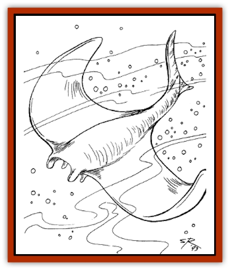

# Cloaker - Sea

| Statistic | **Cloaker, Sea** |
| --- | --- |
| **Activity Cycle:** | Any |
| **Alignment:** | Chaotic evil |
| **Armor Class:** | 2 |
| **Climate/Terrain:** | Salt water/Simorgya |
| **Damage/Attack:** | 1-6/1-6 + victim's AC |
| **Diet:** | Carnivore |
| **Frequency:** | Very rare |
| **Hit Dice:** | 5 |
| **Intelligence:** | Low (5-7) |
| **Magic Resistance:** | Nil |
| **Morale:** | Average (8-10) |
| **Movement:** | 6, Sw 18 |
| **No. Appearing:** | 1-6 |
| **No. of Attacks:** | 1 + special |
| **Organization:** | School |
| **Size:** | M (5' tall) |
| **Special Attacks:** | Envelopment |
| **Special Defenses:** | Nil |
| **THAC0:** | 15 |
| **Treasure:** | E |
| **XP Value:** | 270 |

These [[Ray|manta]]like creatures may be related to the more common [[Cloaker|cloaker]]. They inhabit the sunken realm of Simorgya and may follow the orders of its rulers. Sea cloakers have dead black backs with small red eyes and light gray undersides which sport vicious fanged maws.

**Combat:** A sea cloaker makes a single special attack on its chosen victim. If the attack hits, the cloaker has enveloped its victim and automatically inflicts 1-6 points of damage per round plus the victim's unadjusted Armor Class (a victim in leather armor would suffer 1d6+8 points of damage) until killed or dislodged. Armor values of less than 0 are treated as 0. While attacking an enveloped victim, the cloaker attacks others with its tail, inflicting 1-6 points of damage per hit.

Attacks on a cloaker holding an enveloped victim inflict half damage on the cloaker and half on its prey. Once a cloaker has been reduced to 25% of its original hit points, the DM rolls 1d20 against its morale score. If the roll indicates a failure, the cloaker frees its victim and attempts to flee.

**Habitat/Society:** Sea cloakers like to inhabit dark, confined areas from which they emerge unexpectedly, or they cling to ceilings or walls, allowing them to drop on passing prey.

**Ecology:** Cloakers are usually scavengers, but they can easily become predators. They are extremely tough and can survive out of water or 1-4 turns. Sea cloakers move slowly on land, fighting with -4 attack penalties. If an enveloped victim emerges from the water, the cloaker continues to inflict damage normally until killed or dislodged.

---
## Discovery & Documentation

**Source Publication:** Lankhmar: City of Adventure (2nd Ed.) (1993)
**Campaign Setting:** Lankhmar
**Author(s):** Bruce Nesmith, Douglas Niles, and Ken Rolston

### Other Creatures Found in This Source Book
   * [[Astral_Wolf|Astral Wolf]]
   * [[Behemoth|Behemoth]]
   * [[Bird_of_Tyaa|Bird of Tyaa]]
   * [[Cat_War|Cat, War]]
   * [[Cold_Woman|Cold Woman]]
   * [[Devourer_Lankhmar|Devourer (Lankhmar)]]
   * [[Ghoul_Kleshite|Ghoul, Kleshite]]
   * [[Ghoul_Lankhmar|Ghoul (Lankhmar)]]
   * [[Gladiator_Lizard|Gladiator Lizard]]
   * [[Horag|Horag]]
   * [[Howler|Howler]]
   * [[Ice_Gnome|Ice Gnome]]
   * [[Invisible_of_Stardock|Invisible of Stardock]]
   * [[Lizard|Lizard]]
   * [[Ophidian|Ophidian]]
   * [[Ray_Invisible_Flying|Ray, Invisible Flying]]
   * [[Scorpion|Scorpion]]
   * [[Simorgyan|Simorgyan]]
   * [[Snow_Serpent|Snow Serpent]]
   * [[Thunder_Children|Thunder Children]]
   * [[Wraith-Spider|Wraith-Spider]]
   * [[Zombie_Sea|Zombie, Sea]]
