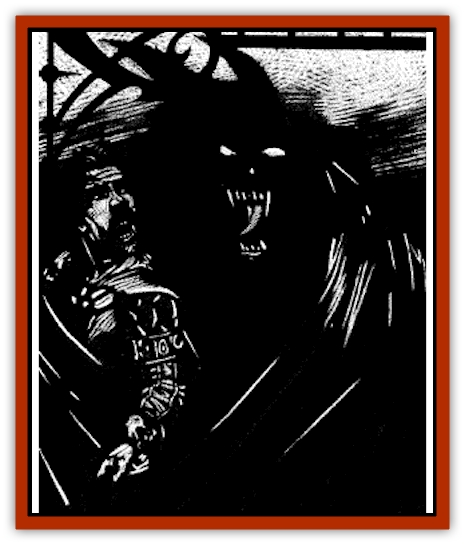

# Cloaker - Shadow

| Statistic | **Cloaker, Shadow** |
| --- | --- |
| **Activity Cycle:** | Any |
| **Alignment:** | Chaotic neutral |
| **Armor Class:** | 7 |
| **Climate/Terrain:** | Ravenloft |
| **Damage/Attack:** | 1d6/1d6 |
| **Diet:** | Special |
| **Frequency:** | Very rare |
| **Hit Dice:** | 6 |
| **Intelligence:** | High (13-14) |
| **Magic Resistance:** | Nil |
| **Morale:** | Elite (13-14) |
| **Movement:** | 12, Fl 15 (D) |
| **No. Appearing:** | 1 |
| **No. of Attacks:** | 2 |
| **Organization:** | Solitary |
| **Size:** | M (7' long) |
| **Special Attacks:** | Constitution drain |
| **Special Defenses:** | See below |
| **THAC0:** | 15 |
| **Treasure:** | Nil |
| **XP Value:** | 2,000 |

The shadow [[Cloaker|cloaker]] is an unusual parasite that is believed to have been spawned on the Demiplane of Shadow. Once it attaches itself to someone, it uses them as a conduit through which it can drain the Constitution of other creatures. If unable to satisfy its hunger in this fashion, it begins to feed directly on the Constitution of its host.

When seen in bright light the shadow cloaker appears to be a black void in the shape of a great cape. Because of its ability to blend naturally into shadows, the cloaker is rarely seen except when it has already attached itself to a host.

It is believed that shadow cloakers are intelligent and may have their own language but every attempt to communicate with them has resulted in failure. Attempts to establish direct mental contact with any form of cloaker often require a madness check.

**Combat:** This sinister creature stalks its prey silently, gliding along the ground or along walls as gently as a passing shadow. Because of its absolute lack of color, a shadow cloaker has a 90% chance of hiding in shadows. If it is successfully hidden. the shadow cloaker always gains surprise when it attacks.

The shadow cloaker's whiplike tail is a dangerous weapon. In a single round it may strike twice, doing 1d6 points of damage each time.

When it is without a human counterpart, the cloaker will attempt to attach itself to a potential host's shadow by making a successful Attack Roll. A successful hit on the part of the shadow cloaked does no damage to the victim, but allows the creature to affix itself to its target's shoulders.

Once a shadow cloaker has attached itself to a new host it will attempt to feed by imbuing its companion with the ability to drain Constitution points by touch. Any time the host makes physical contact with another living creature, the shadow cloaker will drain a point of Constitution from him. The shadow cloaker will drain only one point per day so that subsequent touches will do no harm to anyone.

If a full day passes without the cloaker feeding, it will draw the point directly from its host instead. If a host's Constitution reaches 0, he dies. When this happens, the shadow cloaker will leave to seek another host. Twenty-four hours later, the drained host will rise again as an undead [[Shadow|shadow]].

The shadow cloaker's Constitution draining ability is difficult to detect because of a strange anesthetizing quality of its attack that causes the weakening effects of the touch to be unfelt for 2d8 rounds. The intentional use of a shadow cloaker's draining touch by a host is an evil action and requires a powers check.

A shadow cloaker can only be struck by magical weapons. If attacked when it is attached to someone, the creature will engulf its host and use its tail to ward off would-be rescuers. While engulfed, the host may use no melee weapons, psionics, or spells that require verbal or somatic components. The host absorbs half of any normal damage delivered to a shadow cloaker while engulfed. Area effect weapons and spells do full damage to both the creature and its host.

A *continual light* or *light* spell cast directly at a shadow cloaker will force it to release its hold on a host and flee. These creatures are immune to *sleep*, *charm*, and *hold* spells. Shadow cloakers are not undead and cannot be turned or harmed by holy water.

**Habitat/Society:** What little is known (or assumed) about these solitary creatures has been almost impossible to verify. The first known shadow cloaker returned almost unnoticed with the sole survivor of a party of Dark Delvers exploring a series of underground caverns in Arak. Since then, other creatures of this type have appeared in Ravenloft, seemingly without cause.

**Ecology:** Shadow cloakers are parasites that depend upon a host to employ their energy-draining powers. Without a host to help it feed, the shadow cloaker loses 1 Hit Die per week until it dies.

---
## Discovery & Documentation

**Source Publication:** Ravenloft Appendix III (1991)
**Campaign Setting:** Ravenloft
**Author(s):** Kirk Botulla

### Other Creatures Found in This Source Book
   * [[Akikage|Akikage]]
   * [[Animator_Common|Animator, Common]]
   * [[Animator_Greater|Animator, Greater]]
   * [[Animator_Minor|Animator, Minor]]
   * [[Animator_General_Information|Animator, General Information]]
   * [[Bakhna_Rakhna|Bakhna Rakhna]]
   * [[Baobhan_Sith|Baobhan Sith]]
   * [[Beetle_Scarab|Beetle, Scarab]]
   * [[Boneless|Boneless]]
   * [[Boowray|Boowray]]
   * [[Bruja|Bruja]]
   * [[Carrionette|Carrionette]]
   * [[Carrion_Stalker|Carrion Stalker]]
   * [[Cat_Midnight|Cat, Midnight]]
   * [[Cat_Skeletal|Cat, Skeletal]]
   * [[Cloaker_Resplendent|Cloaker, Resplendent]]
   * [[Cloaker_Undead|Cloaker, Undead]]
   * [[Corpse_Candle|Corpse Candle]]
   * [[Death's_Head_Tree|Death's Head Tree]]
   * [[Doppelganger_Ravenloft|Doppelganger (Ravenloft)]]
   * [[Familiar_Pseudo-|Familiar, Pseudo-]]
   * [[Familiar_Undead|Familiar, Undead]]
   * [[Feathered_Serpent|Feathered Serpent]]
   * [[Fenhound|Fenhound]]
   * [[Figurine_Ceramic|Figurine, Ceramic]]
   * [[Figurine_Crystal|Figurine, Crystal]]
   * [[Figurine_Ivory|Figurine, Ivory]]
   * [[Figurine_Obsidian|Figurine, Obsidian]]
   * [[Figurine_Porcelain|Figurine, Porcelain]]
   * [[Figurine_General_Information|Figurine, General Information]]
   * [[Fleas_of_Madness|Fleas of Madness]]
   * [[Furies|Furies]]
   * [[Geist|Geist]]
   * [[Ghost_Animal|Ghost, Animal]]
   * [[Golem_Flesh_Ravenloft|Golem, Flesh (Ravenloft)]]
   * [[Golem_Mist_Ravenloft|Golem, Mist (Ravenloft)]]
   * [[Golem_Wax_Ravenloft|Golem, Wax (Ravenloft)]]
   * [[Gremishka|Gremishka]]
   * [[Hag_Spectral|Hag, Spectral]]
   * [[Head_Hunter|Head Hunter]]
   * [[Hearth_Fiend|Hearth Fiend]]
   * [[Hebi-No-Onna|Hebi-No-Onna]]
   * [[Hound_Phantom|Hound, Phantom]]
   * [[Hound_Skeletal|Hound, Skeletal]]
   * [[Imp_Wishing|Imp, Wishing]]
   * [[Ivy_Crawling|Ivy, Crawling]]
   * [[Jack_Frost|Jack Frost]]
   * [[Jolly_Roger|Jolly Roger]]
   * [[Kizoku|Kizoku]]
   * [[Lashweed|Lashweed]]
   * [[Leech_Magical|Leech, Magical]]
   * [[Leech_Psionic|Leech, Psionic]]
   * [[Lich_Defiler|Lich, Defiler]]
   * [[Lich_Drow|Lich, Drow]]
   * [[Lich_Elemental|Lich, Elemental]]
   * [[Lich_Psionic|Lich, Psionic]]
   * [[Living_Tattoo|Living Tattoo]]
   * [[Lycanthrope_Loup-garou|Lycanthrope, Loup-garou]]
   * [[Lycanthrope_Werejackal|Lycanthrope, Werejackal]]
   * [[Lycanthrope_Werejaguar_Ravenloft|Lycanthrope, Werejaguar (Ravenloft)]]
   * [[Lycanthrope_Wereleopard|Lycanthrope, Wereleopard]]
   * [[Lycanthrope_Wereray|Lycanthrope, Wereray]]
   * [[Mist_Ferryman|Mist Ferryman]]
   * [[Moor_Man|Moor Man]]
   * [[Obedient|Obedient]]
   * [[Odem|Odem]]
   * [[Paka|Paka]]
   * [[Plant_Blood_Rose|Plant, Blood Rose]]
   * [[Plant_Fearweed|Plant, Fearweed]]
   * [[Radiant_Spirit|Radiant Spirit]]
   * [[Recluse|Recluse]]
   * [[Remnant_Aquatic|Remnant, Aquatic]]
   * [[Rushlight|Rushlight]]
   * [[Sea_Spawn_Master|Sea Spawn, Master]]
   * [[Sea_Spawn_Minion|Sea Spawn, Minion]]
   * [[Shadow_Asp|Shadow Asp]]
   * [[Shattered_Brethren|Shattered Brethren]]
   * [[Skeleton_Archer|Skeleton, Archer]]
   * [[Skeleton_Insectoid|Skeleton, Insectoid]]
   * [[Skin_Thief|Skin Thief]]
   * [[Spirit_Psionic|Spirit, Psionic]]
   * [[Strahd_Skeleton|Strahd Skeleton]]
   * [[Strahd_Zombie|Strahd Zombie]]
   * [[Unicorn_Shadow|Unicorn, Shadow]]
   * [[Vampire_Drow|Vampire, Drow]]
   * [[Vampire_Nosferatu|Vampire, Nosferatu]]
   * [[Vampire_Oriental|Vampire, Oriental]]
   * [[Virus_General_Information|Virus, General Information]]
   * [[Virus_I|Virus I]]
   * [[Virus_II|Virus II]]
   * [[Virus_III|Virus III]]
   * [[Vorlog|Vorlog]]
   * [[Will_O'Dawn|Will O'Dawn]]
   * [[Will_O'Deep|Will O'Deep]]
   * [[Will_O'Mist|Will O'Mist]]
   * [[Will_O'Sea|Will O'Sea]]
   * [[Zombie_Cannibal|Zombie, Cannibal]]
   * [[Zombie_Desert|Zombie, Desert]]
   * [[Zombie_Wolf|Zombie Wolf]]
   * [[Zombie_Fog|Zombie Fog]]
