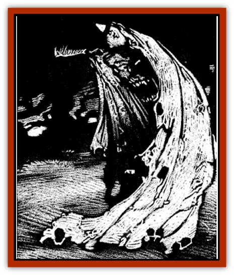

# Cloaker - Undead

| Statistic | **Cloaker, Undead** |
| --- | --- |
| **Activity Cycle:** | Night |
| **Alignment:** | Chaotic evil |
| **Armor Class:** | 3 |
| **Climate/Terrain:** | Ravenloft |
| **Damage/Attack:** | 1d6/1d6 |
| **Diet:** | Special |
| **Frequency:** | Very rare |
| **Hit Dice:** | 6 |
| **Intelligence:** | High (13-14) |
| **Magic Resistance:** | Nil |
| **Morale:** | Elite (13-14) |
| **Movement:** | 3, Fl 15 (D) |
| **No. Appearing:** | 1 |
| **No. of Attacks:** | 2 |
| **Organization:** | Solitary |
| **Size:** | M (7' long) |
| **Special Attacks:** | Level drain, laceration |
| **Special Defenses:** | See below |
| **THAC0:** | 15 |
| **Treasure:** | C |
| **XP Value:** | 2,000 |

The undead [[Cloaker|cloaker]] is a foul and dangerous creature that is believed to be the earthly remains of a [[Cloaker_Resplendent|resplendent cloaker]] that has had its life drained away by the living dead. The creature actually imbues its host with the power to drain life energy. If the host fails to do this, the undead cloaker will drain his life energy instead.

The undead cloaker appears to be a large decaying cloak. What might seem to be tattered cloth from a distance is clearly composed of rotting flesh when viewed at closer range.

While it is not known if these creatures can communicate, they are believed to have a dim telepathic ability to direct the actions of a mindless undead host. Direct mental contact with an undead cloaker requires any living being to make a madness check.

**Combat:** When the undead cloaker assaults a new host, it flies quickly at the victim and engulfs it in its rotting folds. If its attack is successful, it will have attached itself to its victim's neck, doing 1d4 points of damage. If the attack is unsuccessful, it will continue to attempt to attach itself in succeeding rounds.

A victim who is engulfed by an undead cloaker is unable to take any physical actions, cast spells with somatic or material components, or use psionics of any kind. The undead cloaker will keep its new host engulfed until he stops struggling. Once a new host is subdued, the undead cloaker will retain its grip at the victim's neck, but allow its host free movement. The undead cloaker may engulf its host at any time without an attack roll if the host attempts to free itself. An engulfed host will take half of any physical damage inflicted upon the undead cloaker. Area effect weapons and spells will do full damage to both the undead cloaker and its host.

Once the undead cloaker has secured a new host, it will drain a life level from any living creature that the host touches. If the host fails to feed the undead cloaker in this manner at least once per day, the creature will drain a life level from the host. Any creature that is drained to zero level by an undead cloaker or its host will return from the grave in 1d4 days as a common [[Zombie|zombie]].

The undead cloaker can also use its tail to deliver two lacerating attacks per round to any opponents who attempt to harm it or remove it from its host. Each time the tail strikes a victim, it delivers 1d6 points of damage and creates a long, bloody gash that will continue to bleed (1d6 points per round) until the wound is bound or some form of healing magic is employed. It requires one full round and the use of both hands for an individual to bind one of these wounds.

Physically removing an undead cloaker from its host requires a bend bars/lift gates roll. If the cloaker is successfully torn from its wearer, the creature will be instantly killed and drain 1d4 life levels from the host.

An undead cloaker will not select a host who is under the effects of a *negative plane protection* spell. Casting this spell on an undead cloaker's host will cause the creature to break free and seek a new quarry. A cloaker can also be turned by a priest as a 6-HD creature, in which case it will detach from its host and flee.

Undead cloakers are immune to all *sleep*, *charm*, *hold*, *fear*, and cold-based attacks. They are not harmed by diseases, poisons, or paralyzation attacks. They are also immune to the level draining touch of their hosts or other undead creatures. A *raise dead* spell cast upon an undead cloaker will destroy it if a saving throw vs. spell fails. Holy water will inflict 1d6+2 points of damage to an undead cloaker.

**Habitat/Society:** Undead cloakers are solitary and chaotic creatures who have never been known to cooperate with one another or with other creatures. They are, however, occasionally found attached to zombies they have created. An undead cloaker seems to have the ability to direct the actions of a mindless unlead host that it has destroyed. In these cases. the creature will continue to use the newly-created zombie as a conduit for its life-draining power.

The willful use of an undead cloaker by a host to drain life energy levels is an evil act and requires a powers check.

**Ecology:** As undead creatures, these cloakers have no place in the natural order. If it is true that they were once resplendent cloakers, then their conversion to unlife is somewhat tragic.

---
## Discovery & Documentation

**Source Publication:** Ravenloft Appendix III (1991)
**Campaign Setting:** Ravenloft
**Author(s):** Kirk Botulla

### Other Creatures Found in This Source Book
   * [[Akikage|Akikage]]
   * [[Animator_Common|Animator, Common]]
   * [[Animator_Greater|Animator, Greater]]
   * [[Animator_Minor|Animator, Minor]]
   * [[Animator_General_Information|Animator, General Information]]
   * [[Bakhna_Rakhna|Bakhna Rakhna]]
   * [[Baobhan_Sith|Baobhan Sith]]
   * [[Beetle_Scarab|Beetle, Scarab]]
   * [[Boneless|Boneless]]
   * [[Boowray|Boowray]]
   * [[Bruja|Bruja]]
   * [[Carrionette|Carrionette]]
   * [[Carrion_Stalker|Carrion Stalker]]
   * [[Cat_Midnight|Cat, Midnight]]
   * [[Cat_Skeletal|Cat, Skeletal]]
   * [[Cloaker_Resplendent|Cloaker, Resplendent]]
   * [[Cloaker_Shadow|Cloaker, Shadow]]
   * [[Corpse_Candle|Corpse Candle]]
   * [[Death's_Head_Tree|Death's Head Tree]]
   * [[Doppelganger_Ravenloft|Doppelganger (Ravenloft)]]
   * [[Familiar_Pseudo-|Familiar, Pseudo-]]
   * [[Familiar_Undead|Familiar, Undead]]
   * [[Feathered_Serpent|Feathered Serpent]]
   * [[Fenhound|Fenhound]]
   * [[Figurine_Ceramic|Figurine, Ceramic]]
   * [[Figurine_Crystal|Figurine, Crystal]]
   * [[Figurine_Ivory|Figurine, Ivory]]
   * [[Figurine_Obsidian|Figurine, Obsidian]]
   * [[Figurine_Porcelain|Figurine, Porcelain]]
   * [[Figurine_General_Information|Figurine, General Information]]
   * [[Fleas_of_Madness|Fleas of Madness]]
   * [[Furies|Furies]]
   * [[Geist|Geist]]
   * [[Ghost_Animal|Ghost, Animal]]
   * [[Golem_Flesh_Ravenloft|Golem, Flesh (Ravenloft)]]
   * [[Golem_Mist_Ravenloft|Golem, Mist (Ravenloft)]]
   * [[Golem_Wax_Ravenloft|Golem, Wax (Ravenloft)]]
   * [[Gremishka|Gremishka]]
   * [[Hag_Spectral|Hag, Spectral]]
   * [[Head_Hunter|Head Hunter]]
   * [[Hearth_Fiend|Hearth Fiend]]
   * [[Hebi-No-Onna|Hebi-No-Onna]]
   * [[Hound_Phantom|Hound, Phantom]]
   * [[Hound_Skeletal|Hound, Skeletal]]
   * [[Imp_Wishing|Imp, Wishing]]
   * [[Ivy_Crawling|Ivy, Crawling]]
   * [[Jack_Frost|Jack Frost]]
   * [[Jolly_Roger|Jolly Roger]]
   * [[Kizoku|Kizoku]]
   * [[Lashweed|Lashweed]]
   * [[Leech_Magical|Leech, Magical]]
   * [[Leech_Psionic|Leech, Psionic]]
   * [[Lich_Defiler|Lich, Defiler]]
   * [[Lich_Drow|Lich, Drow]]
   * [[Lich_Elemental|Lich, Elemental]]
   * [[Lich_Psionic|Lich, Psionic]]
   * [[Living_Tattoo|Living Tattoo]]
   * [[Lycanthrope_Loup-garou|Lycanthrope, Loup-garou]]
   * [[Lycanthrope_Werejackal|Lycanthrope, Werejackal]]
   * [[Lycanthrope_Werejaguar_Ravenloft|Lycanthrope, Werejaguar (Ravenloft)]]
   * [[Lycanthrope_Wereleopard|Lycanthrope, Wereleopard]]
   * [[Lycanthrope_Wereray|Lycanthrope, Wereray]]
   * [[Mist_Ferryman|Mist Ferryman]]
   * [[Moor_Man|Moor Man]]
   * [[Obedient|Obedient]]
   * [[Odem|Odem]]
   * [[Paka|Paka]]
   * [[Plant_Blood_Rose|Plant, Blood Rose]]
   * [[Plant_Fearweed|Plant, Fearweed]]
   * [[Radiant_Spirit|Radiant Spirit]]
   * [[Recluse|Recluse]]
   * [[Remnant_Aquatic|Remnant, Aquatic]]
   * [[Rushlight|Rushlight]]
   * [[Sea_Spawn_Master|Sea Spawn, Master]]
   * [[Sea_Spawn_Minion|Sea Spawn, Minion]]
   * [[Shadow_Asp|Shadow Asp]]
   * [[Shattered_Brethren|Shattered Brethren]]
   * [[Skeleton_Archer|Skeleton, Archer]]
   * [[Skeleton_Insectoid|Skeleton, Insectoid]]
   * [[Skin_Thief|Skin Thief]]
   * [[Spirit_Psionic|Spirit, Psionic]]
   * [[Strahd_Skeleton|Strahd Skeleton]]
   * [[Strahd_Zombie|Strahd Zombie]]
   * [[Unicorn_Shadow|Unicorn, Shadow]]
   * [[Vampire_Drow|Vampire, Drow]]
   * [[Vampire_Nosferatu|Vampire, Nosferatu]]
   * [[Vampire_Oriental|Vampire, Oriental]]
   * [[Virus_General_Information|Virus, General Information]]
   * [[Virus_I|Virus I]]
   * [[Virus_II|Virus II]]
   * [[Virus_III|Virus III]]
   * [[Vorlog|Vorlog]]
   * [[Will_O'Dawn|Will O'Dawn]]
   * [[Will_O'Deep|Will O'Deep]]
   * [[Will_O'Mist|Will O'Mist]]
   * [[Will_O'Sea|Will O'Sea]]
   * [[Zombie_Cannibal|Zombie, Cannibal]]
   * [[Zombie_Desert|Zombie, Desert]]
   * [[Zombie_Wolf|Zombie Wolf]]
   * [[Zombie_Fog|Zombie Fog]]
