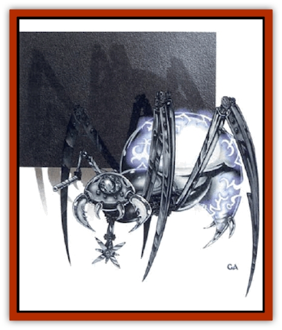

# Clockwork Horror

| Statistic | **Adamantite** | **Copper** | **Electrum** | **Gold** | **Platinum** | **Silver** |
| --- | --- | --- | --- | --- | --- | --- |
| **Activity Cycle:** | Any | Any | Any | Any | Any | Any |
| **Alignment:** | Lawful evil | Lawful evil | Lawful evil | Lawful evil | Lawful evil | Lawful evil |
| **Armor Class:** | -6 | 4 | 0 | -2 | -4 | 2 |
| **Climate/Terrain:** | Any nonaquatic | Any nonaquatic | Any nonaquatic | Any nonaquatic | Any nonaquatic | Any nonaquatic |
| **Damage/Attack:** | 1d20 | 1d4 | 1d8 | 1d10 | 1d12 | 1d6 |
| **Diet:** | None | None | None | None | None | None |
| **Frequency:** | Unique | Uncommon | Rare | Very rare | Unique | Rare |
| **Hit Dice:** | 7 | 2 | 4 | 5 | 6 | 3 |
| **Intelligence:** | Genius (17-18) | Low (5-7) | Very (11-12) | High (13-14) | Exceptional (15-16) | Average (8-10) |
| **Magic Resistance:** | 90% | 10% | 30% | 50% | 70% | 20% |
| **Morale:** | Fearless (20) | Fearless (20) | Fearless (20) | Fearless (20) | Fearless (20) | Fearless (20) |
| **Movement:** | 9 | 9 | 9 | 9 | 9 | 9 |
| **No. Appearing:** | 1 | 2-20 | 1-6 | 1 | 1 | 1-10 |
| **No. of Attacks:** | 1 | 1 | 1 | 1 | 1 | 1 |
| **Organization:** | Race | Race | Race | Race | Race | Race |
| **Size:** | S (2' dia.) | S (2' dia.) | S (2' dia.) | S (2' dia.) | S (2' dia.) | S (2' dia.) |
| **Special Attacks:** | Disintegrate | Nil | Steam caster | Lightning rod | Lightning rod | Spring caster |
| **Special Defenses:** | See below | See below | See below | See below | See below | See below |
| **THAC0:** | 13 | 19 | 17 | 15 | 15 | 17 |
| **Treasure:** | Nil | Nil | Nil | Nil | Nil | Nil |
| **XP Value:** | 6,000 | 65 | 175 | 975 | 1,400 | 120 |

If one thinks of campaign worlds as single cells in the body of the cosmos, then one must certainly think of clockwork horrors as viruses that have come to destroy that body.

Clockwork horrors are a form of arcane apparatus. They look something like a mechanical [[Spider|spider]] (though they have only four legs). While the body of the horror is only about two feet in diameter, the legs give the creature an overall diameter of about four feet. In the front of the body is a crystal that enables the horror to see. Two depressions, one on each side of this lens, serve the horror as hearing organs. Two limbs, located roughly below the hearing dishes, serve a number of purposes described later.

The body of a clockwork horror is always cast as a single piece from some type of metal. The most common type of horror is created from copper, but others may be cast from silver, electrum, gold, platinum or even adamantite. The surface of the body is always highly polished and covered with pulsating runes of mystical power.

Clockwork horrors communicate with each other by means of clicks, whirs, and similar mechanical sounds. The exact nature of their language is unknown. It is believed, however, that the horrors use a type of dot-and-dash code similar to that employed by sailors when they signal each other with lights.

**Combat:** All clockwork horrors share the same special defenses. They are immune to all spells that depend on biological functions for their effects. Examples of these include *cure* or *cause wounds*, *feign death*, *polymorph other*, and *cloudkill*. In addition all mind-affecting spells, such as *charm*, *hypnotize*, or *fear*, have no effect on them; nor do psionic attack modes. They can be affected only by attacks that have some power over nonliving objects. A *shatter* spell directed at the horror's seeing crystal will blind it for one round per level of the caster. Similarly, a *dispel magic* spell focused on a single horror paralyzes the horror for a like duration.

In addition, all horrors are immune to electricity-based attacks of any type. Heat and cold affect them normally, as do all other types of spells not specifically excluded.

**Habitat/Society:** The wisest sages tell of an ancient humanoid race, known only as the "Lost Ones". Records of their origin have long since faded, but frightening tales are told of their demise.

The Lost Ones were fond of mechanisms. The more subtle and clever their devices, the better they liked them. In the end, however, their own love of such toys brought them down. One of their most brilliant artificers built a magnificent adamantite machine with workings so advanced that none but he could fathom its operation. In addition, he wove powerful spells about the contraption, bestowing on it intelligence and mystical abilities. In gratitude for its creation, the adamantite machine destroyed him.

Over the course of the next few decades, the adamantite horror built an army of mechanical followers, each in its own image, but of lesser quality. As the horrors rose to power in their sphere, they eliminated all biological life in it. In the end, they tore apart the worlds in their sphere and used the raw materials thus obtained to build more and more horrors.

Centuries passed for the horrors contained in the sphere of the Lost Ones. They would have been forever doomed to remain there had they not been visited by a fleet of [[Neogi|neogi]] deathspiders. The neogi had come seeking slaves and "cattle" to feast upon. Instead, they found death. One by one, their ships were taken from them. In the end the neogi and their slaves found themselves forced into *lifejammers* (spelljamming ships powered by life energy instead of magic).

Now able to journey between crystal spheres, the clockwork horrors began to spread. Each crystal sphere they entered was violated and the worlds within were plundered. For those living in these doomed spheres, there was no escape.

The society of clockwork horrors, if one can call it that, is a rigid, almost military one. Horrors have no individual identities. Rather, they have a mission: the race must survive.

Once the clockwork horrors have established a foothold on a world, they see all living things on that world as a threat. Logically, to the horrors, such cultures must be removed - and removal of living things is one thing at which the clockwork horrors are expert.

**Ecology:** The clockwork horrors are not natural creatures, but make radical changes in the worlds they visit. They sometimes temporarily enslave intelligent races, keeping hopes of some  accommodation alive until they have total control. They also take occasional prisoners to study and analyze species weaknesses.

A clockwork horror fleet, which nearly always consists of 10d10 captured neogi ships, leaves the worlds it visits stripped of their natural resources. Metals are strip-mined, living things are removed as useless and troublesome, and everything that can be exploited is drained away. This process takes only two or three centuries.

The powerful weapons of the clockwork horrors are highly prized by most artificers. While they do not retain their powers after removal from the horrors, they are nonetheless interesting to study.

**Copper Horror**

The copper horror is the most commonly encountered horror. While all of the other horrors have a built-in weapon of some type, the copper horror is not so equipped. Copper horrors serve as the menial workers of the race. The special appendages that they use in their daily labors, however, can often be used in combat with some success. When a copper horror is forced to engage in melee, the mechanism can be used to make one attack that inflicts 1d4 points of damage. The exact nature of the attack may vary (S, P, or B), depending on the task to which the copper horror was assigned.

**Silver Horror**

The silver horror is somewhat less common that its copper kin, but is far more dangerous. The silver horror is the warrior of the race. It is most often encountered as a patrol or guard at work sites or in horror-dominated regions.

The right manipulator arm of the silver horror is fashioned to serve a dual purpose. Besides enabling the silver horror to grasp and handle items in the manner of a human hand, it can present sharp blades for combat. Once extended, these spin at high speed, turning the manipulator into a deadly rotating saw that strikes for 1d6 points of damage.

The silver horror has a missile weapon as well. Where the copper horror has a secondary manipulating arm, the silver horror has a hollow black tube. This weapon, a *spring caster*, is a clockwork-driven device that ejects a barbed dart at high veltocity. The dart has ranges of 10/20/40 yards and inflicts 1d3 points of damage. The spring caster can fire once per round.

**Electrum Horror**

The electrum horror fills the role of commanding officer or overseer. It often leads patrols of silver horros or directs the operations of large numbers of copper horrors.

The electrum horror is equipped with the same combination manipulator/razor saw found on the silver horror. However, the electrum razor saw is sharper and more dangerous, inflicting 1d8 points of damage with a successful hit.

Where the silver horror has a spring caster, however, the electrum horror is armed with a *steam caster*. The steam caster uses a jet of high pressure steam to fire its missiles. As with the spring caster, the rate of fire is but one per round. The range of the steam caster is 20/40/80 yards, and the damage inflicted by a hit is 2d4 points.

**Gold Horror**

The gold horror is a high-ranking member of the clockwork horror social structure. As a rule, there is only one gold horror to a planet, and its task is the direction of all horror operations on that world. Besides its keen intelligence, the gold horror's combat abilities make it more than able to carry out its mission.

The gold horror's razor saw is one of the sharpest cutting devices known. In combat, it inflicts 1d10 points of damage. The gold horror's second arm is a black tube known as a *lightning rod*. Once every other combat round, the rod can unleash a stroke of lightning that functions just as the 3rd-level wizard spell, *lightning bolt*, but inflicting 3d6 points of damage. A saving throw vs. spell is allowed for half damage.

**Platinum Horror**

Seldom will more that one platinum horror be found in a given crystal sphere (campaign universe). Where gold horrors direct the actions of the lesser clockwork horrors, the platinum horror directs the gold horrors.

The weapons of the platinum horror are the same as those of the gold horror: the razor saw and lightning rod. However, the platinum razor saw inflicts 1d12 points of damage and the lightning rod can fire every round for 4d8 points of damage. A saving throw vs. spell is allowed for half damage.

**Adamantite Horror**

The so-called "father" of the clockwork horror race, only one adamantite horror is known to exist. A cold and calculating entity, the adamantite horror is fond of intricate strategies and devious planning.

When drawn into actual combat, a rare occurrence, the adamantite horror is far from helpless. Its first line of defense is its trusty razor saw. More dangerous than the saw of the platinum horror, the adamantite razor saw inflicts 1d20 damage with a successful attack.

The adamantite horror has no lightning rod, but wields a weapon known as the *nightmare stick*. Each round, the nightmare stick functions as the 6th-level wizard spell, *disintegrate*, with a 50-yard range. A saving throw vs. spell is allowed to avoid the deadly effect.

---
## Discovery & Documentation

**Source Publication:** MC7 Spelljammer Appendix I (1990)
**Campaign Setting:** Advanced Dungeons & Dragons 2nd Edition
**Author(s):** various

### Other Creatures Found in This Source Book
   * [[Aartuk|Aartuk]]
   * [[Albari|Albari]]
   * [[Ancient_Mariner|Ancient Mariner]]
   * [[Argos|Argos]]
   * [[Beholder_Abomination_Astereater|Beholder (Abomination), Astereater]]
   * [[Blazozoid|Blazozoid]]
   * [[Chattur|Chattur]]
   * [[Chevall|Chevall]]
   * [[Colossus|Colossus]]
   * [[Delphinid|Delphinid]]
   * [[Dizantar|Dizantar]]
   * [[Dog|Dog]]
   * [[Dog_Bog_Hound|Dog, Bog Hound]]
   * [[Esthetic|Esthetic]]
   * [[Focoid|Focoid]]
   * [[Fractine|Fractine]]
   * [[Giant_Spacesea|Giant, Spacesea]]
   * [[Golem_Furnace|Golem, Furnace]]
   * [[Golem_Radiant|Golem, Radiant]]
   * [[Gravislayer|Gravislayer]]
   * [[Grommam|Grommam]]
   * [[Hadozee|Hadozee]]
   * [[Hamster_Giant_Space|Hamster, Giant Space]]
   * [[Jammer_Leech|Jammer Leech]]
   * [[Lakshu|Lakshu]]
   * [[Lumineaux|Lumineaux]]
   * [[Lutum|Lutum]]
   * [[Mimic_Space|Mimic, Space]]
   * [[Misi|Misi]]
   * [[Moon_Rogue|Moon, Rogue]]
   * [[Mortiss|Mortiss]]
   * [[Murderoid|Murderoid]]
   * [[Nay-Churr|Nay-Churr]]
   * [[Phlog-Crawler|Phlog-Crawler]]
   * [[Plasman|Plasman]]
   * [[Plasmoid_DeGleash|Plasmoid, DeGleash]]
   * [[Plasmoid_DelNoric|Plasmoid, DelNoric]]
   * [[Plasmoid_General_Information|Plasmoid, General Information]]
   * [[Plasmoid_Ontalak|Plasmoid, Ontalak]]
   * [[Puffer|Puffer]]
   * [[Q'nidar|Q'nidar]]
   * [[Rastipede|Rastipede]]
   * [[Reigar|Reigar]]
   * [[Rock_Hopper|Rock Hopper]]
   * [[Slinker|Slinker]]
   * [[Spider_Asteroid|Spider, Asteroid]]
   * [[Spiritjam|Spiritjam]]
   * [[Survivor|Survivor]]
   * [[Syllix|Syllix]]
   * [[Symbiont_Power|Symbiont, Power]]
   * [[Vine_Infinity|Vine, Infinity]]
   * [[Wiggle|Wiggle]]
   * [[Wizshade|Wizshade]]
   * [[Wryback|Wryback]]
   * [[Zard|Zard]]
   * [[Zodar|Zodar]]
