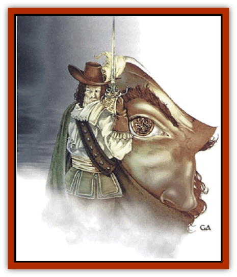

# Clockwork Swordsman

| Statistic | **Clockwork Swordsman** |
| --- | --- |
| **Activity Cycle:** | Any |
| **Alignment:** | Chaotic good |
| **Armor Class:** | 2 |
| **Climate/Terrain:** | Any |
| **Damage/Attack:** | By weapon (+3 Strength bonus) |
| **Diet:** | None |
| **Frequency:** | Very rare |
| **Hit Dice:** | 5-10 |
| **Intelligence:** | Very to Exceptional (11-16) |
| **Magic Resistance:** | Nil |
| **Morale:** | Fearless (19-20) |
| **Movement:** | 12 |
| **No. Appearing:** | 1 |
| **No. of Attacks:** | 2 |
| **Organization:** | Solitary |
| **Size:** | M (6' tall) |
| **Special Attacks:** | See below |
| **Special Defenses:** | See below |
| **THAC0:** | 5-6 HD: 15 / 7-8 HD: 13 / 9-10 HD: 11 |
| **Treasure:** | Q (&times;2), see below |
| **XP Value:** | 5 HD: 650 / 6 HD: 975 / 7 HD: 1,400 / 8 HD: 2,000 (+1000 per additional HD) |

Clockwork swordsmen are the [[Golem_Ravenloft|mechanical and magical creations]] of powerful mages, originally devised as elite bodyguards. Clockwork swordsmen are fearless and act according to a "code of conduct" very similar to that of a swashbuckler. The DM should treat the clockwork swordsman as a swashbuckler of level equal to its Hit Dice. The clockwork swordsman has all the applicable nonweapon proficiencies and swashbuckler abilities, but they never belong to any of the fighting schools. (See the *Savage Coast Campaign Book* for the swashbuckler description.) Because of its mechanical nature, the clockwork swordsman succeeds on all proficiency checks on a roll of 18 or less.

Clockwork swordsmen are sentient, generally intelligent and charismatic, but they have a horrendous Wisdom. It is very difficult for them to learn from their mistakes, and they will repeat the same error over and over again, even if corrected. These automatons are quite capable of handling sophisticated missions within a limited time frame and are capable of limited interpolation and extrapolation of past behavior to cope with new situations. However, the results generally leave something to be desired.

Clockwork swordsmen are almost perfect replicas of the humanoids they were built to emulate, with only slight clicks and whirs to betray their true nature. All clockwork swordsmen are obsessed with the fact that they only have a mechanical heart and no soul. They see this condition as a curse. A clockwork swordsman in company is cheery and quite outgoing. When a clockwork swordsman thinks that is unobserved or alone, however, it can be quite morose and melancholy. As magical constructs, they are bound to serve their creators, but most clockwork swordsmen quickly develop an intense dislike (or even hatred) for their creators.

**Combat:** Consult the following table to determine what additional action the clockwork swordsman attempts each round. A clockwork swordsman loses one full hour of activity for each point of damage it inflicts, so it is unlikely to actually attack unless absolutely necessary.

| 1d100 | Action attempted |
| --- | --- |
| 01-25 | Fancy move |
| 26-45 | Amusing quip |
| 46-60 | Salute or disarm |
| 61-75 | Charming compliment |
| 76-90 | Embarrassing maneuver |
| 91-00 | Bold fencing attack |

*Fancy move:* The automaton daringly moves across the room with this flashy maneuver (treat as a parry). All clockwork swordsmen parry as 10th-level fighters, which gives them a -6 AC bonus.

*Amusing quip:* The clockwork swordsman calls out an amusing joke at the expense of its opponent, such as "I've spoken with pigs more polite than you". Treat this as a parry plus a taunt against one target.

*Salute:* The clockwork swordsman calls out a poetic and amusing salute for friends and foes alike. The salute has the same effect as a bard's heroic inspiration, giving all friends a +1 bonus to attack rolls. The effect lasts one round per Hit Die of the automaton.

*Charming compliment:* This is always directed at a person of the opposite sex. The target must make a successful saving throw vs. spell or behave as if under the effects of a *charm person* spell.

*Embarrassing maneuver:* The automaton attempts a daring and flashy maneuver aimed at embarrassing the target, such as cutting a belt or suspenders, spanking an opponent's posterior with the flat of its blade, etc. The normal called-shot penalties do not apply because of the automaton's mechanical nature. The embarrassing maneuver, if successful, is immediately followed by a relevant amusing quip.

*Bold fencing attack:* The automaton rushes its opponent, gaining a +2 bonus on all of its attack rolls that round and causing the foe to retreat 1d10 steps. This is most effective when fighting on stairs, balconies, and cliffs. If the automaton has fewer than 50 hours of activity remaining, ignore this result.

These automatons are immune to spells that influence the mind, such as *charm person* and *suggestion*. However, *ESP* and *telepathy* will affect them.

A clockwork swordsman is usually armed with either a rapier and main-gauche or a saber and stiletto, although they will sometimes (20%) have a wheellock pistol. A clockwork swordsman has an effective strength of 18, giving it a +1 bonus to hit and a +3 bonus to damage.

Clockwork swordsmen always seek to avoid water. Most of them even carry a can of oil, just in case. Exposure to moisture can damage their internal mechanisms. If exposed to moisture, the clockwork swordsman must make a successful saving throw vs. poison or take 6d6 points of damage 1d4 days after the exposure. These automatons are also terrified of rust monsters.

**Habitat/Society:** Clockwork swordsmen have no treasure and generally have no desire to accumulate any beyond the trappings necessary to support a flashy, graceful lifestyle. Clockwork swordsmen seek to emulate swashbucklers in every particular, including the flashy clothing, gaudy belongings, and lavish gifts.

Clockwork swordsmen desires above all else to be human. As such, they attempt to behave as humanly as possible. Clockwork swordsmen often harbor deep fears that they do not really have emotions and a sense of humor. Given the opportunity, a clockwork swordsman will ask endless questions about "emotions" and what it means to be "real".

Clockwork swordsmen are valuable and expensive servants. Most creators will not risk their creations unnecessarily, so they send them out only on critically important missions. Most of the time, they keep such automatons close by to serve as bodyguards. In this case, a clockwork swordsman may only be partially wound up, forcing it to stay close to its master.

**Ecology:** "Swordsman" is kind of a misnomer, because roughly half of these automatons are female.

If destroyed, the body of a clockwork swordsman yields rare gems equivalent to a Q(x2) treasure and precious metals (gold, platinum, and silver) worth 1d4x1000 gold pieces. These materials are part of the automaton's internal workings.

Clockwork swordsmen need to be rewound on a regular basis. They can operate for a maximum of (hit points x 10) hours before needing to be rewound. If its springs run out, the clockwork swordsman goes dormant. When encountered, use percentile dice to determine what percentage of activity it has left, with a minimum of 10%. A clockwork swordsman with 45 hit points would have a maximum activity duration of 450 hours (about two and a half weeks). A percentile roll of 70% would indicate that it has 315 hours of activity left in its springs when encountered. A clockwork swordsman with less than 50% time remaining is always returning to its creator.

Rewinding a clockwork swordsman takes one round per hour of activity restored. When attempting to fully wind the springs, there is a 10% chance of breaking the automaton's delicate internal workings, which effectively kills it. Clockwork swordsmen cannot be raised since they have no souls. They can be repaired, but only by the original creator. Clockwork swordsmen cannot rewind themselves, and the most powerful automatons (9 or more Hit Dice) often require magical keys, which are usually safeguarded by their creators.

A clockwork swordsman could conceivably host a [[Spirit_Heroic|heroic spirit]]. Such a clockwork swordsman could rewind itself, if it obtained its key. This would allow it to become independent from its creator. The heroic spirit would stay with its mechanical host until its internal workings rusted, which could be a very long time.

**Rogue Automaton**

  Occasionally, a clockwork swordsman becomes a host for a legacy leech. The combination creates an utterly ruthless, cold-hearted, mechanical killer known as a rogue automaton. Like a clockwork swordsman hosting a heroic spirit, a rogue automaton has no need for a key, and it is independent from its creator. The rogue automaton and the legacy leech exist in a symbiotic partnership, so the legacy leech will often let the rogue use its stolen Legacies.

A rogue automaton retains all of its swashbuckling abilities and flashy behavior patterns, so they can be quite deadly. Rogue automatons always function with an effective Strength of 19. Rogues also develop a taste for wealth for its own sake and will often accumulate a significant treasure horde.

Rogue automatons will stop at nothing to track down and kill their creators. Rogues prefer a long, drawn-out stalking campaign culminating in the dramatic death of their creators. A rogue automaton attempts to kill any other clockwork servants made by its creators first, then living servants and immediate relatives, leaving its creators for last.

 

Other types of clockwork automatons are certainly possible. For example, a mage might construct a mechanical body servant, laboratory assistant, or even a [[Horse|horse]].

---
## Discovery & Documentation

**Source Publication:** Monstrous Compendium, 1997 Annual, Volume 4 (1995)
**Campaign Setting:** Advanced Dungeons & Dragons 2nd Edition
**Author(s):** Jon Pickens

### Other Creatures Found in This Source Book
   * [[Anemone_Giant_Sea|Anemone, Giant Sea]]
   * [[Asperii|Asperii]]
   * [[Bainligor|Bainligor]]
   * [[Beast_of_Chaos|Beast of Chaos]]
   * [[Blindheim|Blindheim]]
   * [[Bloodsipper_Far_Realm|Bloodsipper (Far Realm)]]
   * [[Bulette_Gohlbrorn|Bulette, Gohlbrorn]]
   * [[Child_of_the_Sea|Child of the Sea]]
   * [[Clockwork_Horror|Clockwork Horror]]
   * [[Coral|Coral]]
   * [[Darklore|Darklore]]
   * [[Dharculus|Dharculus]]
   * [[Dolphin_Athas|Dolphin (Athas)]]
   * [[Dragon_Neutral_Moonstone|Dragon, Neutral, Moonstone]]
   * [[Dragon_Prismatic|Dragon, Prismatic]]
   * [[Dream_Stalker|Dream Stalker]]
   * [[Dragon-kin_Albino_Wyrm|Dragon-kin, Albino Wyrm]]
   * [[Echyan|Echyan]]
   * [[Firestar|Firestar]]
   * [[Firetail|Firetail]]
   * [[Fish_Ascallion|Fish, Ascallion]]
   * [[Fish_Deep_Ocean|Fish, Deep Ocean]]
   * [[Fish_Tropical|Fish, Tropical]]
   * [[Fish_Vurgens|Fish, Vurgens]]
   * [[Fogwarden|Fogwarden]]
   * [[Fraal|Fraal]]
   * [[Giant_Crag|Giant, Crag]]
   * [[Gibberling_Brood|Gibberling, Brood]]
   * [[Glutton_Sea|Glutton, Sea]]
   * [[Golden_Ammonite|Golden Ammonite]]
   * [[Golem_Brass_Minotaur|Golem, Brass Minotaur]]
   * [[Golem_Gemstone|Golem, Gemstone]]
   * [[Golem_Maggot|Golem, Maggot]]
   * [[Groundling|Groundling]]
   * [[Hermit_Sea|Hermit, Sea]]
   * [[Hound_of_Law|Hound of Law]]
   * [[Human_Amazon|Human, Amazon]]
   * [[Human_Pygmy|Human, Pygmy]]
   * [[Inquisitor|Inquisitor]]
   * [[Kercpa|Kercpa]]
   * [[Kreel|Kreel]]
   * [[Lycanthrope_Lythari|Lycanthrope, Lythari]]
   * [[Mercurial|Mercurial]]
   * [[Mold_Chromatic|Mold, Chromatic]]
   * [[Mummy_Bog|Mummy, Bog]]
   * [[Neh-thalggu|Neh-thalggu]]
   * [[Nymph_Grain|Nymph, Grain]]
   * [[Nymph_Unseelie|Nymph, Unseelie]]
   * [[Octopus_Octo-Jelly|Octopus, Octo-Jelly]]
   * [[Puddingfish|Puddingfish]]
   * [[Sea_Demon|Sea Demon]]
   * [[Shade|Shade]]
   * [[Shadowrath|Shadowrath]]
   * [[Shark_Athas|Shark (Athas)]]
   * [[Siren_Ravenloft|Siren (Ravenloft)]]
   * [[Skeleton_Variant|Skeleton, Variant]]
   * [[Skyfish|Skyfish]]
   * [[Spectral_Scion|Spectral Scion]]
   * [[Spyder_Fiend|Spyder Fiend]]
   * [[Squid_Squark|Squid, Squark]]
   * [[Tanar'ri_Lesser_Uridezu|Tanar'ri, Lesser, Uridezu]]
   * [[Troll_Mutate|Troll Mutate]]
   * [[Vaati|Vaati]]
   * [[Vampire_Cerebral|Vampire, Cerebral]]
   * [[Varkha|Varkha]]
   * [[Wizshade|Wizshade]]
   * [[Worm_Lukhorn|Worm, Lukhorn]]
   * [[Wyste|Wyste]]
   * [[Yugoloth_Lesser_Gacholoth|Yugoloth, Lesser, Gacholoth]]
   * [[Zombie_Mud|Zombie, Mud]]
