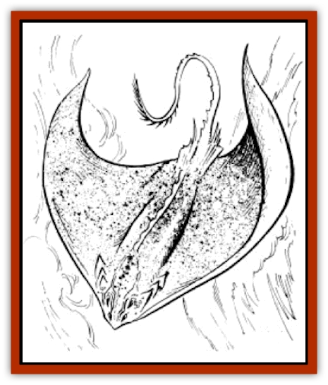

# Cloud Ray

| Statistic | **Cloud Ray** |
| --- | --- |
| **Activity Cycle:** | Any |
| **Alignment:** | Neutral |
| **Armor Class:** | 5 |
| **Climate/Terrain:** | Any |
| **Damage/Attack:** | 5-50 (tail) or 10-100 (bite) |
| **Diet:** | Carnivore |
| **Frequency:** | Very rare |
| **Hit Dice:** | 12+7 to 24+7 |
| **Intelligence:** | Animal (1) |
| **Magic Resistance:** | Nil |
| **Morale:** | Elite (14) |
| **Movement:** | Fl 24 (C) |
| **No. Appearing:** | 1 |
| **No. of Attacks:** | 1 tail or 1 bite and psionic |
| **Organization:** | Solitary |
| **Size:** | G (100'+) |
| **Special Attacks:** | Swallow whole |
| **Special Defenses:** | Psionics |
| **THAC0:** | 12-13 Hit Dice: 7 / 14+ Hit Dice: 5 |
| **Treasure:** | Nil |
| **XP Value:** | 12 Hit Dice: 19,000 / 18 Hit Dice: 25,000 / 24 Hit Dice: 31,000 |

**Psionics Summary**

| Level | Dis/Sci/Dev | Attack/Defense | Score | PSPs |
| --- | --- | --- | --- | --- |
| 3 | 2/1/4 | -/M-,MB,TS | 10 | 100 |

**Psychokinesis -** *Science:* telekinesis; *Devotions:* control winds, inertial barrier, levitation.

**Psychoportation -** *Sciences:* nil; *Devotion:* dream travel.

Control winds, inertial barrier, and levitation are special abilities (no cost)

Through the skies and clouds of Athas slowly fly these deadly giants. Cloud [[Ray|rays]] can sometimes be seen crossing the evening sky.

Cloud rays have a broad, flattened body and flap their huge pectoral fins to aid their psionic flight powers. They are speckled-brown on top and drab olive and white underneath. Sets of ridges protect the creatures' eyes. They have four jetblack eyes, two mounted on each side of the snout and the other two on each side of the cranial bulge. Down the back from the bulge runs a spine that becomes a long, thin, whip-like tail that ends in an appendage known as a zip. The zip is comprised of razor-sharp, barbed ridges that grow at the tip of the spine. The interior mouth or maw (20+ feet across) is lined with row upon row of razor-sharp cartilage ridges.

The zip is also used in a complex signaling system that is only understood by other cloud rays.

**Combat:** The preferred attack of the cloud ray is to simply swallow its victim whole, which it can attempt once per potential victim. On a successful attack roll, any creature smaller than "huge" is swallowed entirely. Failing that, the cloud ray will employ the dangerous tail zip. The cloud ray will move in as close as possible on a silent glide, then strike the target with its tail, using a whip-like motion. The tail whip lashes out so quickly that it produces noise, like a thunder clap and inflicts 5-50 points of damage. The gigantic creature will rotate its body with amazing speed and follow the tail attack with a bite attack the next round.

The cloud ray has the unique, innate psychokinetic ability to create an inertial barrier that always surrounds the creature. This ability functions for the ray just as described in *The Complete Psionics Handbook*.

**Habitat/Society:** Cloud rays wander aimlessly through the Athasian skies always searching for their next meal. On rare occasions they land on the ground and may be mistaken for an outcropping of rock. Those hapless enough to be standing on a ray when it decides to become airborne may become its next meal. A cloud ray's preferred diet consists of devouring other flying creatures. They have a special fondness for [[Roc_Athas|rocs]], [[Pterrax|pterrax]], and flying humanoids. The ray has no true stomach, preferring to swallow prey whole and grind the victim to liquid on its interior jaw ridges to help aid with digestion. After a good meal, cloud rays will sometimes psionically dream travel while their meal digests. Cloud rays have territorial respect for others of their species and, with very few exceptions, do not intrude into another ray's "air space". They are solitary beings except when they seek a mate. Females have a gestation period which lasts over 3 years. They bear living young while airborne. The male catches and supports the young ray on his back for the first year of its life while the female forages. After the young cloud ray learns to fly and becomes self-sufficient, the three go their separate ways.

Although innately psionic, cloud rays become infuriated when a psionicist contacts them. It drives them into a tremendous rage, and they will do anything they can (except land) to capture and devour the offending psionicist. The [[Dragon_of_Tyr|Dragon]] is the only creature in the world that cloud rays truly fear.

**Ecology:** A single cloud ray could easily provide an entire settlement with enough meat and raw materials for 2-3 months. The chances of this occurring are slim at best. These creatures are fierce and feared for good reasons. Entire villages have been reported decimated by a single cloud ray on the hunt. The effect of the creature hovering close over buildings and flapping its massive wings has the same effect as the most deadly sandstorm. The zip alone can easily destroy most buildings in a few swipes.

---
## Discovery & Documentation

**Source Publication:** MC12 Dark Sun Appendix I - Terrors of the Desert (1991)
**Campaign Setting:** Dark Sun
**Author(s):** Tom Prusa, Louis J. Prosperi, Walter M. Baas

### Other Creatures Found in This Source Book
   * [[Animal_Herd_Athas|Animal, Herd (Athas)]]
   * [[Animal_Household_Athas|Animal, Household (Athas)]]
   * [[Antloid_Desert|Antloid, Desert]]
   * [[Banshee_Dwarf|Banshee, Dwarf]]
   * [[Beetle_Agony|Beetle, Agony]]
   * [[Bog_Wader|Bog Wader]]
   * [[Brambleweed|Brambleweed]]
   * [[B'rohg|B'rohg]]
   * [[Burnflower|Burnflower]]
   * [[Cat_Psionic|Cat, Psionic]]
   * [[Cha'thrang|Cha'thrang]]
   * [[Cistern_Fiend|Cistern Fiend]]
   * [[Clam_Giant|Clam, Giant]]
   * [[Drake_Athas_Air|Drake (Athas), Air]]
   * [[Drake_Athas_Earth|Drake (Athas), Earth]]
   * [[Drake_Athas_Fire|Drake (Athas), Fire]]
   * [[Drake_Athas_Water|Drake (Athas), Water]]
   * [[Dune_Runner|Dune Runner]]
   * [[Dune_Trapper|Dune Trapper]]
   * [[Elemental_Athas_Greater_Air|Elemental (Athas), Greater, Air]]
   * [[Elemental_Athas_Greater_Earth|Elemental (Athas), Greater, Earth]]
   * [[Elemental_Athas_Greater_Fire|Elemental (Athas), Greater, Fire]]
   * [[Elemental_Athas_Greater_Water|Elemental (Athas), Greater, Water]]
   * [[Elemental_Athas_Lesser_Air_Earth|Elemental (Athas), Lesser, Air/Earth]]
   * [[Elemental_Athas_Lesser_Fire_Water|Elemental (Athas), Lesser, Fire/Water]]
   * [[Elemental_Athas_General_Information|Elemental (Athas), General Information]]
   * [[Erdland|Erdland]]
   * [[Esperweed|Esperweed]]
   * [[Flailer|Flailer]]
   * [[Floater|Floater]]
   * [[Giant_Athas|Giant (Athas)]]
   * [[Golem_Athas_I|Golem (Athas) I]]
   * [[Golem_Athas_II|Golem (Athas) II]]
   * [[Golem_Athas_III|Golem (Athas) III]]
   * [[Golem_Athas_General_Information|Golem (Athas), General Information]]
   * [[Halfling_Renegade|Halfling, Renegade]]
   * [[Hej-kin|Hej-kin]]
   * [[Id_Fiend|Id Fiend]]
   * [[Insect_Swarm_Athas|Insect Swarm (Athas)]]
   * [[Kank_Wild|Kank, Wild]]
   * [[Kirre|Kirre]]
   * [[Megapede|Megapede]]
   * [[Mul_Wild|Mul, Wild]]
   * [[Nightmare_Beast|Nightmare Beast]]
   * [[Plant_Carnivorous_Athas|Plant, Carnivorous (Athas)]]
   * [[Pterran|Pterran]]
   * [[Pterrax|Pterrax]]
   * [[Pulp_Bee|Pulp Bee]]
   * [[Pyreen|Pyreen]]
   * [[Rasclinn|Rasclinn]]
   * [[Razorwing|Razorwing]]
   * [[Roc_Athas|Roc (Athas)]]
   * [[Sand_Bride|Sand Bride]]
   * [[Sand_Cactus|Sand Cactus]]
   * [[Sand_Vortex|Sand Vortex]]
   * [[Scrab|Scrab]]
   * [[Silt_Horror|Silt Horror]]
   * [[Silt_Runner|Silt Runner]]
   * [[Sink_Worm|Sink Worm]]
   * [[Sloth_Athas|Sloth (Athas)]]
   * [[So-ut|So-ut]]
   * [[Spider_Cactus|Spider Cactus]]
   * [[Spider_Crystal|Spider, Crystal]]
   * [[Spirit_of_the_Land|Spirit of the Land]]
   * [[T'Chowb|T'Chowb]]
   * [[Thrax|Thrax]]
   * [[Tohr-kreen_I|Tohr-kreen I]]
   * [[Villichi|Villichi]]
   * [[Zhackal|Zhackal]]
   * [[Zombie_Plant|Zombie Plant]]
