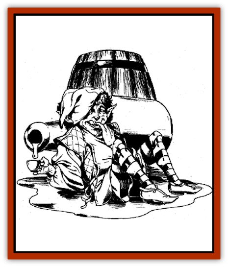

# Clurichaun

| Statistic | **Clurichaun** |
| --- | --- |
| **Activity Cycle:** | Any |
| **Alignment:** | Chaotic (50% Neutral, 25% Good, 25% Evil) |
| **Armor Class:** | 4 |
| **Climate/Terrain:** | Any Urban |
| **Damage/Attack:** | By weapon |
| **Diet:** | Wine |
| **Frequency:** | Very rare |
| **Hit Dice:** | 3 |
| **Intelligence:** | Non- (0) |
| **Magic Resistance:** | 30% |
| **Morale:** | Average (8-10) |
| **Movement:** | 12 |
| **No. Appearing:** | 1 |
| **No. of Attacks:** | 1 |
| **Organization:** | Solitary |
| **Size:** | T (2' tall) |
| **Special Attacks:** | Control liquids |
| **Special Defenses:** | Nil |
| **THAC0:** | 19 |
| **Treasure:** | See below |
| **XP Value:** | 270 |

Clurichauns are relatives of [[Leprechaun|leprechauns]]. They are spirits who inhabit wine cellars of inns and other such establishments. They are mischievous little creatures who love nothing more than fine wine. They appear as tiny [[Elf|elves]] dressed like innkeepers.

**Combat:** When forced into melee, a clurichaun uses small weapons, usually daggers; however, clurichauns have a much more dangerous ability. Clurichauns can control up to 10 gallons of any liquid (usually wine) through telekinesis. In doing so, they can make bottles squirt fluid with the force of a *decanter of endless water*. They can also *create wine or water* twice per day (as the *create water* spell). If hard pressed, a clurichaun can *create a watery double*, once per day, but using wine rather than water.

**Habitat/Society:** A clurichaun's behavior depends mostly on its alignment. A good-aligned clurichaun may help an innkeeper by making sure spigots are tightened and no wine is wasted. An evil clurichaun might slurp up all the supplies, forcing the innkeeper out of business.

Regardless, a clurichaun can become nasty when drunk. It smashes bottles, scares pets, and makes a general mess of things. More than one innkeeper has hired adventurers as clurichaun-exterminators.

**Ecology:** A clurichaun lives entirely on wine, of any style or vintage. They don't drink to excess, taking only about a bottle a week, though individual clurichauns have been known to drink heavily.

Clurichauns collect no treasure, though all of them know the location of great riches, or at least interesting rumors of treasure hoards. Naturally, these caches are often well guarded by powerful monsters - a fact a clurichaun conveniently leaves out if interrogated rather than questioned politely.

---
## Discovery & Documentation

**Source Publication:** Dragon239 (1997)
**Campaign Setting:** Dragon Magazine
**Author(s):** 

### Other Creatures Found in This Source Book
   * [[Boggart|Boggart]]
   * [[Leprechaun_Wicked|Leprechaun, Wicked]]
   * [[Leshy|Leshy]]
