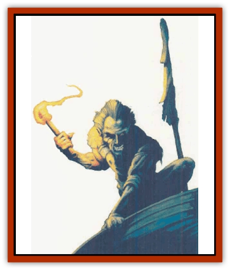

# Coffer Corpse

| Statistic | **Coffer Corpse** |
| --- | --- |
| **Activity Cycle:** | Any |
| **Alignment:** | Chaotic evil |
| **Armor Class:** | 8 |
| **Climate/Terrain:** | Any |
| **Damage/Attack:** | 1d6 or by weapon |
| **Diet:** | None |
| **Frequency:** | Very rare |
| **Hit Dice:** | 2 |
| **Intelligence:** | Low (5-7) |
| **Magic Resistance:** | Nil |
| **Morale:** | Average (9) |
| **Movement:** | 6 |
| **No. Appearing:** | 1 |
| **No. of Attacks:** | 1 |
| **Organization:** | Solitary |
| **Size:** | M (4'1&rdquo;-7' tall) |
| **Special Attacks:** | Nil |
| **Special Defenses:** | Hit only by +1 or better magical weapons, see below |
| **THAC0:** | 19 |
| **Treasure:** | Nil (8) |
| **XP Value:** | 65 |

The coffer corpse is an undead creature seeking its final rest. It is always encountered on the scene of an incomplete death ritual: a stranded funeral barge, unburnt pyre, or so on. Coffer corpses look like [[Zombie|zombies]]. They hate life, and will attack any living humanoid creature that disturbs them.

**Combat:** The coffer corpse attacks in combat with whatever weapon it was to be buried with, inflicting standard damage for that weapon. Only about 25% of coffer corpses have weapons. If it has no weapon, the coffer corpse attacks with its bare hands, attempting to lock them around the victim's throat. If its attack roll succeeds, it has fastened its hands in a death grip, inflicting 1d6 points of damage per round until either it is destroyed or its victim is killed. Coffer corpses are unusually strong - a Strength of 20 is needed to break free of a death grip.

A coffer corpse struck by a nonmagical weapon for 6 or more points of damage will fall to the ground as if dead, although no real physical damage occurs. Any creature held in a death grip will fall with it, as the grip is not yet broken. After one melee round, the coffer corpse will reanimate and continue to strangle any victim. All those who witness this reanimation must save vs. spell or flee in terror for 2-8 rounds.

Magical weapons inflict damage on a coffer corpse depending on their type: Bludgeoning weapons (B) inflict full damage. Slashing weapons (S) inflict normal damage, but gain no damage bonuses for Strength or enchantment. Piercing weapons (P) inflict half normal damage, and do not gain magical or Strength bonuses.

As it has no mind, a coffer corpse is immune to all spells of the schools of enchantment/charm and illusion/phantasm.

Coffer corpses are turned as wraiths

**Habitat/Society:** As an undead creature which seeks only to complete its journey from life, the coffer corpse is either solitary or one of a group of restless dead. Its habitat is determined by the location and type of its burial method. Any treasure found with it will indicate its station in life - the richer and more powerful the coffer corpse was in life, the more treasure it will have in unlife.

A coffer corpse has one overriding instinctive urge: as it was denied a complete death, so others shall be denied life. It is bitter over its incomplete death ritual and seeks to take the lives of others in revenge, particularly if it can deny its victims the release of a death ritual. Thus, when it attacks, the coffer corpse will often attack priests first in the hope that no one will be left to see to a proper burial for its victims.

The creature's bitterness can be used to some advantage if the means to complete the coffer corpse's death journey can be determined. If the unfinished death ritual which binds the coffer corpse to undeath can be completed, the creature will be released and effectively destroyed. The DM must decide what constitutes the final death ritual in each case.

**Ecology:** Coffer corpses have no need for light, air, water, or food. Those slaying a humanoid creature ignore the corpse, leaving it where it lies. They do not interfere with nonliving scavengers - such as [[Ghoul|ghouls]] and [[Ghoul|ghasts]] - that come to feed on the carrion they leave. Otherwise, a coffer corpse will tolerate most undead that do not disturb or attack it. They will attempt to kill any living creature encountered near their (unfinal) resting place. Intelligent monsters often realize that a coffer corpse can be a useful rear guard if care is taken to avoid its lair.

---
## Discovery & Documentation

**Source Publication:** MC14 Fiend Folio Appendix (1992)
**Campaign Setting:** Fiends Folio
**Author(s):** Don Bingle, John Terra, Wes Nicholson, Tim Beach, Steve Hardinger, Kris Hardinger, Rob Nicholls, Greg Swedberg, Al Boyce, Vince Garcia, Norm Ritchie

### Other Creatures Found in This Source Book
   * [[Aballin|Aballin]]
   * [[Achaierai|Achaierai]]
   * [[Adherer|Adherer]]
   * [[Algoid|Algoid]]
   * [[Al-Mi'raj|Al-Mi'raj]]
   * [[Apparition|Apparition]]
   * [[Caterwaul|Caterwaul]]
   * [[Crabman|Crabman]]
   * [[Dark_Creeper|Dark Creeper]]
   * [[Dark_Stalker|Dark Stalker]]
   * [[Darter|Darter]]
   * [[Denzelian|Denzelian]]
   * [[Dune_Stalker|Dune Stalker]]
   * [[Dwarf_Urdunnir|Dwarf, Urdunnir]]
   * [[Falcon_Fire|Falcon, Fire]]
   * [[Faux_Faerie|Faux Faerie]]
   * [[Flawder|Flawder]]
   * [[Fyrefly|Fyrefly]]
   * [[Gambado|Gambado]]
   * [[Garbug|Garbug]]
   * [[Giant_Fhoimorien|Giant, Fhoimorien]]
   * [[Gibberling|Gibberling]]
   * [[Gorbel|Gorbel]]
   * [[Grimlock|Grimlock]]
   * [[Hellcat|Hellcat]]
   * [[Ice_Lizard|Ice Lizard]]
   * [[Iron_Cobra|Iron Cobra]]
   * [[Khargra|Khargra]]
   * [[Mantari|Mantari]]
   * [[Penanggalan|Penanggalan]]
   * [[Pernicon|Pernicon]]
   * [[Phantom_Stalker|Phantom Stalker]]
   * [[Retriever|Retriever]]
   * [[Ruve|Ruve]]
   * [[Scathe|Scathe]]
   * [[Sheet_Ghoul_Sheet_Phantom|Sheet Ghoul/Sheet Phantom]]
   * [[Shocker|Shocker]]
   * [[Spanner|Spanner]]
   * [[Stwinger|Stwinger]]
   * [[Sussurus|Sussurus]]
   * [[Symbiotic_Jelly|Symbiotic Jelly]]
   * [[Terithran|Terithran]]
   * [[Thunder_Children|Thunder Children]]
   * [[Troll_Ice|Troll, Ice]]
   * [[Tween|Tween]]
   * [[Umpleby|Umpleby]]
   * [[Volt|Volt]]
   * [[Xill|Xill]]
   * [[Xvart|Xvart]]
   * [[Zygraat|Zygraat]]
