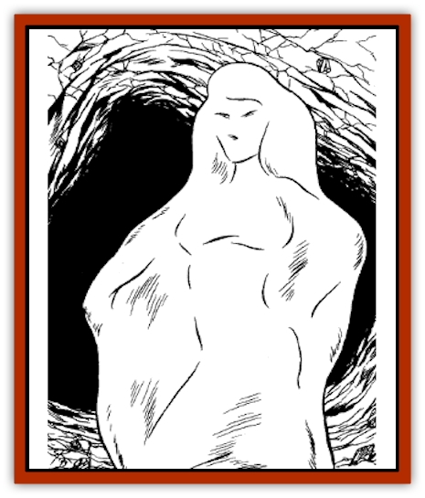
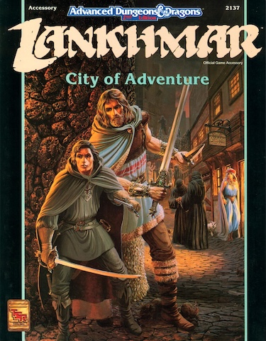

# Cold Woman

| Statistic | **Cold Woman** |
| --- | --- |
| **Activity Cycle:** | Day |
| **Alignment:** | Neutral |
| **Armor Class:** | -2 |
| **Climate/Terrain:** | Cold Wastes |
| **Damage/Attack:** | 4-40 |
| **Diet:** | Carnivore |
| **Frequency:** | Unique |
| **Hit Dice:** | 16 |
| **Intelligence:** | Very (12) |
| **Magic Resistance:** | 25% |
| **Morale:** | Fanatic (17-18) |
| **Movement:** | 9 |
| **No. Appearing:** | 1 |
| **No. of Attacks:** | 1 |
| **Organization:** | Solitary |
| **Size:** | G (30' tall) |
| **Special Attacks:** | Illusion, cold ray, paralysis, touch destroys as black pudding |
| **Special Defenses:** | Immune to slashing and bludgeoning weapons, lightning and cold attacks |
| **THAC0:** | 5 |
| **Treasure:** | F |
| **XP Value:** | 17,000 |

Only a single one of these horrific creatures exists at any one time, striking terror into the inhabitants of the Cold Wastes. A cold woman resembles a gigantic white pudding in the vague shape of a human female. Many legends surround these creatures, but few people can claim to have seen it and lived. These legends say that the cold woman lives in a cave filled with riches, where she paralyzes and consumes the greedy.

**Combat:** A cold woman lures victims with its illusion generation power, creating images of a beautiful woman, a rich treasure, food, or anything else that might attract prey. Victims must save vs. spell or believe the illusion. A cold woman attacks with a cold ray with a range of 6", inflicting 7-70 points of damage. A successful save vs. breath weapon reduces this damage by half.

The cold woman's normal touch inflicts 4-40 points of damage. Anyone hit by this attack must successfully save vs. paralyzation or be paralyzed permanently.

Slashing and bludgeoning attacks have no effect on the cold woman. The same is true for lightning and cold-based magical attacks. Her touch dissolves and corrodes metal in the same way as a [[Pudding_Deadly|black pudding]] does.

**Habitat/Society:** The cold woman inhabits a large cave complex in the Cold Wastes, a remote region of the Great Forest. She is constantly attended by 2-8 cold spawn which hatch from eggs laid on her victims. They are equivalent to [[Pudding_Deadly|white puddings]].

**Ecology:** The cold woman lays eggs upon the bodies of her paralyzed victims. These eggs are easily removable and are destroyed if taken from the host body. The eggs hatch in 24 hours and immediately consume the host. The cold spawn live with their mother until her deaths after which all surviving spawn fight for dominance. The last surviving spawn metamorphoses into a new cold woman.

---
## Discovery & Documentation

**Source Publication:** Lankhmar: City of Adventure (2nd Ed.) (1993)
**Campaign Setting:** Lankhmar
**Author(s):** Bruce Nesmith, Douglas Niles, and Ken Rolston

### Other Creatures Found in This Source Book
   * [[Astral_Wolf|Astral Wolf]]
   * [[Behemoth|Behemoth]]
   * [[Bird_of_Tyaa|Bird of Tyaa]]
   * [[Cat_War|Cat, War]]
   * [[Cloaker_Sea|Cloaker, Sea]]
   * [[Devourer_Lankhmar|Devourer (Lankhmar)]]
   * [[Ghoul_Kleshite|Ghoul, Kleshite]]
   * [[Ghoul_Lankhmar|Ghoul (Lankhmar)]]
   * [[Gladiator_Lizard|Gladiator Lizard]]
   * [[Horag|Horag]]
   * [[Howler|Howler]]
   * [[Ice_Gnome|Ice Gnome]]
   * [[Invisible_of_Stardock|Invisible of Stardock]]
   * [[Lizard|Lizard]]
   * [[Ophidian|Ophidian]]
   * [[Ray_Invisible_Flying|Ray, Invisible Flying]]
   * [[Scorpion|Scorpion]]
   * [[Simorgyan|Simorgyan]]
   * [[Snow_Serpent|Snow Serpent]]
   * [[Thunder_Children|Thunder Children]]
   * [[Wraith-Spider|Wraith-Spider]]
   * [[Zombie_Sea|Zombie, Sea]]
