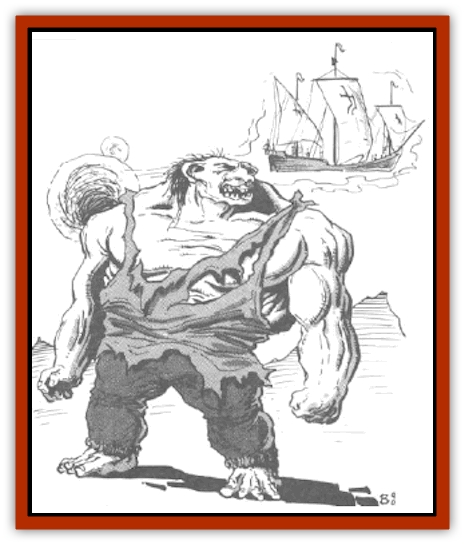

# Colossus

| Statistic | **Colossus** |
| --- | --- |
| **Activity Cycle:** | Day |
| **Alignment:** | Any chaotic |
| **Armor Class:** | 10 |
| **Climate/Terrain:** | Wildspace |
| **Damage/Attack:** | 50-100 (or 5-10 hull points) |
| **Diet:** | Herbivore |
| **Frequency:** | Very rare |
| **Hit Dice:** | 35 |
| **Intelligence:** | Low to average (5-10) |
| **Magic Resistance:** | Nil |
| **Morale:** | Unsteady (6) |
| **Movement:** | 48, Fl 24 (E) |
| **No. Appearing:** | 1 or 1-6 |
| **No. of Attacks:** | 1 every 2 rounds |
| **Organization:** | Solitary or clan |
| **Size:** | G (60' tall) |
| **Special Attacks:** | Stunning clap, throw boulders |
| **Special Defenses:** | Nil |
| **THAC0:** | 5 |
| **Treasure:** | Nil |
| **XP Value:** | 27,000 |

These dim-witted giants are 60 feet tall and weigh 70 tons. Although not related to the giants of the known worlds, they are basically humanoid.

Compared to human proportions, their heads are too small and their legs are too short. Their features tend to be thick and bulbous. Their foreheads slope back sharply and their noses are round blobs of flesh. Their teeth are rarely straight and always have jagged edges. Their fingers are stubby and thick, completely unsuited for delicate manipulations. A colossus can have any color eyes and hair, but black is the most common. Their voices are like rolling thunder, understandable but slow and deep.

Colossi wear heavy, coarse clothes - usually a tunic, breeches, and sandals. Crude though it is, the tailoring is much too fine for any colossus to have stitched it. The clothes can be almost any color, with no regard to fashion sense. It is not uncommon to find large patches covering rips and tears. Colossi never carry weapons or armor, though they could if they wanted to.

**Combat:** Compared to a human, a colossus moves slowly and ponderously. As a result, its great movement rate is only a third of what its 30-foot stride would normally indicate.

Its THAC0 is much worse than one would expect because of its slow movement. In fact, it can attack only once every other round with either a fist punch or a foot stomp. In addition, creatures under 25 feet tall get a -2 Armor Class bonus and those under 10 feet tall get a -4 Armor Class bonus.

But when a colossus manages to hit, the victim must roll a saving throw. vs. death magic (failure means death), in addition to the damage done (see pg. 75 in the *DMG*). Any blow can cause structural damage. Smashing and blunt weapons have no effect whatsoever.

A colossus can clap its hands together with great force and cause a stunning vibration. This is akin to being right next to an explosion. The clap has a range of 60 feet and causes anyone within that range to roll a saving throw vs. paralyzation; failure means the victim is stunned for 1d3 rounds. All characters in the radius of effect are automatically deaf for 1d6 turns.

A colossus can throw boulders up to 500 yards for 5d10 points of damage, but its aim is so poor that it rarely hits what it aims at. In wildspace, a colossus is big enough to be its own ship. Indeed, it has the same air volume as a 15-ton ship. It consumes as much air as a full crew of 10. The collossus can coast through space for months without running out of air.

Food and water can be a problem, though. A colossus cannot propel itself through wildspace except by making a leap from a solid surface, which means it is very slow moving under its own power. It would be possible to fix a spelljamming helm to it and make it into a spelliamming speed "ship" of maneuverability class E. Its plane of gravity makes its back or stomach the walking surface.

**Habitat/Society:** In wildspace these simple creatures are encountered singly. They are usually lost wanderers. They talk about a home called Arhoad, assumed to be a planet. This mythical place has never be found, and the colossi are never able to describe how to find it or how they became lost. It is one of the great mysteries of wildspace.

They speak of close families on Arhoad, so it is assumed that they have a clan society. Since they could not possibly have made their own clothing, many scholars assume that they are the worker or slave class of yet another race, although there is no evidence to support this theory. The [[Reigar|reigar]] accept responsibility for the colossi's plight.

The good colossi are quite friendly and helpful to travelers. The evil ones are marauders and killers, destroying property for the sheer joy of it. Neither variety is considered to be very smart. The only long-term goal they have is to find Arhoad. However, they never seem to know how to go about doing it.

**Ecology:** No one has ever seen a sick colossus or seen one die from anything other than injuries. While they are known to have two sexes, children have never been seen. They do not seem to age, at least not in the few hundred years they have been in known space. They can eat virtually any type of plant. The evil ones eat meat, but they do not seem to need it in their diets. It is assumed that they do it only for the terrorizing effect.

---
## Discovery & Documentation

**Source Publication:** MC7 Spelljammer Appendix I (1990)
**Campaign Setting:** Advanced Dungeons & Dragons 2nd Edition
**Author(s):** various

### Other Creatures Found in This Source Book
   * [[Aartuk|Aartuk]]
   * [[Albari|Albari]]
   * [[Ancient_Mariner|Ancient Mariner]]
   * [[Argos|Argos]]
   * [[Beholder_Abomination_Astereater|Beholder (Abomination), Astereater]]
   * [[Blazozoid|Blazozoid]]
   * [[Chattur|Chattur]]
   * [[Chevall|Chevall]]
   * [[Clockwork_Horror|Clockwork Horror]]
   * [[Delphinid|Delphinid]]
   * [[Dizantar|Dizantar]]
   * [[Dog|Dog]]
   * [[Dog_Bog_Hound|Dog, Bog Hound]]
   * [[Esthetic|Esthetic]]
   * [[Focoid|Focoid]]
   * [[Fractine|Fractine]]
   * [[Giant_Spacesea|Giant, Spacesea]]
   * [[Golem_Furnace|Golem, Furnace]]
   * [[Golem_Radiant|Golem, Radiant]]
   * [[Gravislayer|Gravislayer]]
   * [[Grommam|Grommam]]
   * [[Hadozee|Hadozee]]
   * [[Hamster_Giant_Space|Hamster, Giant Space]]
   * [[Jammer_Leech|Jammer Leech]]
   * [[Lakshu|Lakshu]]
   * [[Lumineaux|Lumineaux]]
   * [[Lutum|Lutum]]
   * [[Mimic_Space|Mimic, Space]]
   * [[Misi|Misi]]
   * [[Moon_Rogue|Moon, Rogue]]
   * [[Mortiss|Mortiss]]
   * [[Murderoid|Murderoid]]
   * [[Nay-Churr|Nay-Churr]]
   * [[Phlog-Crawler|Phlog-Crawler]]
   * [[Plasman|Plasman]]
   * [[Plasmoid_DeGleash|Plasmoid, DeGleash]]
   * [[Plasmoid_DelNoric|Plasmoid, DelNoric]]
   * [[Plasmoid_General_Information|Plasmoid, General Information]]
   * [[Plasmoid_Ontalak|Plasmoid, Ontalak]]
   * [[Puffer|Puffer]]
   * [[Q'nidar|Q'nidar]]
   * [[Rastipede|Rastipede]]
   * [[Reigar|Reigar]]
   * [[Rock_Hopper|Rock Hopper]]
   * [[Slinker|Slinker]]
   * [[Spider_Asteroid|Spider, Asteroid]]
   * [[Spiritjam|Spiritjam]]
   * [[Survivor|Survivor]]
   * [[Syllix|Syllix]]
   * [[Symbiont_Power|Symbiont, Power]]
   * [[Vine_Infinity|Vine, Infinity]]
   * [[Wiggle|Wiggle]]
   * [[Wizshade|Wizshade]]
   * [[Wryback|Wryback]]
   * [[Zard|Zard]]
   * [[Zodar|Zodar]]
