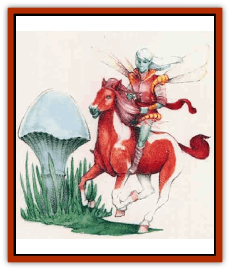

# Coltpixie

| Statistic | **Coltpixie** |
| --- | --- |
| **Activity Cycle:** | Any |
| **Alignment:** | Chaotic neutral |
| **Armor Class:** | 6 |
| **Climate/Terrain:** | Any |
| **Damage/Attack:** | 1d6 (&times;2) (hooves) |
| **Diet:** | Herbivore |
| **Frequency:** | Very rare |
| **Hit Dice:** | 3 |
| **Intelligence:** | Low (7) |
| **Magic Resistance:** | Nil |
| **Morale:** | Steady (11) |
| **Movement:** | 90 |
| **No. Appearing:** | 1 |
| **No. of Attacks:** | 2 |
| **Organization:** | Solitary |
| **Size:** | T-L (1-7' tall) |
| **Special Attacks:** | Nil |
| **Special Defenses:** | See below |
| **THAC0:** | 17 |
| **Treasure:** | Nil |
| **XP Value:** | 120 |

The coltpixy is an enchanted [[Horse|pony]] or [[Horse|horse]], distantly related to the [[Unicorn|unicorn]]. Adventurers who spy this rare creature usually find it in the service of important fairies ([[Brownie|brownies]], [[Leprechaun|leprechauns]], [[Sprite|pixies]], [[Sprite|sprites]], and other "wee folk").

To accommodate the size of their riders, coltpixies can alter their own size from that of the largest horse to but a single hand high. They also can change their coloration, and frequently have gaudy manes and tails that complement their riders' attire.

Coltpixies do not have a language of their own, but they can communicate in the language of horses.

**Combat:** Although they loathe fighting, coltpixies boast sturdy hooves that can cause serious harm in combat. Given the choice of escape or battle, however, wild coltpixies choose the former, while coltpixie mounts do their masters' bidding

Like many of the fairies who ride them, coltpixies can to make themselves *invisible*. However, this invisibility extends only to mortals - not to other coltpixies or their fairy masters.

The coltpixies' ability to alter their size may prove a distinct advantage in some situations, confusing and confounding opponents (especially in combination with *invisibility*).

Whatever their size, coltpixies travel with equal speed (about five times as fast as a common horse), and they are not slowed by rough terrain, bogs, or even water.

Coltpixies are 90% resistant to *sleep* and *charm* spells, and receive any normal saving throw allowed if they fail to resist these magics.

Barding can improve a coltpixy's Armor Class. However, magical barding is required if the creature intends to retain it while changing size.

**Habitat/Society:** The wee fok of Mystara domesticated coltpixies in years before memory. The coltpixies' magical ability to alter their size makes them perfect steeds, and their ability to change color delights the whimsy of fairies. The most important fairies all ride coltpixies, regarding these inielligcnt creatures as friends and companions. In turn, coltpixies reward their masters with steadfast loyalty and obedience.

Wild coltpixies, which are always chaotic neutral in alignment, delight in leading normal horses astray tn the bedevilment of their mortal riders; but like their domesticated cousins, they are generally shy and gentle.

If explicitly commanded by its fey master to do so, a coltpixy will carry a normal human or demihuman, but never for a long period of time.

**Ecology:** No one is quite sure how coltpixies came into being. Sages speculate that they may once have been normal horses or ponies, but long exposure to the fey magic turned them into more wondrous creatures. Or perhaps the reverse is true, and common horses are descended from their faerie counterparts.

Coltpixies move almost five times as fast as normal horses.

| Pace | Movement |
| --- | --- |
| Walk | 45 |
| Trot | 90 |
| Canter | 135 |
| Gallop | 180 |

A coltpixy can move at its full listed speed while carrying up to 170 pounds. It can move at half speed while carrying up to 255 pounds, and at one-third speed while carrying up to 340 pounds.

As noted in the *Player's Handbook* (Chapter 14), in a day of travel over good terrain, a creature can travel a number of miles equal to twice its normal movement rate (a trot); that is, a coltpixy can cover 180 miles. The numbers above reflect the enchanted nature and incredible magical speed of the coltpixy, for which a comfortable trotting pace is almost twice the gallop of the fastest mortal horses. Like horses, coltpixies can be goaded to go faster, pushed to a canter or gallop. A canter can be safely maintained for two hours, or a gallop for one hour, but the coltpixy must be walked for an hour before its speed can be again increased.

A coltpixy will not gallop if loaded with enough material to reduce its normal movement rate by half; nor will it canter or gallop if carrying a load which will reduce its normal moveement rate to one-third normal.

---
## Discovery & Documentation

**Source Publication:** Mystara Appendix (1994)
**Campaign Setting:** Mystara
**Author(s):** John Nephew, Teeuwynn Woodruff, John Terra, Skip Williams

### Other Creatures Found in This Source Book
   * [[Actaeon|Actaeon]]
   * [[Agarat|Agarat]]
   * [[Ash_Crawler|Ash Crawler]]
   * [[Baldandar|Baldandar]]
   * [[Bargda|Bargda]]
   * [[Bhut|Bhut]]
   * [[Bird_Mystara|Bird (Mystara)]]
   * [[Blackball|Blackball]]
   * [[Choker|Choker]]
   * [[Crone_of_Chaos|Crone of Chaos]]
   * [[Darkhood|Darkhood]]
   * [[Darkwing|Darkwing]]
   * [[Decapus|Decapus]]
   * [[Deep_Glaurant|Deep Glaurant]]
   * [[Diabolus|Diabolus]]
   * [[Dimensional_Warper|Dimensional Warper]]
   * [[Dragon_Mystara_Crystalline|Dragon (Mystara), Crystalline]]
   * [[Dragon_Mystara_Jade|Dragon (Mystara), Jade]]
   * [[Dragon_Mystara_Onyx|Dragon (Mystara), Onyx]]
   * [[Dragon_Mystara_Ruby|Dragon (Mystara), Ruby]]
   * [[Drake_Mystara|Drake (Mystara)]]
   * [[Dragonfly|Dragonfly]]
   * [[Dusanu|Dusanu]]
   * [[Elemental_of_Chaos_Air_Earth|Elemental of Chaos, Air/Earth]]
   * [[Elemental_of_Chaos_Fire_Water|Elemental of Chaos, Fire/Water]]
   * [[Elemental_of_Law_Air_Earth|Elemental of Law, Air/Earth]]
   * [[Elemental_of_Law_Fire_Water|Elemental of Law, Fire/Water]]
   * [[Familiar_Mystara|Familiar (Mystara)]]
   * [[Frost_Salamander|Frost Salamander]]
   * [[Fundamental_Air_Earth|Fundamental, Air/Earth]]
   * [[Fundamental_Fire_Water|Fundamental, Fire/Water]]
   * [[Gargantua_Mystara|Gargantua (Mystara)]]
   * [[Geonid|Geonid]]
   * [[Ghostly_Horde|Ghostly Horde]]
   * [[Giant_Athach|Giant, Athach]]
   * [[Giant_Hephaeston|Giant, Hephaeston]]
   * [[Golem_Drolem|Golem, Drolem]]
   * [[Golem_Mystara_I|Golem (Mystara) I]]
   * [[Golem_Mystara_II|Golem (Mystara) II]]
   * [[Golem_Mystara_III|Golem (Mystara) III]]
   * [[Gray_Philosopher|Gray Philosopher]]
   * [[Guardian_Warrior|Guardian Warrior]]
   * [[Gyerian|Gyerian]]
   * [[Herex|Herex]]
   * [[Hivebrood|Hivebrood]]
   * [[Horde|Horde]]
   * [[Hsiao|Hsiao]]
   * [[Huptzeen|Huptzeen]]
   * [[Hutaakan|Hutaakan]]
   * [[Imp_Mystara|Imp (Mystara)]]
   * [[Jellyfish_Giant_Mystara|Jellyfish, Giant (Mystara)]]
   * [[Kna|Kna]]
   * [[Kopru|Kopru]]
   * [[Lizard_Mystara|Lizard (Mystara)]]
   * [[Lizard-kin_Mystara|Lizard-kin (Mystara)]]
   * [[Lupin|Lupin]]
   * [[Lycanthrope_Werejaguar_Mystara|Lycanthrope, Werejaguar (Mystara)]]
   * [[Lycanthrope_Wereswine|Lycanthrope, Wereswine]]
   * [[Magen|Magen]]
   * [[Manikin|Manikin]]
   * [[Mek|Mek]]
   * [[Mujina|Mujina]]
   * [[Nagpa|Nagpa]]
   * [[Neh-thalggu|Neh-thalggu]]
   * [[Nightshade_Mystara|Nightshade (Mystara)]]
   * [[Nuckalavee|Nuckalavee]]
   * [[Pegataur|Pegataur]]
   * [[Phanaton|Phanaton]]
   * [[Plant_Dangerous_Mystara|Plant, Dangerous (Mystara)]]
   * [[Plasm|Plasm]]
   * [[Rakasta|Rakasta]]
   * [[Rock_Man|Rock Man]]
   * [[Sabreclaw|Sabreclaw]]
   * [[Sacrol|Sacrol]]
   * [[Scamille|Scamille]]
   * [[Shapeshifter|Shapeshifter]]
   * [[Shargugh|Shargugh]]
   * [[Shark-kin|Shark-kin]]
   * [[Sollux|Sollux]]
   * [[Spectral_Death|Spectral Death]]
   * [[Spectral_Hound|Spectral Hound]]
   * [[Spider-kin|Spider-kin]]
   * [[Spirit_Mystara|Spirit (Mystara)]]
   * [[Statue_Living|Statue, Living]]
   * [[Surtaki|Surtaki]]
   * [[Tabi|Tabi]]
   * [[Thoul|Thoul]]
   * [[Thunderhead|Thunderhead]]
   * [[Tiger_Ebon|Tiger, Ebon]]
   * [[Topi|Topi]]
   * [[Tortle|Tortle]]
   * [[Vampire_Velya|Vampire, Velya]]
   * [[White_Fang|White Fang]]
   * [[Worm_Mystara|Worm (Mystara)]]
   * [[Wyrd|Wyrd]]
   * [[Yowler|Yowler]]
   * [[Zombie_Lightning|Zombie, Lightning]]
