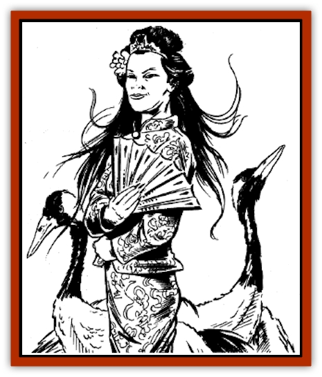

# Con-tinh

| Statistic | **Con-tinh** |
| --- | --- |
| **Activity Cycle:** | Night |
| **Alignment:** | Chaotic evil |
| **Armor Class:** | 7 |
| **Climate/Terrain:** | Tropical, subtropical, and temperate plain, forest, jungle, hill |
| **Damage/Attack:** | 1-4 |
| **Diet:** | Special |
| **Frequency:** | Rare |
| **Hit Dice:** | 6 |
| **Intelligence:** | Average (8-10) |
| **Magic Resistance:** | 20% |
| **Morale:** | Steady (11) |
| **Movement:** | 12 |
| **No. Appearing:** | 1-2 |
| **No. of Attacks:** | 1 |
| **Organization:** | Solitary |
| **Size:** | M (5' tall) |
| **Special Attacks:** | Laugh |
| **Special Defenses:** | See below |
| **THAC0:** | 15 |
| **Treasure:** | I |
| **XP Value:** | 2,000 |

The malicious con-tinh is a lesser spirit believed to be the spirit of a maiden who died before her time. She appears as a beautiful maiden (human or humanoid) with flowing hair and sparkling eyes. She wears the attire of a princess, and carries a large fan and a basket of fruit. A con-tinh is sometimes accompanied by a pair of cranes or sky blue doves, which serve as her familiars.

A con-tinh's lifeforce is tied to that of a single fruit tree. She carries the fruit of this tree in her basket. The fruit crumbles when anyone other than the con-tinh touches it.

The con-tinh speaks the languages common to the area, as well as any languages she knew in life.

**Combat:** The con-tinh's single desire is to destroy life, especially characters of the race she once belonged to herself (usually, this means humans). She is greatly feared. If an area is reputedly the home of a con-tinh, fools and wise men alike will avoid it, especially after nightfall.

The con-tinh cannot leave the area within a 100-foot radius of her tree. She spends daylight hours hiding in its branches, and usually is active only at night. However, if the con-tinh's tree is disturbed at any time, she will attack.

The con-tinh has two special attacks. The first is a weird laugh like the cackling of a madwoman. The con-tinh can use this laugh three times per night. Characters within 20 feet of the laughing spirit must make a successful save vs. death or be stricken with a debilitating insanity. This insanity reduces the victim's Intelligence and Wisdom to 2, and causes the loss of all abilities associated with these scores. (For example, the insanity prevents wu jen and shukenja from casting spells.) *Heal* or a similar spell restores sanity; each day, victims recover 1 point of both Intelligence and Wisdom until their original scores are fully reinstated.

The con-tinh also can project her spirit into the body of a character once per night. Potential victims must come within 100 feet of her tree. She can make only one attempt per subject each night, but can try other subjects until she succeeds. A successful save vs. spells means the con-tinh's attempt has failed. If the victim's saving throw fails, the con-tinh inhabits the victim's body and takes complete control of its actions. The victim is unaware of what is happening, and will have no memory of it.

While inhabiting a victim, the con-tinh gains the character's physical abilities but no spells, special abilities, or powers related to the mind. However, the con-tinh retains her own mental abilities, including spell-casting. The con-tinh herself takes a ½ hit point of damage for every hit point her victim suffers. The projection lasts into daylight hours. If the inhabited character strays more than 100 feet from the con-tinh's tree, the con-tinh is forced to leave the body or be destroyed. Any spell that forcibly ejects the con-tinh also destroys the creature.

Only weapons of +2 or greater can hit a con-tinh. All attacks upon the spirit's personal tree also harm the spirit, hit point for hit point. (The tree has the same hit points and Armor Class as the con-tinh, regardless of the tree's size or type.) Any attack that destroys the tree - such as *wood rot* - also destroys the con-tinh.

Anyone who destroys the tree of a con-tinh must make a successful save vs. spells or suffer an *ancient curse*. Such curses typically involve annual crop failure (if the character is a farmer or land-owner) or periodic spontaneous fires in the victim's home (or other building owned by the character or his family). This power is automatic and can occur day or night.

**Habitat/Society:** According to legend, the Celestial Bureaucracy creates a con-tinh from the spirit of a young maiden who has died before her time, usually as a result of a misdeed. The most common misdeed is an illicit love affair, which ends when the maiden is murdered by a rival or jealous spouse. On rare occasions, sisters who conspired in the same misdeed both become con-tinh, their lifeforces tied to identical, adjacent trees.

A con-tinh with a crane or dove as a familiar often sends it scouting for victims. Mistaking the bird for a good omen, unwary victims may follow it straight to the con-tinh's tree.

A con-tinh's treasure (whatever she takes from victims) usually is buried near the base of her tree, in a deep hole.

**Ecology:** The dust of a crumbled fruit from a con-tinh's tree can be used as a component for a *potion of longevity*.

---
## Discovery & Documentation

**Source Publication:** MC6 Kara-Tur Appendix (1990)
**Campaign Setting:** Kara-Tur (Forgotten Realms)
**Author(s):** Rick Swan

### Other Creatures Found in This Source Book
   * [[Bajang|Bajang]]
   * [[Bakemono|Bakemono]]
   * [[Bisan|Bisan]]
   * [[Buso|Buso]]
   * [[Carp_Giant|Carp, Giant]]
   * [[Centipede_Spirit|Centipede, Spirit]]
   * [[Chu-u|Chu-u]]
   * [[Doc_cu'o'c|Doc cu'o'c]]
   * [[Duruch'i-lin|Duruch'i-lin]]
   * [[Flame_Spirit|Flame Spirit]]
   * [[Foo_Creature|Foo Creature]]
   * [[Gaki|Gaki]]
   * [[Gargantua|Gargantua]]
   * [[Goblin_Rat|Goblin Rat]]
   * [[Hai_Nu|Hai Nu]]
   * [[Hannya|Hannya]]
   * [[Hengeyokai|Hengeyokai]]
   * [[Hsing-sing|Hsing-sing]]
   * [[Hu_Hsien|Hu Hsien]]
   * [[Human_Kara-Tur|Human (Kara-Tur)]]
   * [[Ikiryo|Ikiryo]]
   * [[Jishin_Mushi|Jishin Mushi]]
   * [[Kala|Kala]]
   * [[Kaluk|Kaluk]]
   * [[Kappa|Kappa]]
   * [[Korobokuru|Korobokuru]]
   * [[Krakentua|Krakentua]]
   * [[Kuei|Kuei]]
   * [[Memedi|Memedi]]
   * [[Men-shen|Men-shen]]
   * [[Nat|Nat]]
   * [[Ningyo|Ningyo]]
   * [[Oni|Oni]]
   * [[P'oh|P'oh]]
   * [[P'oh_Gohei|P'oh, Gohei]]
   * [[Shan_Sao|Shan Sao]]
   * [[Shirokinukatsukami|Shirokinukatsukami]]
   * [[Spirit_Folk|Spirit Folk]]
   * [[Spirit_Nature|Spirit, Nature]]
   * [[Spirit_Stone|Spirit, Stone]]
   * [[Tako|Tako]]
   * [[Tengu|Tengu]]
   * [[Wang-Liang|Wang-Liang]]
   * [[Yuan-ti_Histachii|Yuan-ti, Histachii]]
   * [[Yuki-on-na|Yuki-on-na]]
