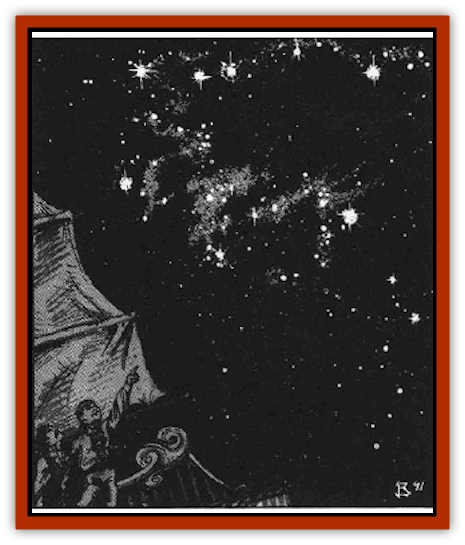

# Constellate

| Statistic | **Constellate** |
| --- | --- |
| **Activity Cycle:** | Any |
| **Alignment:** | Neutral |
| **Armor Class:** | 5 (-10) |
| **Climate/Terrain:** | Wildspace |
| **Damage/Attack:** | See below |
| **Diet:** | None |
| **Frequency:** | Common |
| **Hit Dice:** | N/A |
| **Intelligence:** | Low (5-7) |
| **Magic Resistance:** | Nil |
| **Morale:** | Fearless (19-20) |
| **Movement:** | Varies |
| **No. Appearing:** | 1 |
| **No. of Attacks:** | 1 |
| **Organization:** | Constellation |
| **Size:** | G (1 to 100 million sqare miles) |
| **Special Attacks:** | See below |
| **Special Defenses:** | Nil |
| **THAC0:** | 2 |
| **Treasure:** | Nil |
| **XP Value:** | N/A |

The peaceful constellates are made of small motes of light gathered in constellations, groupings of stars that suggest various objects and life forms. Surrounding each constellation is the ghostly image of the thing it represents - the constellate proper. These ghostly images depict [[Wolf|wolves]], swords, warriors, and the like.

Individual stars' colors vary, but most are bluish-white. Their color may relate to their age. No single star has ever seperated from its constellate group.

**Combat:** Constellates choose to avoid battle when possible. Generally they fly away from danger (playing hob with astronomers in the process!). After the danger has passed, the constellate returns to its position.

When an [[Aperusa|Aperusa]] clan leader summons a constellate, its nature changes radically. Witnesses see an immense shadowy figure shaped like the constellation drop down from the heavens. The stars diffuse and move randomly within the constellate's body. It can change size at will, usually to maintain its size relative to the viewers; for instance, the Panther constellate seems to remain panther-sized whether in the sky or on a ship's deck. The constellate gains the special abilities of the character or object it portrays: e.g. the [[Swanmay|Swan]] could use wing buffets, and the Krynnspace constellation Raistlin-Fistandantilus could use *timestop*.

If it wishes, the constellate can melee at up to its full size - often millions of square miles! The full-size constellate can crush with its enormous bulk, causing 2d20 points of damage per 1.000 square mites of area. The range of this attack is the constellate's size. It can use this attack form once every other round. It can also throw bolts of energy (calls *sunbolts*) with unerring accuracy. *Sunbolts* cause 2d12 points of damage for every 1,000 square miles of the constellate's area. The range of the *sunbolts* is believed to be 500,000| miles. Damage does not decrease over distance; however, accuracy does decrease. At short range (1125,000 miles) there is no penalty to the attack roll; medium range (125,001-250,000 miles) takes a -2 penalty; and long range (250,001-500,000 miles) takes a -5 penalty. The constellate can use this attack once per round, even while it uses its crushing blow.

The *sunbolt* is a cone-shaped area 1,000 miles in diameter. When this area of effect is added to the strength of the *sunbolt*, the constellate can literally crush planets at its whim. Some believe that the Grinder asteroid belt within the heavens of Greyspace is actually the residue of a summoned constellate's attack. Legends speak of constellates who inflicted great harm against a planet within that crystal sphere. The gods retaliated against these constellates, thereby banning them from the crystal sphere. The constellates' whereabouts are unknown.

A constellate's attack lasts only five rounds. There are no reports of an attack lasting longer that this. It then resumes its place in the sky and its former nature. A given constellate can only be *summoned* once a year.

**Habitat/Society:** Each constellation in a sphere's night sky is a constellate. They occupy their assigned positions, swapping choice information about the goings-on of the groundling races or lamenting their eternal celestial imprisonment. The advent of spelljamming ships has created new gossip for these beings, and their overall morale has risen.

Although they converse freely among themselves through telepathy, they never speak to corporeal life forms. Attempts to imprison and interrogate constellates fail, for they simply change size to escape from their prison.

**Ecology:** Sages dispute the true genesis of the constellates. Some postulate that they have existed as long as the stars in the sky. Others point to Krynnspace, where new constellations appeared and old ones disappeared in the War of the Lance. Still others talk of the influence of divine entities.

Why the Aperusa have an affinity with the constellates is an equally tantalizing mystery. They have never divulged their spells of summoning, and with the constellate as allies, it is unlikely that anyone will wrest the secret from the wildspace gypsies.

---
## Discovery & Documentation

**Source Publication:** MC9 Spelljammer Appendix II (1991)
**Campaign Setting:** Planescape
**Author(s):** Scott Davis, Newton Ewell, John Terra

### Other Creatures Found in This Source Book
   * [[Alchemy_Plant|Alchemy Plant]]
   * [[Allura|Allura]]
   * [[Aperusa|Aperusa]]
   * [[Autognome|Autognome]]
   * [[Bionoid|Bionoid]]
   * [[Bloodsac|Bloodsac]]
   * [[Buzzjewel|Buzzjewel]]
   * [[Contemplator|Contemplator]]
   * [[Dohwar|Dohwar]]
   * [[Dragon_Moon|Dragon, Moon]]
   * [[Dragon_Stellar|Dragon, Stellar]]
   * [[Dragon_Sun|Dragon, Sun]]
   * [[Dreamslayer|Dreamslayer]]
   * [[Dweomerborn|Dweomerborn]]
   * [[Fal|Fal]]
   * [[Feesu|Feesu]]
   * [[Fire_Bat|Fire Bat]]
   * [[Firebird|Firebird]]
   * [[Firelich|Firelich]]
   * [[Flowfiend|Flowfiend]]
   * [[Gadabout|Gadabout]]
   * [[Gammaroid|Gammaroid]]
   * [[Gonn|Gonn]]
   * [[Gossamer|Gossamer]]
   * [[Grav|Grav]]
   * [[Great_Dreamer|Great Dreamer]]
   * [[Greatswan|Greatswan]]
   * [[Grell_Colonial|Grell, Colonial]]
   * [[Gullion|Gullion]]
   * [[Insectare|Insectare]]
   * [[Lhee|Lhee]]
   * [[Mercurial_Slime|Mercurial Slime]]
   * [[Meteorspawn|Meteorspawn]]
   * [[Monitor|Monitor]]
   * [[Owl_Space|Owl, Space]]
   * [[Pristatic|Pristatic]]
   * [[Scro|Scro]]
   * [[Selkie_Star|Selkie, Star]]
   * [[Silatic|Silatic]]
   * [[Skullbird|Skullbird]]
   * [[Sleek|Sleek]]
   * [[Sluk|Sluk]]
   * [[Space_Swine|Space Swine]]
   * [[Sphinx_Astro-|Sphinx, Astro-]]
   * [[Spirit_Warrior|Spirit Warrior]]
   * [[Starfly_Plant|Starfly Plant]]
   * [[Stargazer|Stargazer]]
   * [[Undead_Stellar|Undead, Stellar]]
   * [[Witchlight_Marauder|Witchlight Marauder]]
   * [[Xixchil|Xixchil]]
   * [[Yitsan|Yitsan]]
   * [[Zurchin|Zurchin]]
