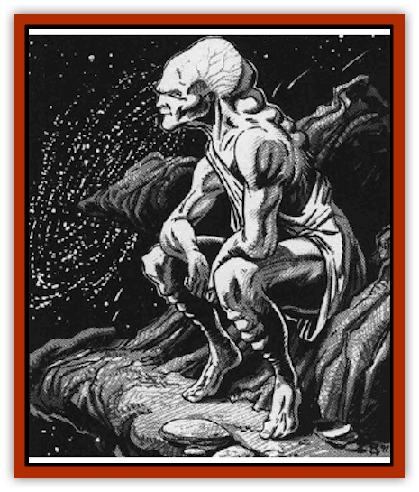

# Contemplator

| Statistic | **Contemplator** |
| --- | --- |
| **Activity Cycle:** | Any |
| **Alignment:** | Neutral |
| **Armor Class:** | 0 |
| **Climate/Terrain:** | Asteroid |
| **Damage/Attack:** | 2d10/2d10/2d10 (2d8/2d8) |
| **Diet:** | None |
| **Frequency:** | Very rare |
| **Hit Dice:** | 13+1 |
| **Intelligence:** | Godlike (21) |
| **Magic Resistance:** | 50% |
| **Morale:** | Fanatic (18) |
| **Movement:** | 24 |
| **No. Appearing:** | 1 |
| **No. of Attacks:** | 3 (5) |
| **Organization:** | Solitary |
| **Size:** | L (12') |
| **Special Attacks:** | See below |
| **Special Defenses:** | Spell |
| **THAC0:** | 7 |
| **Treasure:** | H |
| **XP Value:** | 13,000 |

Contemplators live on barren asteroids, pondering the questions of the universe. Some say that when one discovers all the answers to all the questions, the universe will end.

A contemplator is found most often seated in the classical thinker pose on a large stone outcropping. A gray humanoid, 12' tall, he often wears a gray toga. Consequently, unwary adventurers may easily mistake him for a statue.

**Combat:** A contemplator yearns for all knowledge and has deduced that the best way to gather it is directly from the minds of other beings. To gather information, he captures any intelligent being who lands on or comes near his asteroid.

The contemplator creates three arms out of the asteroid's surface to capture his specimens. Each arm can extend 50' and has 25 hit points. If an arm is destroyed, the contemplator can create another after 24 hours have passed.

If forced into a fight personally, the contemplator punches with his own two arms (inflicting 2d8 points of damage with each) as well as with his three extra appendages.

When a contemplator captures a victim with one of the three large arms, he encases its body in a thin (1/4" thick) layer of stone and drains its Intelligence, one point a day. This requires the contemplator's uninterrupted concentration. If he is disturbed at any time, that day's point of Intelligence remains with the captured character (at least for one more day). Each day, the entombed victim can attempt a Bend Bars/Lift Gates role to escape the stone prison. When the victim's Intelligence is reduced to 3, the contemplator's stone arm flings the now-useless simpleton into space.

If a *wish* or similar magic restores a character's Intelligence, the knowledge restored vanishes from the contemplator who stole it. If this restored character ever comes within 50 miles of the contemplator who lost the knowledge, the contemplator immediately detects, intercepts, and attacks the character. A contemplator cannot tolerate knowing something and then having it taken away!

A contemplator who drains a wizard gains all the wizard's memorized spells. He casts these acquired spells only once, for he won't waste the time necessary to write them down. He can only use wizard spells, not those of priests. A contemplator still must use material components for spells that require them.

**Habitat/Society:** The contemplator spends all of his time on his asteroid sifting through his acquired knowledge, searching for any clue to the origin and end of the universe. He is totally devoid of emotion, but he is usually willing to negotiate for a captive's life. The price is often a quest for information, such as the answer to a question. The contemplator always sets a time limit on the quest and, once the deal is made, never reneges or renegotiates.

A contemplator can move his asteroid through space using a mysterious form of locomotion. He is usually content to drift through space, but when the need arises, he can move quickly in any direction.

A contemplator knows of any change on the surface of his asteroid, as though it were an extension of his body. This makes stealthy approach impossible except by flight.

**Ecology:** Strewn about the contemplator's asteroid are the material remains of his past conflicts. When he tosses his victims into wildspace, the contemplator keeps their possessions, primarily for his experiments with newfound spells. He still needs the components to make them work correctly.

---
## Discovery & Documentation

**Source Publication:** MC9 Spelljammer Appendix II (1991)
**Campaign Setting:** Planescape
**Author(s):** Scott Davis, Newton Ewell, John Terra

### Other Creatures Found in This Source Book
   * [[Alchemy_Plant|Alchemy Plant]]
   * [[Allura|Allura]]
   * [[Aperusa|Aperusa]]
   * [[Autognome|Autognome]]
   * [[Bionoid|Bionoid]]
   * [[Bloodsac|Bloodsac]]
   * [[Buzzjewel|Buzzjewel]]
   * [[Constellate|Constellate]]
   * [[Dohwar|Dohwar]]
   * [[Dragon_Moon|Dragon, Moon]]
   * [[Dragon_Stellar|Dragon, Stellar]]
   * [[Dragon_Sun|Dragon, Sun]]
   * [[Dreamslayer|Dreamslayer]]
   * [[Dweomerborn|Dweomerborn]]
   * [[Fal|Fal]]
   * [[Feesu|Feesu]]
   * [[Fire_Bat|Fire Bat]]
   * [[Firebird|Firebird]]
   * [[Firelich|Firelich]]
   * [[Flowfiend|Flowfiend]]
   * [[Gadabout|Gadabout]]
   * [[Gammaroid|Gammaroid]]
   * [[Gonn|Gonn]]
   * [[Gossamer|Gossamer]]
   * [[Grav|Grav]]
   * [[Great_Dreamer|Great Dreamer]]
   * [[Greatswan|Greatswan]]
   * [[Grell_Colonial|Grell, Colonial]]
   * [[Gullion|Gullion]]
   * [[Insectare|Insectare]]
   * [[Lhee|Lhee]]
   * [[Mercurial_Slime|Mercurial Slime]]
   * [[Meteorspawn|Meteorspawn]]
   * [[Monitor|Monitor]]
   * [[Owl_Space|Owl, Space]]
   * [[Pristatic|Pristatic]]
   * [[Scro|Scro]]
   * [[Selkie_Star|Selkie, Star]]
   * [[Silatic|Silatic]]
   * [[Skullbird|Skullbird]]
   * [[Sleek|Sleek]]
   * [[Sluk|Sluk]]
   * [[Space_Swine|Space Swine]]
   * [[Sphinx_Astro-|Sphinx, Astro-]]
   * [[Spirit_Warrior|Spirit Warrior]]
   * [[Starfly_Plant|Starfly Plant]]
   * [[Stargazer|Stargazer]]
   * [[Undead_Stellar|Undead, Stellar]]
   * [[Witchlight_Marauder|Witchlight Marauder]]
   * [[Xixchil|Xixchil]]
   * [[Yitsan|Yitsan]]
   * [[Zurchin|Zurchin]]
